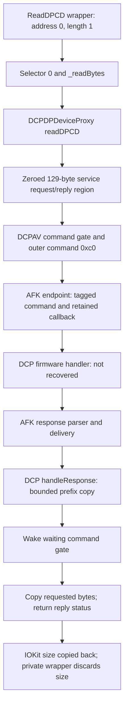

# M2A-RPC-03: DCP DPCD Read Safety Contract

## Milestone Branch Follow-up

The published baseline already contained the original RPC-03 investigation below.
This follow-up runs on `research/dcp-rpc-safety`, created from
`2512e2f34ec5fc2b2f03102ecfb44951dad3c517`. Local/remote main and the annotated
`research-baseline-v0.1` tag were verified before branching and remain unchanged.
It reuses the established host ABI and adds the missing direct-caller evidence
for command admission, recovery notifications and endpoint cleanup.

| New Record | Scope |
| --- | --- |
| G5, `artifacts/probes/20260912T093139Z/` | One fresh invocation of the existing public probe through the collector; 33 read-only commands, zero failures. |
| R4, `artifacts/probes/iodp-static-20260912T095457Z/` | Static lifetime follow-up: 204 selected kernel blocks, five direct recovery/acquisition references and six requested vtables. |
| R4 report SHA-256 | `1262f818b09a562b22c4649c97d94e77a5c865148268793cd2a9dc8d5c72ab1f` |
| R4 completion | 2026-09-12T09:55:00Z; current kernel UUID and container/decoded hashes equal R3. |

`VERIFIED_ON_M5`: G5 again has one external active 1920x1080@60 display and the
same External DCPEXT0 / Unit 0 DP device/service paths with both interface flags.
Port 4 remains active, HPD 2 / High, two lanes, raw LinkRate 4 / published HBR3,
SinkCount 1, Tunneled false. The freshly observed IDs happen to remain
`4294970467` / `4294970463`; no old handle or ID was used for selection.
**USB inventory changed from nine in G4 to six in G5.** This is a material
inventory difference, not evidence that the external DP route changed or that
every physical attachment remained identical. No cable cycle was performed.
The original owner-reported hub association remains an inference from C1/D1/C2,
not a new physical identification from G5.

R4 uses `--kernel-callers-of` to preserve exact B/BL bytes, target definitions
and containing LC_FUNCTION_STARTS-bounded functions. It does not resolve every
indirect callback, and absence of a direct caller is not absence of a path.
The first caller-capture tests passed before real-image use. Intermediate
captures are retained; R3 remains the original baseline evidence.

Reproduce the new static selection on the recorded build using G5 (or a new
locally generated baseline). These commands never open a private display client:

```sh
python3 tools/inspect_iodp.py \
  --baseline artifacts/probes/20260912T093139Z --server \
  --reference-root artifacts/sources/rpc03 \
  --kernel-callers-of __ZN16AFKEPInterfaceV220createErrorResponsesEv \
  --kernel-callers-of __ZN16AFKEPInterfaceV224willDisconnectTransitionEv \
  --kernel-callers-of __ZN16AFKEPInterfaceV214acquireCommandEv \
  --kernel-vtable __ZTV16AFKEPInterfaceV2 \
  --kernel-vtable __ZTV27AFKEPInterfaceEventSourceV2 \
  --kernel-vtable __ZTV20AFKEPInterfaceKextV2 \
  --kernel-vtable __ZTV26AFKEndpointInterfaceClient \
  --kernel-vtable __ZTV10DCPAVProxy \
  --kernel-vtable __ZTV26DCPDPDeviceProxyUserClient \
  --kernel-symbol __ZN27AFKEPInterfaceEventSourceV220dispatchNotificationEN5AFKEP12NotificationEPNSt3__16atomicIhEE \
  --kernel-symbol __ZN20AFKEPInterfaceKextV211handleCloseEP9IOServicej \
  --kernel-symbol __ZN20AFKEPInterfaceKextV213stateCompleteEN5AFKEP12NotificationEPNSt3__16atomicIhEE \
  --kernel-symbol __ZN20AFKEPInterfaceKextV214doNotificationEN5AFKEP12NotificationE \
  --kernel-symbol __ZN20AFKEPInterfaceKextV218handleNotificationEN5AFKEP12NotificationEPNSt3__16atomicIhEE \
  --kernel-symbol __ZN20AFKEPInterfaceKextV219deliverNotificationEN5AFKEP12NotificationEPNSt3__16atomicIhEE \
  --kernel-symbol __ZN20AFKEPInterfaceKextV211closeHelperEv \
  --kernel-symbol __ZN20AFKEPInterfaceKextV211closeHelperEv.cold.1 \
  --kernel-symbol ____ZN20AFKEPInterfaceKextV211closeHelperEv_block_invoke \
  --kernel-symbol __ZN16AFKEPInterfaceV211handleCloseEv \
  --kernel-symbol __ZN16AFKEPInterfaceV211handleCloseEv.cold.1 \
  --kernel-symbol ____ZN16AFKEPInterfaceV211handleCloseEv_block_invoke \
  --kernel-symbol __ZN16AFKEPInterfaceV220cleanupRemoteContextEv \
  --kernel-symbol __ZN27AFKEPInterfaceEventSourceV28clearAllEv \
  --kernel-address 0xfffffe0009275858 \
  --kernel-address 0xfffffe00092758e0 \
  --kernel-address 0xfffffe0009275ad4 \
  --kernel-address 0xfffffe0009278dbc
```

The address selections require the recorded image identities. They are not
portable entry points or permission to invoke them. Reference files remain
ignored; the tool only hashes them. Source comparisons reused the 14 pinned
files after hash verification, and current Asahi Linux/m1n1 HEADs still equal
the revisions in the mapping table below.

### Admission Before The Reply Wait

`PRIMARY_SOURCE`: the selected enqueue callback at `0xfffffe0009276e1c` calls
`AFKEPInterfaceV2::acquireCommand` at `0xfffffe0009276f18` (bytes `3a390094`).
Before that call it can sleep on the endpoint with deadline zero when the endpoint
is not inactive and two local state snapshots equal 3 and 1. Those snapshots
are not assigned hardware meanings without further evidence.

The acquisition block at `0xfffffe000928549c` reads an eight-bit reservation
limit at interface+144 and reservation count at +145. Its complete decision is:

```text
while u8(interface + 145) >= u8(interface + 144):
    interface.workloop_at_8.sleep(interface + 144, deadline=0)
increment_u8(interface + 145)
```

The matching release block at `0xfffffe0009285590` decrements +145 and wakes
the event at +144. There is no local timeout or alternate error return in the
acquisition loop. `AFKWorkloop::sleep` at `0xfffffe000927bbd8` explicitly selects
gate+512 when its deadline is zero and gate+528 otherwise; the former is the
already established uninterruptible/no-deadline overload. Thus a firmware-side
meaning for raw 500 would not bound admission **before** firmware receives the
request, even if it later proved to be a firmware execution timeout.

### Conditional Recovery Notifications

Two direct callers of `createErrorResponses` were found in the selected images:

| Caller / Call Site | Condition | Established Result |
| --- | --- | --- |
| AFKEPInterfaceV2::handleNotification, `0xfffffe000928362c`; BL `0xfffffe0009283664` | Notification argument equals raw 4; handler requires its AFK gate. | Calls createErrorResponses before dispatching the notification. |
| AFKEPInterfaceV2::handleClientReport, `0xfffffe0009283ffc`; BL `0xfffffe000928419c` | After report dispatch, report type equals raw 19 and the final boolean argument is nonzero. | Calls createErrorResponses. |

Raw report type 20 sets bit 7 in the interface flags at +24 and invokes the
notification handler with raw 4. The concrete interface vtable+8 resolves to
the above handleNotification. This is a code-backed association between these
values, not a proved mapping from every physical HPD drop, firmware crash or
USB detach to notification 4.

`createErrorResponses` repeatedly routes a synthesized `0xe00002d7` Offline
response through the normal tag-matching handler until the local command list
is empty. If this path and response delivery run successfully, waiting reads
can receive errors. This strengthens **conditional recovery**, not cancellation
or a time bound. Neither the notification's arrival nor workloop progress is
guaranteed by these branches.

The disconnect-transition block at `0xfffffe0009285128` checks raw phase +26
equals 2, then calls its completion slot only when the two uint16 counters at
+74 and +76 are equal. The enclosing function returns whether the phase was 2,
not an independent assertion that every request was cancelled. The counters
and callback are evidence of ordering, not a replacement for a deadline.

### Request Ownership And Endpoint Close

| Resource | Normal Ownership Evidence | Cancellation Limit |
| --- | --- | --- |
| Caller byte/private CF object | Caller keeps storage and its object alive through the synchronous call; ordinary CF cleanup is unchanged. | Concurrent CFRelease is not safe cancellation and is not proposed. |
| DCP OSData message | DP read holds it across send/wait and releases it on returned success/error. | A stranded thread retains the message; permanent leak behavior is not demonstrated. |
| Stack CommandContext | Adapter callback stores the context pointer; DCP response handler writes status/size and wakes before the stack frame returns normally. | Callback retention does not heap-own that stack context; abnormal return needs quiescence not established by abort. |
| AFK reservation and command | Admission increments the count; local command is queued with an eight-bit tag after successful send; response removes it. | No-op abort does not remove a command or release its reservation. |
| Callback blocks/client | AFK retains the queued block, releases it on normal delivery; AFKEndpointInterfaceClient::free at `0xfffffe000926eb54` releases stored blocks and service reference. | Reference counts alone do not guarantee an error response reaches a waiting stack frame. |
| Notification task/endpoint | Notification dispatcher allocates/queues a task; KextV2 deliverNotification retains the endpoint around the transition and later releases it. | A queued task still requires event-source progress. |

The endpoint close path now has additional concrete evidence:

1. `AFKEPInterfaceKextV2::close` (`0xfffffe0009275984`) runs a gated callback.
   When an EPIC client exists and the client-collection count is <=1, the callback
   calls closeHelper, wakes the endpoint event, then delegates to its base close.
2. closeHelper (`0xfffffe000927553c`) calls the AFK interface handleClose, runs a
   property-setting loop while the uint32 at endpoint+344 is nonzero, and schedules
   event-source cleanup. No finite bound is shown for that property loop.
3. `AFKEPInterfaceV2::handleClose` (`0xfffffe0009285040`) invokes
   cleanupRemoteContext on its workloop and reaches the concrete tryClose slot.
4. Despite its name, `cleanupRemoteContext` (`0xfffffe0009283a70`) releases both
   the remote list at +56 and local command list at +40, resets tails, and zeros
   the reservation count at +145. Its body has no normal response callback or
   commandSleep wake. List cleanup is therefore not proof that pending reads
   were completed. The release implementations and transport may have additional
   lifetime effects; no universal firmware-quiescence guarantee is inferred.
5. The closeHelper callback (`0xfffffe0009275ad4`) removes the event source,
   calls clearAll and releases it. `clearAll` (`0xfffffe000925e660`) drains task
   allocations under its lock; notification tasks run state completion, while
   data-bearing tasks release their allocations. It does not turn every discarded
   response task into a normal DCP response callback.
6. The concrete tryClose path queues an async request. The callback at
   `0xfffffe0009275858` has conditional assertPowerState/deassertPowerState calls
   and delegates to the AFK base tryClose slot. A successful enqueue or cleanup
   is not a demonstrated synchronous transaction cancellation.

These facts do not demonstrate a use-after-free on the ordinary path. They do
identify the exact lifetime concern: close/disconnect ordering must prevent a
late callback into an expired stack context and must not strand an uninterruptible
wait after discarding its command/task. The examined code provides conditional
error delivery, ownership and cleanup, **not** a cancel-safe bounded API for
arbitrary firmware failure or concurrent application teardown. No fault injection,
forced wake, concurrent close, or abnormal termination experiment was performed.

## Decision And Scope

**NOT_READY_FOR_DPCD_TEST**

The remaining problem is no longer the host ABI. This milestone establishes
zero-initialization of the host RPC buffer, the lower AFK command/response path,
an uninterruptible host wait without a local deadline, and a concrete no-op abort
hook. It does not establish a safe bound supplied by another layer, cancellation
after a lost reply, the firmware meaning of argument `500`, or authorization for
the eventual process under the current mandatory policies.

The best-supported semantic classification is **3: a host-side read request
mapped to a DCP register-read RPC whose physical implementation is unknown**.
A mediated read would be acceptable; direct raw AUX access is not a requirement.
What is missing is a credible complete, bounded, read-only operation, not a
requirement that the application processor drive AUX itself.

`VERIFIED_ON_M5`: only public observations and static file analysis were performed.
No private constructor, DPDV open/selector, DPCD/MST transaction, updater, kernel
load, debugger attachment, firmware modification, or security change occurred.
The public probe, native source and transport-unverified behavior are unchanged.
The prior host ABI/lifetime work is retained in [iodpdevice-abi-02.md](iodpdevice-abi-02.md).

## Evidence

| Record | Scope |
| --- | --- |
| G4, `artifacts/probes/20260912T042950Z/` | The single Stage 1 public probe invocation, inside the unchanged collector; 33 public read-only commands, zero failures. |
| R3, `artifacts/probes/iodp-static-20260912T045748Z/` | Final static capture: 97 names, 26 IOKit blocks, six PS190 blocks, 206 selected kernel function blocks, exact vtable/fixup evidence, 14 reference-source hashes. |
| R3 report SHA-256 | `b80b5f6b1d9553ce1ee1b292f68102369d0c7e3d29cfdd6ab80ff3c9c199b263` |
| Original kernel container SHA-256 | `b20d50fc8f445a5c578ac63bd974efeb6ae48a97116800301071891795fb26d9` |
| Decoded kernel collection SHA-256 | `f516560c295e10d62c3d219237d23c5900664107b2115dad590eaa259516d05f` |
| Embedded/running kernel UUID | `447D769E-1CB7-3086-A0B4-32226837B587`, equal in R3. |
| AppleFirmwareKit UUID | `339ECC76-9A70-3F09-A740-09E5C89B1794` |
| Sandbox UUID | `D4780E99-68D4-3902-8072-5151727ABD4C` |

Other image UUIDs are unchanged from ABI-02. Host: Apple M5 / Mac17,2,
macOS 26.6.2 (25G83), Xcode 26.6 (17F113), SDK 26.5. R3 completed at
2026-09-12T04:57:50Z; the local work date is 2026-09-11. Intermediate captures
are preserved, not silently replaced. The decoded collection is inspected in
memory, not loaded as executable kernel code or saved as a whole-image dump.
Matching the kernel UUID establishes build identity, not attestation of every
live kext page or the identity of running DCP firmware.

R3 uses `LC_FUNCTION_STARTS`, not the next available symbol, to bound functions.
The kernel table contains uint64 backwards deltas; Apple's pinned FunctionStarts
implementation uses unsigned arithmetic. The reader preserves that arithmetic,
checks every result against an executable section, then orders starts for range
selection. Repeated symbol names at distinct addresses remain distinct records.
LSE decoding resolves the atomic client-close instructions. Three instructions
in OSData allocation/growth routines remain explicitly undecoded; the explicit
`appendBytes(NULL, capacity)` zero-fill branch is fully decoded.

Reproduce the final selection without guessing addresses from another build:

```sh
python3 tools/inspect_iodp.py \
  --baseline artifacts/probes/20260912T042950Z --server \
  --reference-root artifacts/sources/rpc03 \
  --kernel-image com.apple.security.sandbox \
  --kernel-symbol _hook_iokit_check_open \
  --kernel-symbol _hook_iokit_check_open_service \
  --kernel-symbol _sb_evaluate_internal \
  --kernel-symbol __ZN12IOUserClient10clientDiedEv \
  --kernel-symbol __ZN10DCPAVProxy10handleStopEP9IOService \
  --kernel-symbol __ZN10DCPAVProxy6stopPMEv \
  --kernel-symbol _afk_tp_alloc_mem \
  --kernel-symbol __ZN16AFKEPSendOptionsC1E13AFKEPSendOpts \
  --kernel-vtable __ZTV10DCPAVProxy \
  --kernel-vtable __ZTV26DCPDPDeviceProxyUserClient \
  --kernel-vtable __ZTV13IOCommandGate \
  --kernel-string 'IOUC %s missing entitlement in process %s
' \
  --kernel-address 0xfffffe000c0dc69c \
  --kernel-address 0xfffffe000c0dc918
```

The quoted error string includes its final newline. These address selections
are scoped to the recorded collection hash/UUID; they are not portable symbols.
Reference files must already be downloaded from the pinned revisions listed
below. The tool hashes them; it never imports, builds, or executes them.

## External Target

`VERIFIED_ON_M5`: G4 has one built-in and one external logical display. The
external display is active at 1920x1080@60; the External DCPEXT0 / Unit 0 DP
device/service paths and their respective support flags remain present. Port 4
is active, HPD raw 2 / High, two lanes, LinkRate raw 4 / published HBR3, SinkCount
1, Tunneled false. New observed DP device/service IDs are `4294970467` and
`4294970463`; they are provenance, never reusable handles.

The display-path comparison passed. **The entire USB inventory is not identical**:
G3 had ten USB entries and G4 has nine. Therefore this report does not claim that
all physical attachments remained unchanged. The existing C1/D1/C2 correlation
still supplies the association with the owner-identified ZMUIPNG hub on the
right-side socket; no new physical identification or cable cycle was performed.
The target was present, so another cycle was unnecessary for static analysis.
Before a later experiment, reconcile any relevant attachment change and reselect
the External target from fresh properties, not either set of old IDs.

## DCP Read RPC

`PRIMARY_SOURCE`: `DCPDPDeviceProxy::readDPCD` at `0xfffffe000a020628`, 392 bytes,
is reached by the already resolved selector-0/interface thunk. It consumes address,
length and the fourth argument as uint32 values; the output pointer is 64-bit.
There is no local address mask, null-buffer check, zero-length rejection, HPD
check, length cap, retry, or link-training call in this implementation. The
userspace wrapper supplies the cap of 4096; the proposed length is exactly one.

Evidence-backed pseudocode below names offsets for readability. It is not a
compiled API implementation or a recovered private header.

```text
readDPCD(proxy, address_u32, output, length_u32, argument4_u32):
    storage = OSData::withCapacity(u32(length_u32 + 128))
    if storage == NULL:
        return 0xe00002bd

    capacity = storage.getCapacity()
    storage.appendBytes(NULL, capacity)
    message = storage.getBytesNoCopy()

    store_u16(message + 0, 0)
    store_u16(message + 2, length_u32 != 0 ? 1 : 0)
    store_u32(message + 4, 6)
    store_u32(message + 8, u32(length_u32 + 64))
    store_u32(message + 12, 0x69706378)
    zero(message + 16, 48)
    store_u32(message + 64, address_u32)
    store_u32(message + 80, length_u32)
    store_u32(message + 96, argument4_u32)

    result = proxy.__sendMessage(message)
    if result == 0:
        memcpy(output, message + 128, length_u32)
        result = load_u32(message + 112)

    storage.release()
    return result
```

The append return is ignored, but on the intended successful allocation path
length starts at zero and appending the existing capacity needs no growth.
The fully decoded null-source branch in `OSData::appendBytes` at
`0xfffffe000bf17640` calls `_bzero` at `0xfffffe000bf17730`. Vtable slots +360,
+392 and +408 bind exactly to getCapacity, appendBytes and getBytesNoCopy.
Pinned XNU OSData source also uses zeroing allocation and sets length to zero;
it corroborates the local trace rather than replacing the noted decode limits.
With length <=4096, the additions above cannot wrap uint32. The proxy itself
does not enforce that bound and must not be called with arbitrary lengths.

`__sendMessage` at `0xfffffe000a008e20` applies these conditions:

```text
flags = load_u16(message + 2)
if (flags & 0x0c) == 0x0c:
    log ambiguous power-assertion settings
    return 0xe00002c2

message_size = u64(load_u32(message + 8)) + 64
options = (proxy.byte_at_208 & 1) != 0 ? 0 : 4
if (flags & 4) != 0: options = 0
if (flags & 8) != 0: options = 4

if (flags & 2) != 0:
    run the alternate notification-style block
else:
    run the response-taking block under proxy.command_gate:
        local_reply_size = message_size
        return performCommandGated(0xc0, message, message_size,
                                   message, &local_reply_size, options)
```

For the one-byte request flags/group is **1**: the ambiguous-flags branch and
alternate block are not taken. The response-taking block is
`0xfffffe000a0090a4`; its local reply size is not examined after the call.
The byte-at-208 branch is real; its live value is not exposed in our public
capture. Do not assume that power options are disabled for the live object.



## Request And Response Structures

Widths and numeric values are `PRIMARY_SOURCE` from R3. Semantic names are
qualified where only Asahi or data-flow evidence supplies them. All offsets in
the first two tables are from the beginning of the DCP service message, not
from a physical AUX packet or an AFK transport header.

### Request

| Offset | Width | Meaning / Value | Confidence | Evidence |
| --- | --- | --- | --- | --- |
| 0 | 2 bytes | Zero field | HIGH | Explicit halfword store. |
| 2 | 2 bytes | Group/flags, 1 for nonzero length | HIGH raw; MEDIUM naming | Conditional halfword store; Asahi calls this group, host tests its bits. |
| 4 | 4 bytes | Service command 6 | HIGH | Explicit store; not user-client selector 0 or AUX opcode 0x9. |
| 8 | 4 bytes | Payload-region length, requested length +64 | HIGH | Explicit addition/store. |
| 12 | 4 bytes | Magic `0x69706378` | HIGH | Explicit store; matches Asahi service envelope. |
| 16 | 48 bytes | Zeroed reserved/header area | HIGH | Vector zero stores and OSData initialization. |
| 64 | 4 bytes | Address argument, 0 for first experiment | HIGH | Original w1 stored here. |
| 68 | 12 bytes | Initially zero, no recovered field meaning | HIGH raw | Whole-capacity zero fill. |
| 80 | 4 bytes | Requested byte length | HIGH | Original w3 stored here. |
| 84 | 12 bytes | Initially zero | HIGH raw | Zero fill. |
| 96 | 4 bytes | Fourth DP-interface argument, raw 500 | HIGH raw; UNKNOWN units | _readBytes w4=500, then stored by proxy. |
| 100 | 12 bytes | Initially zero | HIGH raw | Zero fill. |
| 112 | 4 bytes | Result slot, initially zero | HIGH | Later read as return status. |
| 116 | 12 bytes | Initially zero | HIGH raw | Zero fill. |
| 128 | requested length | Output region, initially zero | HIGH | Zero fill and later memcpy source. |

For length 1 the service message is **129 bytes**, not a one-byte RPC packet.
There is no serialized port, Unit or registry ID in this constructed body.
Routing comes from the selected DP proxy and its already associated AFK endpoint.
The body is not a protocol license to change other fields or addresses.

### Response Expected By The Host

| Offset | Width | Meaning / Check | Confidence | Evidence |
| --- | --- | --- | --- | --- |
| 0..63 | 64 bytes | Service envelope region; not revalidated by this reply path | HIGH | handleResponse copies bytes; readDPCD does not call validateMessage. |
| 64 | 4 bytes | Address slot; echo is not checked | HIGH for absence of check | Complete read routine. |
| 80 | 4 bytes | Requested-length slot; not treated as actual returned count | HIGH | No load used for copy length. |
| 96 | 4 bytes | Raw argument4 slot; not consumed by host reply logic | HIGH | Complete read routine. |
| 112 | 4 bytes | DCP operation status | HIGH role | Loaded after copying requested bytes. |
| 128 | requested length | Bytes copied to caller | HIGH | Original request count controls memcpy. |
| None exposed | None | End-to-end actual DPCD count | HIGH limitation | No count is returned by the DP interface or wrapper. |

`DCPAVProxy::validateMessage` exists, but its existence is not a reply guarantee:
it is not called on the examined read reply path. The returned magic, group,
command, address and inner payload length are not checked there.

### AFK Framing And Correlation

`PRIMARY_SOURCE`: endpoint vtable +2184 selects
`AFKEndpointInterface::enqueueCommand` at `0xfffffe000926de54`; +2232 selects
`AFKEPInterfaceKextV2::enqueueCommand` at `0xfffffe0009276a3c`. The adapter requires
an associated EPIC client and a command <=255, wraps the service bytes in an
AFKEPMessage span, and supplies a retained callback. A callback boolean distinguishes
an immediate submission failure from a delivered response.

`AFKEPInterfaceV2::enqueueCommand` at `0xfffffe00092855b4` allocates an 8-bit tag
from object+146, checks endpoint state, constructs a local command object,
prepends headers, sends, and queues the outstanding command only on success.
Its optional synchronous branch passes deadline **0** to AFKWorkloop::sleep;
the studied default options leave the synchronous bit clear and use delivery
to the outer DCP gate instead. Neither branch supplies a demonstrated finite bound.

| AFK Structure | Offset | Width | Observed Role | Confidence |
| --- | --- | --- | --- | --- |
| Prepended outer request header | 0 | 8 bytes | Opaque value passed as zero by DCPAV | HIGH raw; not identified as Unit or registry ID |
| Same header | 8 | 1 byte | Outer command 0xc0 | HIGH |
| Same header | 9 | 2 bytes | Raw value 1; remaining header bytes zero | HIGH raw; UNKNOWN full semantics |
| Local command header, prepended separately | 0 | 1 byte | Flags; bit 0 denotes an out-of-line descriptor in the response parser | HIGH |
| Same header | 1 | 1 byte | Command correlation tag | HIGH |
| Same header | 4 | 4 bytes | Expected response capacity in request; transport status in response | HIGH role from stores/loads; headers have different roles |
| Optional OOL descriptor | 0 | 8 bytes | Receive-buffer physical address | HIGH |
| Same descriptor | 8 | 8 bytes | Transmit-buffer physical address | HIGH |
| Same descriptor | 16 | 4 bytes | Receive length | HIGH |
| Same descriptor | 20 | 4 bytes | Transmit length | HIGH |

`getCmdHeaders` at `0xfffffe000925ead8` prepends the 24-byte descriptor when
flag bit 0 is set, then the eight-byte command header. This table describes the
host's serialized fragments; it is not a complete reconstruction of every
RTBuddy/ring-buffer field. In particular no physical endpoint/channel identifier
or extra generation counter has been recovered from the inner DPCD body.

## Constant 500

`PRIMARY_SOURCE`: `_readBytes` places 500 in w4. The proxy writes the low 32 bits
at message+96. DCPAV and the examined AFK layers treat that body as opaque bytes;
they do not convert 500 to clock units, construct a deadline from it, or use it
as the outer command/tag. The outer command is separately 0xc0 and the inner
command is separately 6.

**Meaning and units: UNKNOWN.** A firmware-side timeout is a `HYPOTHESIS`, not
a recovered contract. Milliseconds, microseconds, retry budget and other option
interpretations cannot be distinguished from the observed stores. Even proof
of a firmware timeout would not alone bound queueing, delivery, host waiting,
or cancellation after a missing response.

The inspected standard firmware location and selected Preboot Firmware pattern
did not provide a usable, target-attributed DCP firmware image. This is a scoped
search result, not a claim that no such image exists or that security prevented
access. No encrypted-image workaround, firmware loader or debugger was used.

## Short Reply Safety

There are three separate questions: memory initialization, successful completion,
and whether returned data represents the receiver. Only the first is substantially
improved by this milestone; none should be silently substituted for another.

1. **AFK response length production.** `handleClientResponse` at
   `0xfffffe000928384c` requires at least an eight-byte transport response header,
   extracts the tag and removes the matching outstanding command. A missing tag
   is logged/dropped, not delivered as a successful reply to the waiting request.
2. **Inline response.** `AFKEPCommandLocal::parseResponse` at
   `0xfffffe000925eb44` uses the remaining span size when the OOL bit is clear.
   It does not require that size to equal the DPCD request's expected 129 bytes.
3. **OOL response.** With the OOL bit set it requires at least a 24-byte descriptor,
   checks received length <= allocated receive capacity, and for nonzero length
   checks the physical buffer address before obtaining the virtual buffer and
   assuming its ownership. A zero receive length selects the trailing inline
   bytes after the descriptor; no DPCD-specific minimum is enforced. Several
   descriptor violations lead to cold assertion/panic paths, not a benign
   short-read error. No malformed response was generated or tested.
4. **Delivery.** AFK delivers the parsed span and transport status. DCPAV
   `handleResponse` at `0xfffffe000a01908c` conditionally copies
   `min(*reply_capacity, received_size)` and updates that local size when the
   context, output, input and size pointer are present. It writes transport status
   and wakes the gate. If data pointers are absent, it can skip the copy/size
   update while still writing status and waking. There is no success-length test.
5. **Lost count.** The synchronous send block's size is local and discarded.
   After transport success the DP proxy copies the originally requested count
   from message+128, then loads the operation status at +112. `_readBytes` does
   not update IOExternalMethodArguments::structureOutputSize.
6. **Userspace.** Current `IOConnectCallMethod` at `0x184860cd4` writes the reported
   count back through its size pointer (`0x184860dd8`). The pinned XNU
   `is_io_connect_method` copies args.structureOutputSize back to the in-band
   count; the private wrapper discards that count. For one byte this is the
   in-band path, not the special variable-output or large OOL-userspace path.

`PRIMARY_SOURCE`: the host OSData region is zero-filled before send. An honestly
reported short prefix therefore leaves a **zero-initialized tail**, not an
uninitialized host tail. A zero/header-only successful delivery can leave both
the operation status and first data byte at their initial zero values. A longer
valid prefix may overwrite only some fields. The absence of a complete-reply
check can thus produce an initialized but **unsubstantiated successful byte**.

`UNKNOWN`: complete contents/initialization guarantees of the transport-owned
OOL receive memory under malformed or inconsistent firmware reports.
`_afk_tp_alloc_mem` at `0xfffffe0009288e9c` delegates through a transport callback;
this analysis does not establish that callback's buffer-pool zeroing policy.
The bounds/pointer checks are not proof that firmware wrote every byte it claims.
Do not call the entire reply path safe on the strength of OSData zeroing alone.

**Exactly one byte** limits the caller-buffer exposure and avoids request-size
arithmetic overflow on this path. It does not eliminate the 129-byte message,
AFK allocation, tag matching, possible OOL transport, absent completion count,
or an unbounded wait. A missing data byte can still look like zero on success.
An unchanged sentinel may equal real data; an altered sentinel is not proof of
a complete/live read. Record uncertainty rather than substituting either test
for the missing transport guarantee.

## Timeout, Failure And Cancellation

`performCommandGated` at `0xfffffe000a018f40` (332 bytes, SHA-256
`98bf09b907fc17558a5f487ba143182ab3e613585f21ae6f8e30c63c153efee3`) behaves as follows:

```text
increment proxy.outstanding_at_200
context = { status: 0, output: output_pointer, size_pointer: reply_size_pointer }
status = endpoint.enqueueCommand(&context, command, 0, request,
                                 request_size, request_size, options, NULL)
if status == 0:
    wait_result = gate.commandSleep(&context, 0)
    if wait_result != 0:
        status = 0xe00002bc
        endpoint.abortCommand(&context)
        if reply_size_pointer != NULL: *reply_size_pointer = 0
    else:
        status = context.status
decrement proxy.outstanding_at_200
gate.commandWakeup(&proxy.outstanding_at_200, false)
return status
```

The exact gate +512 slot is `IOCommandGate::commandSleep(void*,uint32_t)` at
`0xfffffe000bfe79ac`, not the deadline overload at +528. The second argument is
**THREAD_UNINT (0)** in the installed public header. The corresponding
IOEventSource/IOWorkLoop path uses IORecursiveLockSleep, not SleepDeadline.
The host has no retry loop or measured timeout around it. The alternative
AFKWorkloop synchronous branch likewise receives zero as its deadline.

The actual endpoint +2192 abort slot binds to `0xfffffe0009279284`, whose two
instructions are a landing hint and return. A second same-named implementation
exists at another address; the concrete vtable, not the symbol spelling, proves
which one is used. **This abort hook does not cancel a request.**

| Event | Established Behavior | Remaining Limit |
| --- | --- | --- |
| Host OSData allocation fails | Return raw 0xe00002bd; no send. | Not fault-injected. |
| Missing EPIC, invalid outer command, endpoint offline, or send error | Adapter/AFK returns a nonzero status; DP skips output copy and releases OSData. | Preserve the exact returned code; not every lower allocator failure is recoverable. |
| Transport rejects request | Nonzero transport status propagates; output must not be accepted. | No live rejection tested. |
| DCP operation returns error in +112 | Requested bytes are copied before that status is returned. | Caller must discard all output on nonzero status. |
| Short/zero successful reply | Bounded prefix copy, size discarded, initialized remainder possible. | No complete DPCD-response guarantee. |
| Invalid descriptor or undersized AFK header | Some paths assert/panic; wrong tag is logged/dropped. | Do not fuzz; malformed input is not guaranteed a recoverable error. |
| Missing reply / wrong tag | No callback for the outstanding context; no local finite deadline. | Thread can remain waiting at these layers; no lower watchdog bound established. |
| Nonzero commandSleep result | General error, no-op abort, local size zeroed, then return. | Outstanding callback quiescence is not proved. |
| Device removal | AFK has createErrorResponses, using raw status 0xe00002d7 (Offline), and disconnect state transitions. | No proof every HPD/removal/lost-firmware path reaches them within a bound. |
| HPD drops | No direct HPD test/retry in readDPCD. | Depends on endpoint/firmware response or teardown. |
| User client closes / process dies | IOAV clientClose terminates; base clientDied uses an atomic closed flag; ordinary CF cleanup remains established. | Process exit/port destruction is not a demonstrated cancellation primitive. |
| CF destruction after ordinary returned failure | Same owned-object finalizer closes/releases references exactly once. | Not permission to destroy an object concurrently with a pending read. |

AFK copies/retains the callback when queuing and releases it after response
delivery. The normal response handler finishes its context accesses before its
tail call to wake the waiting gate. IOAV client start retains the provider, and
client stop/free remove/release the gate and provider. DCP provider stop checks
and closes its endpoint, cancels/waits for a separate thread call, and removes
its event source. The actual DP provider's handleStop slot at
`0xfffffe0008310ea0` contains raw word `0x8011bbaf0301cd74`, resolving to the
no-op copy at `0xfffffe000a020d74`. The outstanding-call counter alone is
**not** proof of a deadline or universal drain/cancel guarantee.

`INFERRED` risk, not a demonstrated vulnerability: a callback contains a raw
pointer to the waiting routine's stack context. An abnormal early return without
callback quiescence would require care to avoid a late access. The no-op abort
cannot establish that quiescence. Normal reference-counted delivery is evidenced;
all removal, interruption and process-exit interleavings are not. Do not induce
an extra wake, concurrent CFRelease, or forced close to test this on hardware.

## Open/Start And Read Side Effects

`PRIMARY_SOURCE`: the selected user-open chain allocates a CF wrapper and kernel
client, retains/attaches objects, creates a command gate, installs the dispatch
table, and registers an owner. The user-client start is not a new invocation of
the already-running DCP provider's start. The subsidiary AV constructor checks
the same DP node; its AV support flag is absent in the observation, so that
optional path is not a reason to substitute an AV sibling.

No explicit DPCD write, retraining, HPD toggle, lane/rate change, MST command,
sink power-cycle or display-route setter was found in the selected CF constructor
and concrete client init/start chain. This supports **object bookkeeping** for
that chain. It is not a statement that every driver start function is read-only,
nor a proof that every general IOService/power hook is side-effect-free.

The **read submission** is different. AFK's default response options set
SplitMessage, BlockPower and ChangePower. Outer option bit 2 (numeric 4) clears
BlockPower/ChangePower; DCPAV's flag logic selects 0 or 4 as described above.
When ChangePower is enabled, the KextV2 enqueue path enters an assertion branch,
and response/error completion has a deassertPowerState path. These are firmware/
endpoint power bookkeeping and potentially wake behavior, not proof of a DP
link-rate change. Their precise live selection and display consequences remain
unestablished. No such method was invoked in this milestone.

Authorization is separately analyzed in [dpdv-authorization.md](dpdv-authorization.md).

## Asahi Mapping And Firmware Meaning

The current upstream HEADs were checked and match the following exact revisions.
All comparison files were retained without execution; R3 records their byte
SHA-256 and Git blob SHA-1. Three blob IDs independently match GitHub responses.

| Repository / Commit | File / Symbol | Mapping And Limit |
| --- | --- | --- |
| AsahiLinux/linux `77cb8f24c2381a8abb7272d7bbdec548d6426a8a` | [afk.h](https://github.com/AsahiLinux/linux/blob/77cb8f24c2381a8abb7272d7bbdec548d6426a8a/drivers/gpu/drm/apple/afk.h), epic_service_call, EPIC_SUBTYPE_STD_SERVICE | Exact 64-byte envelope offsets, group/command/data_len/magic and 0xc0 match. Not a DPCD operation implementation. |
| Same Linux commit | [afk.c](https://github.com/AsahiLinux/linux/blob/77cb8f24c2381a8abb7272d7bbdec548d6426a8a/drivers/gpu/drm/apple/afk.c), afk_send_command, afk_service_call | Linux supplies its own one-second completion timeout, late-ack lifetime handling, header checks and output zeroing. These do not prove macOS uses those policies. |
| Same Linux commit | [dpavservep.c](https://github.com/AsahiLinux/linux/blob/77cb8f24c2381a8abb7272d7bbdec548d6426a8a/drivers/gpu/drm/apple/epic/dpavservep.c), dcpavserv_copy_edid | Group 1/command 7 EDID copy on a different service; not DP-device command 6. |
| Same Linux commit | [dptxep.c](https://github.com/AsahiLinux/linux/blob/77cb8f24c2381a8abb7272d7bbdec548d6426a8a/drivers/gpu/drm/apple/dptxep.c), DPTX callbacks and dptxep.h | Adjacent PHY/port operations, not an equivalent readDPCD RPC. |
| AsahiLinux/m1n1 `b4654b32941d51afdb77579d63e7cb1aa6c03ecc` | [epic.py](https://github.com/AsahiLinux/m1n1/blob/b4654b32941d51afdb77579d63e7cb1aa6c03ecc/proxyclient/m1n1/fw/afk/epic.py), EPICStandardService.call | Same envelope/magic/outer command; validates returned group/command. Its generic open is group 4/command 6, not the observed group 1/command 6 read. |
| Same m1n1 commit | [dcpav.py](https://github.com/AsahiLinux/m1n1/blob/b4654b32941d51afdb77579d63e7cb1aa6c03ecc/proxyclient/m1n1/fw/dcp/dcpav.py), DCPDPDevice, DCPDPTXRemotePortService | Device class is only a service-name declaration (named dcpav-device-epic), with no DPCD-read implementation. Remote-port connect/power/HPD operations are different commands. |

Indexed searches for DPCD and direct inspection of the listed DPAV/DPTX/EPIC
files found no equivalent command with a documented `500` unit or physical AUX
handler. This is a bounded source-search result, not proof none exists elsewhere.
Neither Linux's timeout nor a remote-port method may be imported as a macOS
guarantee. The format mapping is strong; the firmware read-only mapping remains
unresolved. M5 source MST packetizer/support is still `UNKNOWN`.

## Readiness Gates

| # | Required Gate | Assessment |
| --- | --- | --- |
| 1 | Repeatable External target selection | Strong existing correlation and fresh path/flag validation; USB delta must not be hidden. |
| 2 | Object construction established | Strong ABI-02 static evidence, retained. |
| 3 | Cleanup established | Strong ordinary CF/client lifetime evidence; exceptional pending-request behavior remains a separate gate. |
| 4 | Authorization known and satisfiable without weakening security | **UNKNOWN** for the eventual process under mandatory/system/sandbox policies; see authorization report. |
| 5 | Selector-0 client contract | Strong exact binding and checked dispatch. |
| 6 | Sufficient request/reply contract | Layout and host behavior established; complete-response semantics not guaranteed. |
| 7 | Bounded wait | **Blocking:** no local deadline; no independently established lower bound. |
| 8 | Failure cleanup understood | Ordinary send/reply failures understood; cancellation/lost-reply/late-callback cases **not established**. |
| 9 | No uninitialized one-byte output on short reply | Host tail initialization established; full malformed/OOL producer guarantee **not established**. No blanket safety claim. |
| 10 | Credibly read-only operation | Host read request established; firmware operation and power consequences **UNKNOWN**. |
| 11 | No dangerous open/start reconfiguration | No explicit link reconfiguration in examined concrete client chain; general indirect effects not universally proved. |
| 12 | Address 0x000 appropriate | PRIMARY_SOURCE: DP_DPCD_REV in the pinned Linux DP definitions; appropriate capability byte. |
| 13 | No write operation anywhere in selected path | No host DPCD-write call found; firmware path and possible power effects prevent an end-to-end guarantee. |

These gaps are not waived because the host ABI is understood. The no-deadline
wait and no-op cancellation alone are sufficient to withhold the experiment.

## Proposed M2-02 (Not Implemented)

Future interface only, **not a runnable command in this repository**:

```text
macmst experimental dpcd-read --address 0x000 --length 1
```

It may be implemented for invocation only after the blocking gates are closed
and a separate prompt explicitly approves the experiment. A disabled transport
scaffold was not useful here and was not added.

The future implementation must enforce all of the following:

1. Re-enumerate immediately before open. Require one exact correlated External
   DCPEXT0 / Unit 0 DP-device target, expected client/support flags, active DP
   transport and HPD High. Reconcile relevant topology changes; never reuse an ID.
2. Reject Embedded/default/sibling/ambiguous targets, changed images, missing
   properties or a disconnected endpoint. No fallback or discovery-by-opening.
3. Permit exactly address 0x000 and length 1, one attempt, no retries, no other
   read, write, MST, retraining or link command. Do not pad to 16 bytes to use
   the full capabilities decoder or read 0x021 opportunistically.
4. Initialize the caller byte and guard storage before the verified call. Keep
   the object/service references alive through completion and clean up once on
   every exit path. No concurrent close/destruction or manually extracted connection.
5. Require an established bounded wait and cancellation/quiescence contract.
   A subprocess timeout, SIGKILL, or CFRelease is not a substitute for cancelling
   outstanding kernel/DCP work. This requirement cannot currently be promised.
6. Log raw status, requested length, timing, image/target provenance and stop
   reason. Log the raw single result byte **only on successful status**, with
   a separately established completion guarantee. Do not fabricate a returned
   DPCD count; this wrapper does not expose one. Then clean up and exit.

Expected result: a complete, attributable one-byte DPCD revision response with
no unexpected display/link change. Any permission/transport/operation error,
target change, guard damage, incomplete response, missing deadline or unexpected
display behavior stops the experiment without retry/escalation. Neither a
plausible byte nor a failed call alone decides physical AUX or MST capability.

## Validation

The focused static suite has **33 passing tests**, including source-root escape
and oversized-file rejection. R3 completed successfully. Both strict and
sanitized builds passed; all seven unit entries, the single public hardware
entry and all seven sanitizer-configuration entries passed. All 139 selected
artifact hashes, 14 reference-source hashes and three tool-source hashes match;
the probe binary and eight core/capture source files are unchanged from G4.

Local links/anchors/fences, ledger IDs, whitespace and editor diagnostics passed.
Exact commands and limits are in [README.md](README.md#m2a-rpc-03-verification).
These results validate software and named public observations, not private
transport or firmware behavior. No generated capture was committed or pushed.