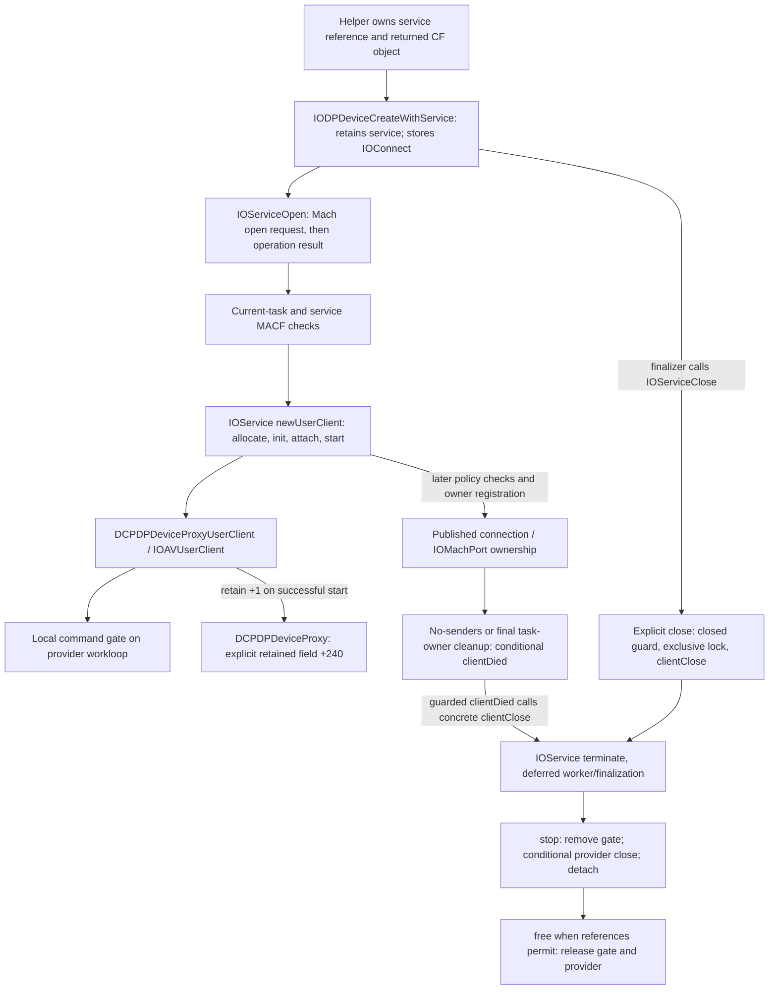

# M2C: DPDV Isolation, Teardown And Open Safety

## Scope

This branch is `research/dpdv-isolation-safety`, based on public-path merge
`dd439c80f7b1190f0e033dcf1a19242de2bd3039`. That normal two-parent merge was pushed
and verified. Both completed research branches and `research-baseline-v0.1` were
retained. No private open, selector, DPCD, I2C request, MST, display-state or
security-setting operation is authorized here. The only dynamic work is the
existing public probe and, later in this milestone, a mock helper.

The global private read gate remains **NOT_READY_FOR_DPCD_TEST**. The public
result remains **PUBLIC_IOFRAMEBUFFER_PATH_UNAVAILABLE** for the recorded M5
topology. Neither finding is reinterpreted as permission for an open-only test.

## Evidence And Target

| Capture | Observation / Provenance |
| --- | --- |
| G6, artifacts/probes/20260912T114320Z/ | One existing public probe through its collector: 40 read-only commands, zero failures. Report SHA-256 `5e33a359afb39d22634b72215f5039e47a1f6c43818e92152e149ac7a4206c32`; manifest `bcfef178b7dda4966e3cb920e412767090723b9028a3812da27e378e5c742476`. |
| R6, artifacts/probes/iodp-static-20260912T115506Z/ | Consolidated current lifecycle/open capture: 212 kernel blocks, 27 IOKit blocks, six PS190 blocks, nine new pinned XNU reference files. Report SHA-256 `8e235935b12579787150b991c1c90db2f618312deab0e58594eb52b1d14843dd`. |
| R7, artifacts/probes/iodp-static-20260912T115605Z/ | AFK local/remote release bodies and five exact caller references; 193 kernel blocks. Report SHA-256 `e52a1db96cad564a3ea0cfebf0884942e8d2139bbc481a8580517b6697077102`. |

`VERIFIED_ON_M5`: G6 still has one active external logical display, raw ID 3,
1920x1080 at 60 Hz, on Apple M5 / Mac17,2 / macOS 26.6.2 (25G83). Freshly observed
External DCPEXT0 / Unit 0 DP device/service IDs are 4294970467 / 4294970463, with
IODPDeviceUserInterfaceSupported / IODPServiceUserInterfaceSupported true. Their
immediate parents are AFKEPInterfaceKextV2 objects. These are observations, not
reusable handles. Active USB-C port 4 reports HPD raw 2 / High, two lanes, raw
LinkRate 4 / HBR3, SinkCount 1 and Tunneled false. No cable cycle was needed.

The kernel UUID remains `447D769E-1CB7-3086-A0B4-32226837B587`, verified equal
between the running kernel and inspected collection. Container SHA-256 is
`b20d50fc8f445a5c578ac63bd974efeb6ae48a97116800301071891795fb26d9`; decompressed
SHA-256 is `f516560c295e10d62c3d219237d23c5900664107b2115dad590eaa259516d05f`.
These match R3/R4. IOKit image UUID is
`12372585-DF92-33EF-B632-714FAA13260A`; AppleFirmwareKit UUID is
`339ECC76-9A70-3F09-A740-09E5C89B1794`. Exact per-function bytes and hashes are in
the ignored reports, not redistributed Apple binaries.

`PRIMARY_SOURCE`: XNU is pinned to
`f6217f891ac0bb64f3d375211650a4c1ff8ca1ea`, also its checked current HEAD. Retained
IOUserClient.cpp and IOService.cpp from S18 are reused. New source includes
[task.c](https://github.com/apple-oss-distributions/xnu/blob/f6217f891ac0bb64f3d375211650a4c1ff8ca1ea/osfmk/kern/task.c),
[thread_act.c](https://github.com/apple-oss-distributions/xnu/blob/f6217f891ac0bb64f3d375211650a4c1ff8ca1ea/osfmk/kern/thread_act.c),
[sched_prim.c](https://github.com/apple-oss-distributions/xnu/blob/f6217f891ac0bb64f3d375211650a4c1ff8ca1ea/osfmk/kern/sched_prim.c),
[iokit_rpc.c](https://github.com/apple-oss-distributions/xnu/blob/f6217f891ac0bb64f3d375211650a4c1ff8ca1ea/osfmk/device/iokit_rpc.c),
ipc_space.c, ipc_right.c, ipc_kobject.c/h and thread.c in the same pinned tree.
Source supports interpretation; it is not asserted to be the exact running build.

The C entrypoint names iokit_task_terminate/is_io_service_close and the
no-senders helper are stripped in this image. Their roles below are **INFERRED**
from exact diagnostic-string references, declared function boundaries, arguments,
decoded vtables and matching source structure. The instructions and addresses
themselves are primary local-image evidence. A failed exact-symbol request was
rejected; it was not silently replaced with a fabricated symbol.

## Concrete Lifecycle

The selected DCPDPDeviceProxyUserClient vtable at `0xfffffe0008311b80` binds
clientClose (primary address-point offset 2336) to IOAVUserClient::clientClose,
clientDied (2344) to IOUserClient::clientDied, free (176) to IOAVUserClient::free,
stop (1528) to IOAVUserClient::stop, terminate (1584) to IOService::terminate,
attach/detach (1696/1704) to IOService, and initWithTask (2320/2328) to IOUserClient.
Bindings use declared collection fixups, not guessed PAC stripping.

The diagram expresses conditional ownership/lifecycle flow, not a synchronous
barrier or proof every arrow completes under firmware failure. The caller owns
its independent IOService reference and returned CF reference. The existing CF
finalizer at `0x18487f0fc` releases nullable same-service AV state, closes the
connection, and releases retained service/controller fields. Ownership is not
transferred by merely copying a registry ID.

Current `IOServiceOpen` at `0x184860ad4` passes no properties and returns the
Mach error if submission failed, otherwise the server's operation result. The
factory path precedes the client-level policy/owner checks. On success, the Mach
connection machinery owns the object while rights/IPC references exist; an exact
total object reference count is not asserted from static code.

`IOAVUserClient::start` at `0xfffffe000a5a3420` obtains the inherited workloop,
creates a command gate (call `0xfffffe000a5cc3e4`), adds it through workloop slot
352, stores dispatch table/count at +224/+232, retains provider at +240, and stores
logging pointer +248. Failure calls stop. `stop` at `0xfffffe000a5a3558` removes
the +216 gate through workloop slot 360 and delegates to its base. `free` at
`0xfffffe000a5a3604` releases +216 and +240, then delegates to IOUserClient::free
at `0xfffffe000c02ea18`. The latter releases mapping/filter/expansion resources;
it is not an AFK transaction-cancellation routine.

IOService::attach/detach and terminatePhase1/terminateWorker are captured at
`0xfffffe000bf9f5a0`, `0xfffffe000bf99334`, `0xfffffe000bfa0f70` and
`0xfffffe000bf9a518`. Termination can defer finalization/stop on arbitration,
workloop progress, child/provider relationships and outstanding IPC. Pinned
actionStop calls client.stop, conditionally provider.close if isOpen(client),
then client.detach. Its ordering is not proof the provider is opened by this
particular zero-selector constructor. Final destruction requires reference
release; neither a port name nor clientClose's success establishes it.

## Explicit Close Versus Process Death

### Explicit Close

The userspace wrapper at `0x184864924` calls the kernel close RPC, then
mach_port_deallocate on its connection send right, and returns the RPC status.
It does not deallocate the right until that call returns.

The current close routine at `0xfffffe000c038688` checks the client type and
shared/closed state. It atomically transitions byte +153 when appropriate,
takes the exclusive lock at +176 (`0xfffffe000b8031ec`), increments IPC count
+156, calls vtable slot 2336, and exits through `0xfffffe000c0303f4` with lock
mode 2. It ignores the virtual close result and returns success on this valid
path. Already-closed calls take a separate logged path. This is not the same
as the base IOUserClient::clientClose, which returns unsupported.

Concrete IOAVUserClient::clientClose at `0xfffffe000a5a3694` calls terminate(0)
and returns zero. Current IOService::terminate at `0xfffffe000bfa0f64` adds raw
option 4 and enters terminatePhase1. The installed SDK's synchronous bit is 2,
not 4; this call does not request that synchronous option. Internal locks can
still block. At `0xfffffe000c0303f4`, decrementing the final IPC count while
inactive can clear deferred-finalization byte +154 and call scheduleFinalize
(`0xfffffe000bf9a30c`) before unlocking. Pending IPC therefore matters even after
termination was requested.

### Connection No-Senders

The candidate at `0xfffffe000c0308c8` supplies raw port type 39 to the helper at
`0xfffffe000c02f7f4`, checks the returned object's IOUserClient type, takes the
same exclusive client lock, calls slot 2344, unlocks, then releases the Mach-port
wrapper. This matches pinned iokit_connect_no_senders. Source iokit_rpc.c
registers that callback for IKOT_IOKIT_CONNECT; the complete live registration
table is not independently attested here.

Pinned IOMachPort::noMoreSenders checks that the notification's make-send count
is current before disabling/removing the wrapper. Stale notifications need not
trigger death. Its client noMoreSenders step removes task-owner list entries;
that is distinct from the later clientDied call. A copied send right, additional
owner, kernel reference or stale notification prevents a simple universal
"one userspace close equals object freed" rule.

### Task Death

The routine at `0xfffffe000c031e4c`, located by the exact "destroying out of band
connect" string, implements phase dispatch and owner cleanup. Current direct
callers include phase 1 at `0xfffffe000b837d70` and `0xfffffe000b83dd2c`, and
phase 2 at `0xfffffe000b83d220`. The latter lies in the declared function at
`0xfffffe000b83d090`, consistent with final task deallocation, not the first
signal-delivery event. Additional reset/exec-related calls are retained without
assuming every caller is SIGKILL.

Pinned task_terminate_internal marks the task inactive, requests thread
termination, invokes IOKit phase 1 and terminates its IPC space. Phase 1 has
driver-task-specific behavior; it is not the ordinary user client's final-owner
cleanup. Pinned task_deallocate_internal calls phase 2 only after final task
references and threads are gone. Phase 2 removes owner links, retains each client
whose owner list becomes empty, conditionally calls clientDied, and releases its
temporary reference. The current phase-2 code has matching owner-list and
shared/closed checks at client offsets +160/+168 and +152/+153.

Current IOUserClient::clientDied at `0xfffffe000c02c0c8` calls slot 2336 only for
a shared instance or successful closed-byte 0-to-1 transition; otherwise it
returns raw `0xe00002d8`. It is **not always invoked**, and an invocation is not
always a new call to clientClose. No-senders and owner teardown must not be
counted as two unconditional close operations.

### Signals, Threads And Rights

Pinned thread_terminate_internal requests an abort and clear_wait with
THREAD_INTERRUPTED for a started thread. Its own comment says kernel execution
continues until an AST boundary. Pinned clear_wait_internal rejects an
interrupted wake of TH_UNINT. A special startup conversion of TH_UNINT is for a
thread that has not started, not an arbitrary blocked driver call. These source
rules support the existing current-image evidence that DCP waits use THREAD_UNINT;
they are not a new live SIGKILL test of DPDV.

| Event | Connection / Client Consequence | Provider / AFK Consequence |
| --- | --- | --- |
| IOServiceClose | Requests guarded clientClose under an exclusive lock; deallocates caller send right after return. Free can be deferred. | No selected direct AFK abort, error synthesis or drain is called by the close body. |
| Normal exit without close | IPC space teardown drops rights when it runs; no-senders and final-owner cleanup are conditional fallback paths. | Not proof an outstanding operation has completed or been cancelled. |
| Crash or unhandled SIGTERM | Leads to task teardown; same lifetime limits, not a guaranteed immediate free. SIGTERM can instead be caught/ignored. | A driver wait/callback can outlive the userspace decision to terminate. |
| SIGKILL | Cannot be caught in userspace; does not establish a finite time to finish uninterruptible kernel work or final task deallocation. | No proof of DCP firmware cancellation or late-reply quiescence. |
| Parent loses helper IPC | Losing a pipe/socket is not losing the helper's IOConnect rights. Helper may still run. | No IOKit or AFK cancellation follows merely from parent communication failure. |

Thus A (connection right gone), B (user client freed), C (provider operation
cancelled), and D (AFK/DCP RPC cancelled) are four separate events. None of B-D
is inferred solely from A or from the parent's waitpid result. The current source
and local bytes do not prove a universally bounded process-death path for a
helper stuck inside a private operation.

## AFK Ownership And Release

The earlier R3/R4 request, callback, tag, buffer and wait findings are retained.
R7 adds the exact command-storage release layer:

- AFKEPCommandLocal::release at `0xfffffe000925ea84` (84 bytes, SHA-256
  `bfab00c4167e888943a87a249e000c4be6713ab32d34f11515758850efd490cc`) conditionally
  passes fields +72 and +80 to transport cleanup at `0xfffffe0009288ec4`, then
  frees the typed command allocation. Its body does not invoke a response
  callback, decrement a visible command refcount, or wake commandSleep.
- AFKEPCommandRemote::release at `0xfffffe000925ed30` invokes a virtual deleting
  destructor. The captured base destructor at `0xfffffe000925ef24` is a return;
  base deleting destructor `0xfffffe000925ef2c` frees the allocation. A derived
  object's override must not be assumed identical to that base implementation.
- Normal handleClientResponse calls local release at `0xfffffe0009283a38`;
  cleanupRemoteContext calls remote/local release at `0xfffffe0009283aac` and
  `0xfffffe0009283ad4`. Enqueue-failure and remote-response callers are also
  captured. These exact branches distinguish release from normal delivery.

| Resource | Established Ownership / Transition | Failure Limit |
| --- | --- | --- |
| Local command/list entry | Enqueue acquires reservation, assigns eight-bit tag, links local command; response matches/removes it and releases storage. Cleanup can release it without response delivery. | Freeing its storage does not complete a waiting DCP caller. |
| Tag/reservation | Interface counter +145 increments during admission; normal release decrements/wakes capacity; cleanup resets it. | Reset is not a demonstrated late-reply generation barrier or firmware cancellation. |
| Callback/block | Normal AFK delivery retains/releases its callback; callback carries a raw pointer to the stack CommandContext. | Retaining a block does not heap-own that stack frame. Late-callback quiescence remains unproved. |
| Reply/request buffers | DCP OSData message is held through synchronous return; command transport fields +72/+80 have explicit release calls. | Firmware/OOL buffer quiescence and all exceptional release effects remain unknown. |
| Provider/service | IOAV client retains provider +240; AFK callback/client and notification paths have their own retained references. | Closing the user client does not force independent provider references to disappear. |
| Endpoint/interface | Notification delivery and AFK work retain endpoint-related objects on observed paths. | Queued work and shared endpoint lifetime need not end with one helper. |
| Waiter | Current DCP stack wait has no local deadline; admission can also wait indefinitely. | No-response paths can retain the stack, message, provider and callback resources. This is a risk, not an observed permanent leak. |

| Outcome | What The Evidence Supports |
| --- | --- |
| Successful completion | Tag-matched response writes status/size, wakes the normal waiter, removes/releases command storage. Completeness failures from RPC-03 still apply. |
| Error response | Normal response/error path can return and release ordinary resources. |
| Synthesized offline response | Notification raw 4 or the recorded conditional report path can synthesize Offline responses through normal delivery. Progress/event arrival is not guaranteed. |
| Endpoint disconnect | Phase/counter conditions, list cleanup and event-source task cleanup occur; neither list removal nor buffer release proves every waiter is woken. |
| User-client close | Inactive admission check limits later gated methods; no direct command-release/drain hook in the selected close body. Already-admitted work remains a separate lifetime. |
| Process death | Owner/right cleanup can run; outstanding IPC and workloop progress can delay client finalization. No per-request cancel proof. |
| Provider termination | Service graph stop/detach and lower endpoint cleanup are conditional lifecycle paths, not universal per-command completion. |
| No response ever | No-op selected abort and deadline-free waits remain. Stranded waiters, retained resources and late callbacks are INFERRED risks; no leak/UAF was dynamically demonstrated. |

## What Close Guarantees

| Question | Current Conclusion |
| --- | --- |
| Stops new command admission? | Current IOAV gated dispatch at `0xfffffe000a5a3788` rejects inactive clients through predicate `0xfffffe000bfb120c`, returning raw 0xe00002c0. This is not retroactive cancellation of already-admitted calls. |
| Waits for current calls? | Exclusive close locking can serialize behind calls using default IPC locking. IPC-exit/finalization also tracks outstanding calls. No universal finite bound. |
| Synthesizes errors or wakes commandSleep? | Not in the selected close/clientClose body. Conditional AFK recovery is a different path. |
| Invalidates all callbacks? | UNKNOWN; no end-to-end callback quiescence proof. |
| Drains AFK queues? | Not established by IOServiceClose. Endpoint cleanup can drop storage without normal completion. |
| Only drops references? | No: it invokes client termination as well as later send-right deallocation. But success does not mean all references were released. |
| Can itself block? | Yes, it enters kernel IPC and takes exclusive/arbitration/workloop locks; no independent deadline is established. |
| Can provider close do power work? | Conditional lower endpoint close paths can assert/deassert power (R4). The worker's provider.close is conditional; reaching that AFK path from this zero-selector client is not proved. |

## Open-Only Operations And Authorization

| Before Any Selector | Classification | Evidence / Limit |
| --- | --- | --- |
| CF allocation, type check, service retain, stored connection | BOOKKEEPING_ONLY | Existing exact constructor/finalizer ABI; no new ABI guessed. |
| Mach open request, user-client allocation/init, attach and publication | LOCAL_KERNEL_STATE | Current public wrapper, factory, init/vtables and outer open. Locks/allocations may fail or wait. |
| Command-gate creation and workloop registration | LOCAL_KERNEL_STATE | Current IOAV start +216, workloop slots 352/360. Shared workloop progress is not bounded here. |
| Explicit provider retain and logging/dispatch setup | BOOKKEEPING_ONLY | Current start +224/+232/+240/+248 and matching free releases. |
| Nullable same-service AV creation | LOCAL_KERNEL_STATE | Existing constructor attempts only the same service. G6 DP node does not advertise IOAVDevice support; no AV sibling substitution. |
| Termination, stop/detach, conditional provider close | POWER/LIFECYCLE | Cleanup can traverse shared lifecycle code. No universal harmlessness or finite completion bound is established. |
| DCP/AFK request before selector | UNKNOWN | No explicit message send in the examined concrete CF/client init/start chain; not a proof about every indirect/shared provider effect. |
| Training, DPCD, HPD, lanes/rate, MST or routing change | UNKNOWN | No such explicit call found in the selected open-only chain. No claim that a live open has been observed harmless. |

No dangerous link transition was demonstrated, but absence of an explicit write
in these bodies is not a completed open/teardown safety contract.

Authorization remains **POLICY_DEPENDENT_UNRESOLVED** (the prior category E).
Current-task equality and service MACF checks precede the factory. The owning task
is passed as security identity; no caller-supplied audit token grants access.
Entitlement, client MACF and filter-policy checks can occur **after** construction
and start. Current outer open `0xfffffe000c037b80` has the same bytes as R5; at
`0xfffffe000c03858c` a failing post-construction path calls clientClose, then
clears termination deferral, releases the client and returns no connection.
Pre-allocation rejection avoids a client; post-allocation rejection relies on
the same unbounded lifecycle and must not be mislabeled as no construction.

No class-local root-only or platform-binary restriction was found in the selected
path. Mandatory/system/sandbox policy and eventual helper identity remain
unresolved; provider support flags are not authorization. R6 codesign display of
the unchanged public probe reports ad-hoc signing, CDHash
`61e874c0d61a4f53533c791d72811e028ccac27a`, no TeamIdentifier and no entitlement data.
That does not attest a future helper's policy. No signing/security change was made.

## Mock Helper Design

The next implementation in this milestone will be a separate, test-only helper
process and parent harness, not a thread and not a runnable DPDV backend. The
production macmst probe will not acquire a private transport. Use posix_spawn
with an exact executable path and fixed scenario arguments, no shell, reset
signal mask/defaults, stdin from /dev/null, and separate stdout/stderr pipes.
Close-on-exec isolation prevents unrelated parent descriptors being inherited.

The response protocol is a fixed 12-byte frame: four-byte ASCII magic M2CM,
version byte 1, operation byte 1 (mock only), two zero reserved bytes, and a
four-byte little-endian mock IOReturn bit pattern. No pointer, shared memory,
target registry ID or private operation selector is transmitted. The parent
preserves raw status bits separately from process exit/signal and captures bounded
stdout/stderr. Extra, missing or malformed response bytes fail closed.

Parent waiting uses a monotonic deadline with nonblocking pipe reads and
waitpid(WNOHANG). A timeout or protocol failure terminates the mock child once,
then observes reaping within a separate bounded grace period. No retry or real
operation follows. If reaping cannot be established, report a distinct fatal
unreaped result, never call an unbounded waitpid, and never claim cancellation.
The mock child's hang is a userspace pause, not an uninterruptible driver wait.

The watchdog bounds **parent-side observation after spawn returns**, not every
OS scheduling/system-call delay, kernel teardown, firmware execution or DCP
cancellation. Tests must demonstrate every mock child is reaped, no parent FD
leaks, one spawn per invocation, and fresh processes for repeated invocations.
Success/failure, crashes/signals, hangs, malformed/oversized responses and early
exit must all be checked before the separate open-only readiness assessment.

## Future Open-Only Command

`macmst experimental dpdv-open-check` remains DESIGN ONLY and is not implemented
or authorized by this report. Any future version must first re-enumerate the
External target, verify DCPEXT0/Unit 0/support flags/active DP/HPD High, then spawn
a one-shot helper which revalidates rather than trusting stale handles. Only the
helper could resolve the minimum creation/open/close symbols. It would perform
one creation/open and ZERO selectors, serialize the raw result, release/close
owned resources and exit. The parent must require both the result and observed
clean helper exit; a result sent before cleanup is not success if cleanup hangs.

No selector 0/1, read, write, MST, retry, Embedded/default/sibling fallback or
link operation is part of that design. Even a favorable later readiness result
would still require a separate explicit prompt before execution.