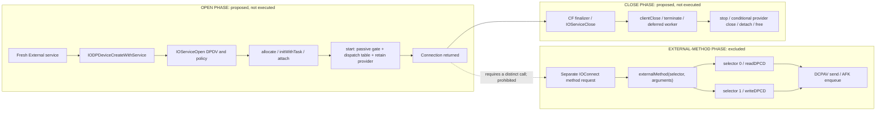
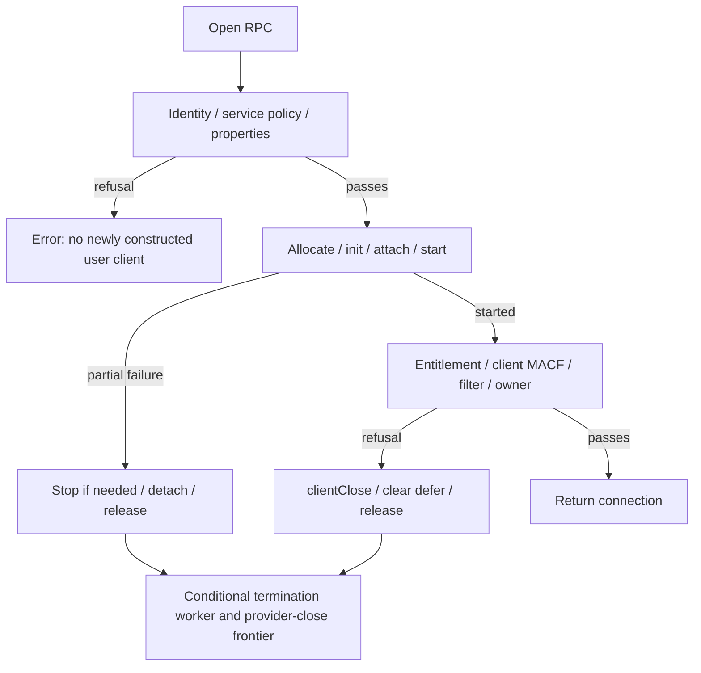

# M2D: Pre-Selector DPDV Open/Close Path

**Result: NOT_READY_FOR_ISOLATED_DPDV_OPEN_CHECK.** This follows from incomplete
pre-selector open/close reachability, not from automatically copying selector-0
cancellation failures into an open-only matrix. The global DPCD gate remains
NOT_READY_FOR_DPCD_TEST.

## Scope And Method

This is STATIC + MOCK ONLY on `research/dpdv-open-path-proof`, based on merge
`a7dc7d647e3e8fccb2e40e5cd56e3f9a8410697b`. The audited M2C branch at
`388e7533cbe311898c42f00ae674e8c0bd2ac5ca` was integrated with `--no-ff`, its exact
tested tree retained, and main pushed/verified. Completed research branches and
the baseline tag were not changed or deleted.

M2D corrects the applicability question, not the evidence from M2C. A zero-selector
client cannot be assumed to have submitted a selector-0 request. Likewise, a
provider reference is not an open, command allocation, power assertion or link
change. Conversely, no direct send in a short start body is not a complete
absence proof if meaningful indirect/lifecycle edges remain unresolved.

The proposed experiment is limited to a fresh External DCPDP device, verified CF
construction, DPDV open/init/start, ZERO external methods, normal close/release,
then helper exit. No such private operation was performed. Production macmst,
the M2C mock helper and their build/test wiring are unchanged in this branch.
The global gate remains **NOT_READY_FOR_DPCD_TEST** regardless of this analysis.



## Current Target And Image

G7 is `artifacts/probes/20260912T124416Z/`: one existing public probe via the
collector, 40 read-only commands, zero failures. Report SHA-256:
`81fda1cb45ded068c327a93586041a785fb641488829032a17b91426df2622ac`.
Manifest SHA-256:
`642c4426757c0d5c764cd956ed59359c22a9d8a10a41d8c4f819804ddc88b2ee`.
Probe SHA-256:
`450832c50446d3a430cbed2bcab7c285cddf5f6b370b2339df2cd0a33aefd89a`.

`VERIFIED_ON_M5`: Apple M5 / Mac17,2 / macOS 26.6.2 (25G83), one active external
logical display (raw ID 3), 1920x1080 at 60 Hz. Fresh External DCPEXT0/Unit 0
device/service IDs are 4294970467/4294970463 with their respective IODP interface
support flags true. USB-C port 4 is active, HPD raw 2/High, LaneCount 2, raw
LinkRate 4/HBR3, SinkCount 1, Tunneled false. The same-service DP node does not
publish IOAVDeviceUserInterfaceSupported. IDs are snapshots, never reusable handles.
The public result remains PUBLIC_IOFRAMEBUFFER_PATH_UNAVAILABLE, with null CG
service and no count/copy request. No cable cycle or state change occurred.

The current collection UUID is `447D769E-1CB7-3086-A0B4-32226837B587`, checked
against the running kernel; container SHA-256 is
`b20d50fc8f445a5c578ac63bd974efeb6ae48a97116800301071891795fb26d9` and decoded
SHA-256 is `f516560c295e10d62c3d219237d23c5900664107b2115dad590eaa259516d05f`.
IOKit UUID is `12372585-DF92-33EF-B632-714FAA13260A`. These are binary identities,
not personal device identifiers. Captures stay ignored; no Apple binary is distributed.

### Static Captures And Source Pins

| Capture | Scope / Report SHA-256 |
| --- | --- |
| R8, artifacts/probes/iodp-static-20260912T131200Z/ | Final current-tool graph: 376 selected kernel blocks plus 377 separately bounded graph bodies, 23 roots, 13 contextual vtable receipts, six selected sink entry points and 184 direct references to __sendMessage. `20a122b56e2daa9ced4ab0de1e4c392aa00e1fa910fc6bbca5681a552b5748ec` |
| U1, artifacts/probes/iodp-static-20260912T125523Z/ | 30 IOKit blocks and cached constructor/CF stub bindings; no kernel graph. `6f6c7ec0aa9930a1e9ff59aefb3183e090373b4257ccf849bd172e22e0144102` |
| L1, artifacts/probes/iodp-static-20260912T130513Z/ | Observed provider ancestry/vtables, open-state functions and generic init; includes AppleDCP and RTBuddy image identities. `2ed386c7ba1d3e1103b0f37f094b898265d7997e7349de61442d0d36fd95ecef` |
| L2, artifacts/probes/iodp-static-20260912T130607Z/ | Exact stop/detach literal references and current guarded actionStop. `2f9a07942834a4b801afbeb892a1c99d12532a4aa41ce62d5b4c22c5ab892b2c` |
| L3, artifacts/probes/iodp-static-20260912T130815Z/ | Observed endpoint getter, gate action store, setup/removal and local wait bodies. `dbed0aca95007e66ae3c1c4550f97e53e3a10d92ee35bb0b6fac26c6e69caf9b` |

The earlier expanded capture at iodp-static-20260912T125235Z contains 19 graph
roots/347 bodies and is preserved with its earlier tool hashes, not rewritten.
R8 uses the final graph/constructor-binding code and records all four tool hashes.
Its complete roots are only the endpoint field getter, handleIsOpen comparison
and passive checkForWork leaf. The remaining 20 roots are incomplete; two retain
proven static send paths inside an excluded selector or conditional provider-close
callback. These are overlapping capture views, not additive unique-function counts.

XNU is pinned to `f6217f891ac0bb64f3d375211650a4c1ff8ca1ea`, rechecked as current
HEAD. Reused S18/S30 files supply IOService, IOUserClient, IOWorkLoop and
IOCommandGate context. Two new files retained under artifacts/sources/m2d are:

- [IOEventSource.cpp](https://github.com/apple-oss-distributions/xnu/blob/f6217f891ac0bb64f3d375211650a4c1ff8ca1ea/iokit/Kernel/IOEventSource.cpp), SHA-256 `933c053484e6c37a0c30c8655b0798def8d0f93dfda06934c1ee9d649747622f`.
- [OSMetaClass.cpp](https://github.com/apple-oss-distributions/xnu/blob/f6217f891ac0bb64f3d375211650a4c1ff8ca1ea/libkern/c%2B%2B/OSMetaClass.cpp), SHA-256 `c751795499d6af2a4b17380bc36253d15b3302832a4de67241d79ed4fb175445`.

Pinned source is PRIMARY_SOURCE for its own revision, not asserted as the exact
running OS source. Runtime class/state assumptions and stripped role names remain
explicitly INFERRED or UNKNOWN even when the current bytes match the source shape.

## Userspace Creation Graph

`PRIMARY_SOURCE`: current instruction bytes and authenticated cache bindings.
The exact constructor is `0x1849047c4`. It checks a nonzero service, calls
IOAVObjectConformsTo for IODPDevice, initializes the CF class once, allocates
48 extra CF bytes, zeros its fields, retains the same service, and opens it with
type `0x44504456` (DPDV). The type is not a selector. Successful open then tries
IOAVDeviceCreateWithService on the SAME service; it does not locate an AV sibling.

| Reachable Local Function / Edge | Classification | Established Behavior / Limit |
| --- | --- | --- |
| IOAVObjectConformsTo, 0x18490510c | IOREGISTRY_READ | Formats the interface-supported key, copies that service property, compares with kCFBooleanTrue, releases temporaries. Absent/false rejects. |
| Once callback to ___IODPDeviceRegister, 0x18487ed5c | PURE/BOOKKEEPING | Constructor explicitly forms/passes this callback. It registers the captured CF class/finalizer, not a selector. The cached pthread_once stub target is known but not matched to an exact export here. |
| _CFRuntimeCreateInstance import at 0x184904834 | PURE/BOOKKEEPING | Stub/slot resolve exactly to current CF export 0x1805425a0. Use of a default allocator is assumed for any future design; arbitrary allocator callbacks are not a proved leaf. |
| IOObjectRetain, 0x184862214 | LOCAL_IOKIT_STATE | Service-reference operation, not provider.open, power or DCP submission. |
| IOServiceOpen, 0x184860ad4 | LOCAL_IOKIT_STATE | Separate Mach open RPC, followed by server operation result; kernel graph below. |
| IOAVDeviceCreateWithService, 0x184905540 | LOCAL_IOKIT_STATE | A second type-0 open exists only after its own IOAVDevice conformance succeeds. For the captured DP node, the absent support flag makes this path return null before its open. A future property change requires revalidation. |
| IOAVDeviceCopyProperty, 0x1848813ec | IOREGISTRY_READ | Tail-calls IORegistryEntryCreateCFProperty on the stored same service; reachable only if the optional AV wrapper exists. No external method call. |
| CFEqual / CFDictionaryGetValue / CFNumberGetValue / CFRelease imports | PURE/BOOKKEEPING | Exact current CF export bindings retained, including nullable property paths. CFRelease can dispatch a type finalizer; the IODP finalizer is separately resolved. |
| ___IODPDeviceFree, 0x18487f0fc | LOCAL_IOKIT_STATE | Null-guarded AV release, connection close, retained service release, cached controller release. The constructor zeros +0x38 and does not call the lazy controller getter. |

Concrete constructor bytes do not invoke IOConnectCallMethod, ReadDPCD,
WriteDPCD, IODPServiceGetDevice or controller lookup. The once callback and CF
finalizer are real indirect edges, resolved from the constructor and registered
CF class rather than ignored. All constructor CF property helpers were statically
bound; the remaining cached pthread target `0x1804fbaec` has no exact export match
in this collection's IOKit/CF export set. A standalone universal pthread dylib
was rejected as a mismatched source of cache base addresses, not used to invent
a binding. This import gap alone is not asserted to be firmware traffic.

## Specific Kernel Open Graph

The outer open routine at `0xfffffe000c037b80` is identified by exact diagnostic
strings, current callsites and pinned XNU structure; its stripped name remains
INFERRED. The provider's actual vtable maps newUserClient to IOService's factory
at `0xfffffe000bf964cc`. The older overload at `0xfffffe000bf964bc` returns
unsupported, allowing the class-property route. The selected class is
DCPDPDeviceProxyUserClient, not the provider itself being restarted.

The current factory tests a user-server field, tries the old overload, copies
IOUserClientClass, allocates by metaclass, verifies IOUserClient inheritance,
then calls initWithTask, attach and start through distinct slots. It returns
the client pointer only after successful start. Failure paths release, or detach
and release, as appropriate. The generic user-server branch and callbacks are
retained in the graph unless their receiver conditions are independently proved.

| Concrete Owner / Function | Address Or Slot | Classification / Decision |
| --- | --- | --- |
| Provider newUserClient | provider slot 1952 -> 0xfffffe000bf964cc | LOCAL_IOKIT_STATE; class-based allocation and lifecycle calls, not selector dispatch. |
| DPDV metaclass allocation/constructor | exact class property and constructor vtable in capture | PURE/BOOKKEEPING; allocation result is a new user client. No claim that all allocator/metaclass internals were proved complete. |
| IOUserClient::initWithTask with dictionary | client slot 2320 -> 0xfffffe000c02c224 | LOCAL_IOKIT_STATE; service init then overload slot 2328. |
| IOUserClient::initWithTask overload | slot 2328 -> 0xfffffe000c02c130 | LOCAL_IOKIT_STATE; reserve/termination deferral, statistics and locks. Slots 1600/1608 are arbitration lock/unlock, not PM calls. |
| IOService::attach | client slot 1696 -> 0xfffffe000bf9f5a0 | LOCAL_IOKIT_STATE; attach in registry plane under arbitration, parent counts and cached provider. It is not provider.open. |
| DCPDPDeviceProxyUserClient::start | slot 1520 -> 0xfffffe000a0214a4 | PURE/BOOKKEEPING; cast provider, supply DP interface at provider+1552 and logging at +136. |
| IODPDeviceUserClient::start | 0xfffffe000a7ac62c | PURE/BOOKKEEPING; store interface +256 and supply six-row method table/count to IOAV start. Stores data, does not call a table entry. |
| IOAVUserClient::start | 0xfffffe000a5a3420 | WORKLOOP/EVENT_SOURCE_SETUP; base start, workloop lookup, new gate +216, add source, store table/count +224/+232, retain provider +240, logging +248. |
| IOService::start | 0xfffffe000bfa25a0 | PURE/BOOKKEEPING; current body returns true. Provider's DCPDP start is a different function and is not this base call. |
| IOAVCommandGate::commandGate | 0xfffffe000a5cc3e4 | WORKLOOP/EVENT_SOURCE_SETUP; metaclass allocation, init(owner, NULL), failure release. |
| IOCommandGate::init | 0xfffffe000bfe7ec0 | WORKLOOP/EVENT_SOURCE_SETUP; delegates to event-source init, statistics bookkeeping. |
| IOEventSource::init / setAction | 0xfffffe000bfe563c / captured slot 352 | WORKLOOP/EVENT_SOURCE_SETUP; stores owner, null action and enabled state, local allocation/statistics. Does not execute the supplied action. |
| IOWorkLoop::addEventSource / _maintRequest | 0xfffffe000bfe398c / 0xfffffe000bfe3d4c | WORKLOOP/EVENT_SOURCE_SETUP; runs its existing control gate to retain/link the new source. Shared workloop control/action callbacks still require context proof. |
| Late open policy / owner registration / Mach publication | outer-open tail and retained M2C paths | LOCAL_IOKIT_STATE; not selector argument marshalling. Registered policy callbacks are a meaningful unresolved graph boundary. |

### Workloop And Gate

G7's observed provider chain is DCPDPDeviceProxy -> AFKEPInterfaceKextV2 ->
AFKEPInterfaceServiceKextV2 -> DCPEndpointV2. Their slot 1720 implementations are
inherited IOService::getWorkLoop until DCPEndpointV2, whose actual vtable points
to AFKEPKextV2::getWorkLoop at `0xfffffe0009279f70`. The earlier RTBuddyService
getter at `0xfffffe000b1fce54` is just a field load, but is not substituted for
the closer observed DCPEndpoint override. Actual dynamic workloop identity and
all shared workloop callbacks are not inferred from the getter's name.

The selected AFKEPKextV2 getter is itself complete: `0xfffffe0009279f70` is a
12-byte body that returns the pointer at +384, without sending a message or
creating a workloop. This resolves the getter, not the dynamic type or prior
activity of the returned shared workloop.

The newly allocated IOAV gate uses IOEventSource::checkForWork at
`0xfffffe000bfe5630`, whose complete 12-byte body returns false. Its initializer
receives action=NULL. Pinned IOWorkLoop source classifies such command gates as
passive and links them to passiveEventChain. That is positive local evidence:
creating this gate does not install externalMethodGated as a background action.
It does not prove there are no other event sources or work on the shared loop.

## Selector Boundary

The separate current IOAVUserClient::externalMethod entry is
`0xfffffe000a5a36e0`. It receives selector in w1 and arguments in x2, stores them
in MethodArgs, checks inactive/gate state, explicitly constructs the callback
address `0xfffffe000a5a3788`, and passes it to gate slot 488 (runAction). That
callback then selects/validates the table row. This callback is not the null
action supplied during gate construction. Table population during start is not
an invocation of selector 0 or 1.

The static positive control readDPCD at `0xfffffe000a020628` has a raw BL at
`0xfffffe000a02074c` (`b5a1ff97`) to `0xfffffe000a008e20` (__sendMessage). This
proves the graph recognizes a real send route in the excluded method phase.
Neither the control nor any other selector was executed. No equivalent direct
read/write/table-entry call is present in the inspected concrete client start
bodies; unresolved generic lifecycle edges prevent promoting that bounded fact
to a complete process-wide absence proof.

## Send-Sink Reachability

Sink inventory is grounded in current function bytes, declared boundaries and
the earlier exact transport bindings, not just names:

| Boundary | Address | Evidence |
| --- | --- | --- |
| DCPAVProxy::__sendMessage | 0xfffffe000a008e20 | Serializes/selects gated DCP RPC paths; direct callers include explicit read/write and provider open/close callbacks. |
| DCPAVProxy::performCommandGated | 0xfffffe000a018f40 | Submits to the selected AFK endpoint and waits for response in RPC-03. |
| AFKEndpointInterface::enqueueCommand | 0xfffffe000926de54 | Concrete adapter path to the selected KextV2 endpoint. |
| AFKEPInterfaceKextV2::enqueueCommand | 0xfffffe0009276a3c | Allocates/queues work and reaches lower admission/submission; callbacks retained in prior evidence. |
| AFKEPInterfaceV2::enqueueCommand | 0xfffffe00092855b4 | Tag/command allocation and send path. |
| AFKEPInterfaceV2::sendMessage | 0xfffffe00092837a8 | Lower transport-facing message send. Its deeper transport callbacks remain a boundary, not a claimed raw AUX instruction. |

Direct-reference capture also records message callers for link starts, I2C and
DPCD operations. They are not all open-phase operations. In particular:

| Root / Condition | Observed Path | Open-Only Interpretation |
| --- | --- | --- |
| Concrete DPDV start | start -> IODP start -> IOAV start -> local gate setup | No selected direct sink found; meaningful indirect/generic graph gaps remain. |
| Outer open / factory | current factory and policy paths | No complete sink-negative graph: policy/metaclass/service-state callbacks and traversal frontiers are retained. |
| Selector-0 read control | 0xfffffe000a02074c -> __sendMessage | Proven static sink path in the excluded external-method phase. |
| DCPAVProxy::open callback | 0xfffffe000a0198e8, send call 0xfffffe000a019984 | A real provider-open message exists. Mere reference retain/registry attach does not invoke this slot. |
| DCPAVProxy::close callback | 0xfffffe000a009bbc, send call 0xfffffe000a009c2c | A real close message exists before the callback delegates to base close. Whether zero-selector teardown reaches provider.close depends on its owner guard. |
| Post-construction denial | outer failure -> clientClose -> termination | Shares the conditional worker/provider-close frontier; cannot label every denial pre-construction or hardware-work-free. |

**Pre-selector result: CALL_GRAPH_INCOMPLETE.** A reachable provider-close sink
inside that callback is not sufficient to claim DCP_MESSAGE_PRESENT for the
specified new zero-selector client. Conversely, no observed sink from the top-level
start roots is not sufficient to claim a complete message-free open/close path.

## Normal Close And Its Guard

The clientClose path remains IOAVUserClient::clientClose -> terminate(0) ->
IOService termination/finalization machinery, then stop/detach/free as references
and workloop progress permit. The worker's source actionStop calls client.stop,
then provider.close(client) only if provider.isOpen(client), then detaches.

Current DCPDP provider slot 1552 is IOService::isOpen at `0xfffffe000bfa2108`,
with handleIsOpen at `0xfffffe000bfa203c`. The latter is a complete 36-byte body:
non-null client tests provider.__owner at +64 against that exact pointer. Base
handleOpen sets __owner; the concrete inspected CF/client init/start path does
not call provider.open or handleOpen. The explicit provider retain at start
does not change __owner. Therefore provider-close traffic is conditional and
must not be reported as inevitable for a fresh zero-selector client.

The current string-located actionStop at `0xfffffe000bf9cb80` confirms the source
order: client.stop at `0xfffffe000bf9cca0`, provider.isOpen(client) at
`0xfffffe000bf9ccd4`, `cbz w0` at `0xfffffe000bf9ccd8` skipping provider.close,
then conditional close at `0xfffffe000bf9cd00` and client.detach. The function
is 600 bytes, SHA-256 `57d4892fa9ecde36a8e9ba0f807ca10e0018835eb0522e3e3928e91a7e33e1aa`.
Its descriptive name is inferred from exact strings and the decoded virtual
slots, not invented as a retained kernel symbol.

The full generic factory/attachment/termination notification graph and concurrent
provider state were not exhausted. The condition cannot yet be promoted to an
unconditional whole-graph exclusion. Callback/port retirement after close also
remains distinct from immediate CFRelease return.

**Zero-selector outstanding-work conclusion: UNKNOWN.** The exact alternative
NO_OUTSTANDING_AFk_WORK_CREATED_BY_OPEN is not asserted without a complete graph,
and OPEN_CREATES_AFk_WORK is not asserted merely because provider-close code can
send. The known selector-created commands are excluded from the proposed helper;
the missing proof concerns possible open/close lifecycle work, not an assumed
selector-0 request.

## Proof Frontier

The bounded graph exports each direct edge's caller, callsite bytes and exact
callee start/hash. Both conditional branches are retained. Unresolved indirect
calls/tails include preceding instructions. Optional vtable receipts verify
slot address/raw bytes/format-8 fixup/target but explicitly retain receiver
context as a separate obligation. Unsupported instructions, unknown function
boundaries and traversal limits prevent complete absence verdicts.

The initial expanded run reached 347 unique function bodies across 19 roots;
many roots hit the conservative 64-node/eight-level limit. This is not a count
of 347 fully resolved functions. It exposes rather than hides missing graph
coverage. Raising that limit does not resolve generic notification callbacks,
allocator/CF callbacks, shared workloop context or registered MACF/filter code.

The meaningful unresolved frontier includes generic service/user-server state,
metaclass/runtime callbacks outside the concrete class bodies, shared workloop
control/action dispatch, termination notification/worker callbacks, and the
provider owner guard across all preceding indirect effects. No source-name
absence search or vtable-pointer match alone closes these obligations. Local
positive exclusions above remain useful even though the overall graph is incomplete.

## Authorization Failure Paths

The current outer open still matches the M2C/M2A byte hash
`29f2834dda56b7192bcfe36c9fd0becd2e0589f6810fe621ca89d96eef368e7c`.
The classification remains POLICY_DEPENDENT_UNRESOLVED. The table distinguishes
where rejection is observed from what happened inside a policy callback. A
service-policy refusal has no newly constructed client to tear down; the policy
engine's own complete call graph is not claimed here.

| Failure Location | Initialization Reached | Gate Registered? | Cleanup And Lifetime | Hardware-Work Conclusion |
| --- | --- | --- | --- | --- |
| Invalid service / missing or non-owning task | Before factory | No | Return error, no new client | No work through a newly created DPDV client. |
| Service-stage MACF rejection | Policy callback, before factory | No | Early error; no new user-client close | No newly created client operation; arbitrary registered policy callback internals are not exhaustively proved. |
| Unsupported open properties | Before factory | No | Early error | Proposed wrapper supplies no properties; rejected branch does not initialize the client. |
| Missing IOUserClientClass / allocation / type check | Factory before init | No | Release temporary allocation if present | No DPDV start or selector; allocator/runtime callback frontier remains explicit. |
| initWithTask failure | Local service/user-client init | No new IOAV gate yet | Release partially initialized client | No observed direct DCP send, not a complete indirect-graph proof. |
| Attach failure | Init completed, attach attempted | No new IOAV gate yet | Release; attach can wait for provider detach/count state | No observed selector work; generic lifecycle state is not fully discharged. |
| Start failure before/addEventSource | Partial local gate setup possible | Possibly | IOAV start may call stop, then factory detaches/releases | Must analyze partially registered gate and shared workloop; not classified as pre-construction refusal. |
| Post-start reserve/default-locking validation failure | Client constructed, attached and started | Yes on successful IOAV start | Current close/release paths; termination may defer | Shares the same zero-selector close proof gap. |
| Required entitlement absent/malformed or task lacks entitlement | Client already started; client-level property checked | Yes | Failure result followed by clientClose, clear defer and release | No selector implied by denial, but no full hardware-work-free cleanup proof. |
| Client-stage MACF rejection | Client already started | Yes | Same post-construction failure tail | Same unresolved lifecycle frontier. |
| Per-client filter resolver rejection | Started client; external callback invoked | Yes | Same cleanup; unsupported resolver status is handled specially as success in source | Actual policy callback/cleanup paths unresolved; no invented permission claim. |
| Owner-registration failure / later publication failure | Started client, owner/port setup attempted | Yes | Reference/port cleanup with possible deferred finalization | Object lifetime can outlive userspace return; outstanding hardware work not established either way. |

The failure tail's virtual call at `0xfffffe000c03858c` is clientClose, not an
external method. It then clears termination deferral, releases the client and
returns no connection. Asynchronous finalization is possible; it is incorrect
to label every denied open either pre-allocation or fully destroyed on return.
No denial was dynamically induced in this milestone.



## Open/Close Wait Inventory

This inventory is restricted to the open and close graphs. It does not assume
that merely including a DPCD method in a dispatch table starts its waits.

| Reachable Operation / Condition | Classification | Evidence And Limit |
| --- | --- | --- |
| CF class initialization / once callback | UNKNOWN | Callback is class registration, but the exact cached pthread import and its full wait path remain unresolved. No firmware wait is established by its name. |
| Allocation, registry/property locks and user-client arbitration | MUTEX/LOCK_ONLY | Current init/factory and pinned source; these are local synchronization operations, not DCP reply waits. Contention has no asserted wall-clock bound. |
| IOService::attach child-count stall | BOUNDED_WAIT | Pinned source establishes one 15-second deadline for detach/count pressure; current attach body is captured. This is a local provider-count wait, not a submitted firmware transaction; other locks are outside that deadline. |
| Provider workloop lookup | ASYNC_NO_WAIT | The final observed endpoint getter returns field +384. Here this classification means no explicit wait or submission, not creation of an async task. |
| Add/remove gate through workloop control gate | MUTEX/LOCK_ONLY | Synchronous gated local list maintenance. Existing shared-loop activity and concrete dispatch context prevent a global progress bound. |
| IOCommandGate::setWorkLoop(nonnull) | ASYNC_NO_WAIT | Current body stores the workloop pointer and returns on the setup branch; no firmware request. |
| IOCommandGate::setWorkLoop(NULL), sleeper bit set | UNKNOWN | Current removal code at 0xfffffe000bfe801c wakes enabled sleepers, calls sleepGate(THREAD_UNINT) and repeats while its sleeper bit remains set. It is a conditional local action-drain wait, not inherently a DCP reply. |
| New gate with no runAction / disabled-wait users | MUTEX/LOCK_ONLY | Null action/passive registration supports no new selector sleepers. Whole-graph proof that no indirect path used this gate is still incomplete; the conditional removal loop is not asserted inevitable. |
| Explicit client close exclusive IPC lock | MUTEX/LOCK_ONLY | Current close locks before clientClose. With zero selectors, a blocked selector-0 reader is not presumed to hold it. |
| Generic terminate/finalize/stop work | UNKNOWN | Local deferred worker/arbitration/notification progress; not demonstrated to await a request created by this open, and not fully bounded. |
| Conditional provider-close RPC path | UNKNOWN | DCP send exists if provider.close is reached. Its message flags and full synchronous/asynchronous effects must be resolved before assigning a firmware-wait guarantee to zero-selector close. |

No UNBOUNDED_EXTERNAL_WAIT has been positively demonstrated from the specified
new-client open/start path. That is **not** a proved absence: the shared workloop,
generic lifecycle and conditional provider-close frontiers remain. RPC-03's
selector-0 no-deadline wait and no-op abort remain valid for DPCD, but are not
used as direct evidence that open-only invokes that wait.

## Side-Effect Inventory

| Potential Effect | Reachability State | Open-Only Evidence |
| --- | --- | --- |
| Service property reads and public reference handling | REACHED_BUT_LOCAL_ONLY | Exact constructor/conformance and retain/release path. |
| CF/kernel object allocation and registry attachment | REACHED_BUT_LOCAL_ONLY | Concrete factory/init/attach path; this is not provider.open. |
| New command gate, workloop registration and provider retain | REACHED_BUT_LOCAL_ONLY | Passive gate/null action and explicit provider retain established in the concrete client path. Shared workloop implementation details remain a graph gap. |
| Controller lookup and AV sibling substitution | NOT_REACHED | Constructor zeros the cached controller; no lazy getter or sibling lookup is called. |
| Same-service AV type-0 open | NOT_REACHED | Conditional on captured absent IOAVDevice support. This is a snapshot-conditioned exclusion, not proof that the property cannot change while a future open runs. |
| Provider DCPAVProxy::open/close RPC | UNKNOWN | Real send callbacks exist; open-only reachability depends on the owner guard and preceding unresolved effects. |
| HPD manipulation, training, DPCD/AUX access | UNKNOWN | No such call in the proved local prefix, but a complete negative graph is not available. No executed hardware observation. |
| Lane count, link rate, sink/DCP display power | UNKNOWN | Provider retain is not a power request; possible lifecycle message effects are not decoded as harmless. |
| MST enable/payload tables, DSC, stream allocation | UNKNOWN | No explicit operation reached in the concrete local prefix; opaque/generic graph gaps prohibit an end-to-end absence claim. |
| Display routing, framebuffer assignment, mode setting | UNKNOWN | No direct open/start call identified; no state change performed. |

The actual provider open/close functions have AFK/DCP_MESSAGE behavior when
called. That fact is not assigned to the proposed open-only root without its
path conditions. No path from that root is classified REACHED_AND_HARDWARE_RELEVANT
unless that condition is proved. Pure retains/releases and local gate setup are
not relabeled as hardware commands merely because they use an AFK-owned workloop.

## Process-Death Relevance

| Concern | Experiment-Specific Conclusion |
| --- | --- |
| Kernel object/resource cleanup after abnormal helper death | UNKNOWN, SUPPORTING operational concern: M2C's conditional rights/owner/finalization analysis remains. A possible retained object is not itself a DP transaction. |
| External hardware cleanup after abnormal helper death | UNKNOWN: absence of open-created external work has not been fully proved, so no-cancellation-needed cannot yet be certified. |
| Outstanding selector-command teardown | UNKNOWN_APPLICABILITY, not an automatic open-only failure. The design invokes zero selectors and the new gate has no stored selector action, but complete absence of pre-selector AFK work is not proved. |
| Selector callback quiescence | UNKNOWN_APPLICABILITY for the same reason. Do not mark PASS or NOT_APPLICABLE_TO_OPEN_ONLY merely from the zero-selector intention. |
| AFK ownership safety from M2C | APPLICABLE to any actually submitted command; UNKNOWN_APPLICABILITY to this new zero-selector client's open/close until the graph is closed. |

If complete analysis establishes no external command exists, selector-command
cancellation may become NOT_APPLICABLE_TO_OPEN_ONLY and abnormal resource cleanup
can remain a documented supporting risk under the user's one-shot/normal-close/
abort-after-failure conditions. Those are conditional future conclusions, not
evidence obtained here. Killing a helper is still not proof of firmware cancellation.

## Gate Applicability Matrix

This matrix supersedes M2C's flat matrix for the proposed **open-only** experiment;
M2C's report remains historical. CRITICAL gates must support the experiment's
safety claim. SUPPORTING gates record distinct operational evidence. UNKNOWN
applicability is an unproved relationship, not an automatic FAIL or waiver.
NOT_APPLICABLE requires positive exclusion proof; none of the unresolved
selector/AFK risks receives that label here.

PASS is scoped to its evidence, not a successful private call. FAIL on graph
completeness means this proof is incomplete, not that opening is known to fail
or change link state. Local leaf proofs do not fill whole-graph gaps.

| Gate | Applicability | State | Evidence |
| --- | --- | --- | --- |
| External target selection | CRITICAL | PASS | G7: one active External DCPEXT0/Unit 0 target, support flags, active DP and HPD High. |
| User-client creation ABI | CRITICAL | PASS | Exact CF/DPDV ABI, current factory/client vtables and constructor import receipts. |
| Open call graph completeness | CRITICAL | FAIL | R8 retains indirect/receiver gaps, non-exhausted lifecycle callbacks and traversal limits; only three local roots are complete. |
| Pre-selector DCP/AFK traffic | CRITICAL | UNKNOWN | No direct send in the proved start prefix; conditional provider sends and unclosed generic paths prevent a zero-traffic proof. |
| Pre-selector display-link effects | CRITICAL | UNKNOWN | Retains/gate setup are local; full link/power reachability is not closed. |
| Authorization pre-construction failure | CRITICAL | PASS | Known early exits precede newUserClient: no new client/gate to cancel. This does not attest every registered policy callback's internals. |
| Authorization post-construction failure | CRITICAL | UNKNOWN | Started client/gate can exist; failure close shares the unresolved hardware-work frontier. |
| Normal close behavior | CRITICAL | UNKNOWN | Current owner guard known; exclusion of conditional provider-close RPC across the full graph is not proved. |
| Open-only external waits | CRITICAL | UNKNOWN | No external wait positively attributed to the new open prefix; shared workloop/lifecycle/conditional close paths remain unresolved. Not inherited from selector 0. |
| Process-death kernel cleanup | SUPPORTING | UNKNOWN | Separate retained-object/resource risk, not proof of a hardware transaction. |
| Process-death hardware cleanup | CRITICAL | UNKNOWN | Cannot yet establish no open-created external command exists to cancel; resource uncertainty is not its substitute. |
| Outstanding selector-command teardown | UNKNOWN | UNKNOWN | UNKNOWN_APPLICABILITY: zero selectors intended and gate passive, but complete open-created AFK-work absence not proved. Not an automatic failure. |
| Selector callback quiescence | UNKNOWN | UNKNOWN | UNKNOWN_APPLICABILITY: initialization differs from selector dispatch; complete exclusion of applicable callbacks remains missing. Not marked PASS. |
| Parent watchdog | CRITICAL | PASS | Unchanged M2C mock runner bounds post-spawn parent observation, not firmware cancellation or arbitrary OS scheduling. |
| Helper reaping | SUPPORTING | PASS | Unchanged mock reaping/ownership tests; no real kernel-blocked helper is claimed reaped. |
| No selector invocation | CRITICAL | PASS | Static/mock-only milestone; method entry is distinct, real backend absent, CLI/import guards preserved. A future backend must enforce the same boundary. |
| No DPCD/write/MST | CRITICAL | PASS | No private transport invoked or added; original capabilities and DPCD states unchanged. |

Counts: 13 CRITICAL, two SUPPORTING, two UNKNOWN-applicability; seven PASS,
one FAIL, nine UNKNOWN. Removing both selector-specific rows entirely would
still leave independent critical graph, traffic, close, failure-cleanup, effect
and wait gaps. They are not the reason this open-only proof remains incomplete.

**Open-check result: NOT_READY_FOR_ISOLATED_DPDV_OPEN_CHECK.**

**Global gate: NOT_READY_FOR_DPCD_TEST.** Its original 13 states remain unchanged.

## Reproduction And Tool Limits

The graph validates raw function hashes, declared starts and sink boundaries;
follows B/BL and both conditional outcomes; and records indirect transfer context.
Vtable receipts reject ambiguous slots, mismatched bytes/addresses and unsupported
formats but do not prove receiver identity. Limits are 64 nodes/eight levels per
root and 512 stored graph bodies; reaching a limit is an explicit proof gap.
BC.cond is tested with B.cond's signed imm19 target semantics, alongside CB/TB.
This is a targeted collector, not a general decompiler. Generic callbacks and
undecoded code are never silently declared bookkeeping leaves.

R8 contains the exact CLI selections, images and four tool-source hashes. The
following standalone recipe reproduces that selection into a new output directory
without needing R8 itself. It requires the public G7 baseline and pinned source
files above; a fresh clone must first obtain those sources and use its own public
baseline directory from the existing collector. The kernel UUID must match.
This invokes only the static collector, never captured code or a private client.

```sh
python3 - artifacts/probes/20260912T124416Z <<'PY'
import subprocess
import sys

expected_uuid = '447D769E-1CB7-3086-A0B4-32226837B587'
running_uuid = subprocess.check_output(['sysctl', '-n', 'kern.uuid'], text=True)
if running_uuid.strip().upper() != expected_uuid:
  raise SystemExit('Kernel UUID mismatch: do not reuse this selection')
arguments = [sys.executable, 'tools/inspect_iodp.py', '--baseline', sys.argv[1],
       '--server', '--kernel-lifecycle', '--reference-root', 'artifacts/sources/m2d',
       '--kernel-image', 'com.apple.driver.AppleDCP',
       '--kernel-callers-of', '__ZNK10DCPAVProxy13__sendMessageEPN8DCPAVIPC7MessageE']
symbols = (
  '__ZN10DCPAVProxy11handleCloseEP9IOServicej',
  '__ZN10DCPAVProxy4openEP9IOServicejPv',
  '__ZN10DCPAVProxy5closeEP9IOServicej',
  '____ZN10DCPAVProxy4openEP9IOServicejPv_block_invoke',
  '____ZN10DCPAVProxy5closeEP9IOServicej_block_invoke',
)
vtables = (
  '__ZTV10IOWorkLoop', '__ZTV12IOUserClient', '__ZTV13DCPEndpointV2',
  '__ZTV13IOCommandGate', '__ZTV15IOAVCommandGate', '__ZTV16DCPDPDeviceProxy',
  '__ZTV20AFKEPInterfaceKextV2', '__ZTV26DCPDPDeviceProxyUserClient',
  '__ZTV27AFKEPInterfaceServiceKextV2', '__ZTV9IOService',
  '__ZTVN15IOAVCommandGate9MetaClassE',
)
roots = (
  '0xfffffe0009279f70', '0xfffffe000a009bbc', '0xfffffe000a009de8',
  '0xfffffe000a020628', '0xfffffe000a0214a4', '0xfffffe000a5a3420',
  '0xfffffe000a5a3558', '0xfffffe000a5a3604', '0xfffffe000a5a3694',
  '0xfffffe000a5cc3e4', '0xfffffe000bf964cc', '0xfffffe000bf9a518',
  '0xfffffe000bf9cb80', '0xfffffe000bfa203c', '0xfffffe000bfe398c',
  '0xfffffe000bfe3d4c', '0xfffffe000bfe5568', '0xfffffe000bfe5630',
  '0xfffffe000bfe801c', '0xfffffe000c02c130', '0xfffffe000c02c224',
  '0xfffffe000c037b80', '0xfffffe000c038688',
)
sinks = (
  '0xfffffe000926de54', '0xfffffe0009276a3c', '0xfffffe00092837a8',
  '0xfffffe00092855b4', '0xfffffe000a008e20', '0xfffffe000a018f40',
)
strings = ('%s[0x%qx]::detach(%s[0x%qx])\n', '%s[0x%qx]::stop(%s[0x%qx])\n')
for flag, values in (('--kernel-symbol', symbols), ('--kernel-vtable', vtables),
           ('--kernel-graph-root', roots), ('--kernel-graph-sink', sinks),
           ('--kernel-string', strings)):
  for value in values:
    arguments.extend((flag, value))
virtual_edges = (
  ('0xfffffe000a5a3464', '__ZTV9IOService', 1520),
  ('0xfffffe000a5a3490', '__ZTV26DCPDPDeviceProxyUserClient', 1720),
  ('0xfffffe000a5a34d4', '__ZTV10IOWorkLoop', 352),
  ('0xfffffe000a5a3504', '__ZTV16DCPDPDeviceProxy', 32),
  ('0xfffffe000a5a354c', '__ZTV26DCPDPDeviceProxyUserClient', 1528),
  ('0xfffffe000a5a36c4', '__ZTV26DCPDPDeviceProxyUserClient', 1584),
  ('0xfffffe000a5cc418', '__ZTVN15IOAVCommandGate9MetaClassE', 168),
  ('0xfffffe000a5cc450', '__ZTV15IOAVCommandGate', 472),
  ('0xfffffe000a5cc474', '__ZTV15IOAVCommandGate', 40),
  ('0xfffffe000bf9cca0', '__ZTV26DCPDPDeviceProxyUserClient', 1528),
  ('0xfffffe000bf9ccd4', '__ZTV16DCPDPDeviceProxy', 1552),
  ('0xfffffe000bf9cd00', '__ZTV16DCPDPDeviceProxy', 1544),
  ('0xfffffe000bfe5680', '__ZTV15IOAVCommandGate', 352),
)
for callsite, vtable, offset in virtual_edges:
  arguments.extend(('--kernel-graph-vtable-edge', callsite, vtable, str(offset)))
subprocess.run(arguments, check=True)
PY
```

Never transplant addresses or registry IDs to another build. Earlier captures
retain their own tool hashes; they are not retroactively assigned the final
parser revision. A selected sink ends traversal at its validated entry boundary,
not at the end of its implementation; a sink count is not a dynamic invocation.

## Validation

Final checks on 2026-09-12, after the R8 tooling changes:

| Command / Check | Result And Scope |
| --- | --- |
| `cmake --build build` | PASS, strict warning/error configuration; production and mock sources unchanged. |
| `ctest --test-dir build -L unit --output-on-failure` | PASS, 8/8 entries including mock isolation and CLI/import guards. |
| `ctest --test-dir build -L hardware --output-on-failure` | PASS, 1/1 existing public-only probe regression. Not a DPDV open. |
| `cmake --build build-sanitized` | PASS, existing ASan/UBSan configuration. |
| `ctest --test-dir build-sanitized -L unit --output-on-failure` | PASS, 8/8 entries, including mock isolation. |
| `python3 -m unittest discover -s tests -p 'test_iodp_static.py' -v` | PASS, 48 methods including direct/conditional/sink/indirect/boundary/limit/vtable/CLI graph cases. |
| Standalone replay, subprocess calls mocked | PASS: every selection equals R8; mismatched kernel UUID aborts before collection. No extra capture. |
| Documentation and preservation checks | PASS: links, anchors, fences, all 17 matrix rows/counts, unique ledger IDs, editor diagnostics and whitespace; prior evidence rows and primary reports preserved. |

No new helper state or architecture change was needed: the new finding concerns
which work can be created before a selector, not a new helper protocol behavior.
The unchanged 13-scenario mock matrix covers success, reported failure, crash,
SIGTERM/SIGKILL, hang, malformed response, early exit, oversized response, valid
response followed by cleanup hang, closed pipes, stderr flood and bad final exit.
It also tests five fresh repeated helpers, spawn/input failures, descriptor/
environment/signal boundaries and lost wait ownership. Each suite creates 20
children: 19 explicit reaps and one deliberately auto-reaped ECHILD case; the
ownership failure is not reported as successful cancellation. The mock entry
took 3.85 seconds in the strict suite and 4.55 seconds in the sanitizer suite.
These are regression results, not real kernel-blocked-helper or DCP evidence.

G7's manifest SHA-256 remains
`642c4426757c0d5c764cd956ed59359c22a9d8a10a41d8c4f819804ddc88b2ee`.
Its 27 artifact hashes, 40 successful recorded commands and ten core/capture
source hashes were rechecked. The rebuilt public probe still has SHA-256
`450832c50446d3a430cbed2bcab7c285cddf5f6b370b2339df2cd0a33aefd89a`,
matching G7; no older signing record is assigned to a different executable.

All 376 selected R8 kernel blocks and 377 graph body hashes/ranges were checked;
the graph bodies contain 49,291 contiguous four-byte instructions. The running
kernel UUID still matches R8. All five report hashes in the provenance table
and 25 retained XNU source hashes/local Git blob IDs (14 reused RPC-03, nine M2C,
two M2D) were verified. The two new Git blob IDs were recomputed locally; no
independent GitHub blob comparison for S34 is claimed.

| R8 Tool Source | SHA-256 |
| --- | --- |
| [inspect_iodp.py](../../tools/inspect_iodp.py) | `2cee42de18934fe2e0457de92e5616cfc4b7ac91f6dfa076a228f99994786a28` |
| [kernel_image.py](../../tools/kernel_image.py) | `cee357fc7323a35f662b8a9cafbc130bfc80003c01b8bd7c6d14a96e926d34b6` |
| [dyld_cache.py](../../tools/dyld_cache.py) | `973a7e27492810291378018e75974050f5b5b35dd4bda7cc146e0697133e5fa7` |
| [call_graph.py](../../tools/call_graph.py) | `6a36c2f085eb855ba26df5b0b306f073c719b40a255b4070ecb81fd4fe694998` |

All four hashes match the final working sources. Build/mock success does not
prove the incomplete open/close graph, zero firmware traffic or hardware cleanup.
No production transport, experimental CLI, helper backend, dependency or security
setting was added or changed by M2D.

## Next Work

Stage 17's READY prerequisite is unmet. No new real open-check experiment or
backend is designed for execution here. Resolve the generic lifecycle/shared-
workloop callbacks and owner-guard invariant, then reassess UNKNOWN applicability.
A later separately approved design would require normal cleanup before success,
one-shot zero-selector execution, abort after abnormal exit, and public pre/post
display/path/HPD/link-rate/lane/mode comparisons. These are future review
constraints, not authorization or a substitute for the missing proof. No DPDV
open, selector, DPCD, AUX, I2C request, MST, firmware/security or display-state
change occurred here.