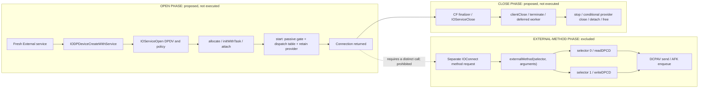
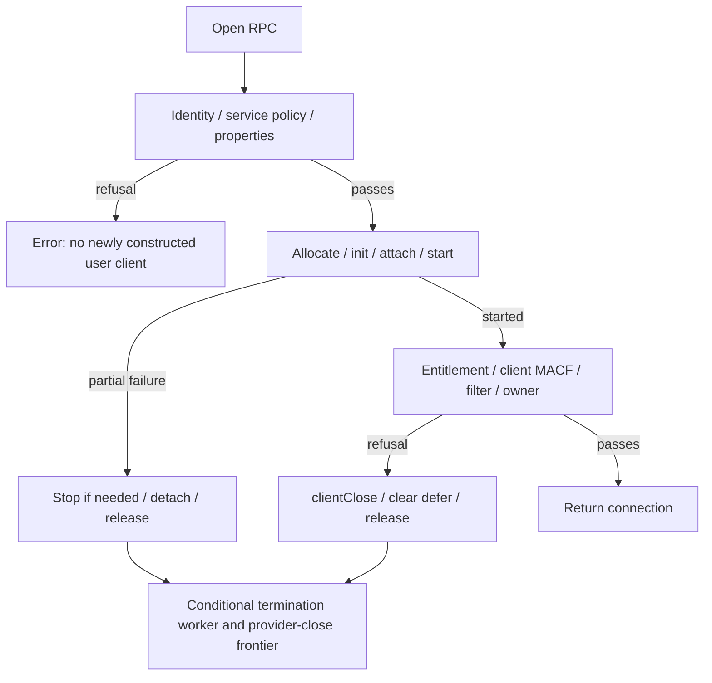

# M2E: Experiment-Specific DPDV Open/Close Proof

## M2E.1 Runtime userServer Discriminator

This follow-up concerns only the selected External provider's
`service->reserved->uvars->userServer` state and direct consequences. M2D/M2E
findings below remain historical evidence; no private open or transport call is
authorized. M2E was integrated with `--no-ff` as
`ce28518eb301592ed6dd3d2b75d152b1a8e54970`; this work is on
`research/dpdv-userserver-discriminator` from that base.

G9 is artifacts/probes/20260912T143703Z: one existing public collector run,
40 commands, zero failures. It selects one External Unit 0 DCPDP device/service
under RTBuddy(DCPEXT0), with supported interfaces, an active display path and HPD
High. Device/service IDs 4294970467/4294970463 are freshly observed snapshot
identifiers, not reused handles. Raw lanes=2 and LinkRate=4 retain Apple's HBR3
description; the public result remains PUBLIC_IOFRAMEBUFFER_PATH_UNAVAILABLE.
Report SHA-256 is
`746dcd2d2faa16f4e48a74c2e5364c01c81ebfe92f4be80430c8e208a82f6c32`;
manifest SHA-256 is
`8cc1e1b265a7aead767fa6bf2e8995a09caafc01384ab0ea36d4e715343c27e1`.

**Runtime discriminator: USER_SERVER_RUNTIME_STATE_UNRESOLVED.** No tested public
observable is equivalent to the private field's value. Native implementation and
matching provenance are verified; a null userServer is not. Static expansion stops
at this discriminator, without reopening the earlier open/close graph.

### Field Layout And Lifetime

The concrete service is DCPDPDeviceProxy, inheriting DCPAVProxy/IOService state.
The first `reserved` below is IOService's ExpansionData pointer, not a similarly
named IORegistryEntry or subclass expansion field. Current arm64e loads/stores
cross-check the layout independently of source structure packing.

| Field | Current Offset | Pinned Source Evidence | Current-Image Evidence | Confidence |
| --- | --- | --- | --- | --- |
| IOService::reserved | service +40 bytes | IOService.h, IOService::ExpansionData and reserved member; IOService.cpp init overloads | Factory load 0xfffffe000bf96508; dictionary init store 0xfffffe000bfa98dc; writer load 0xfffffe000c0619c4 | High, exact current offsets; live contents unobserved. |
| ExpansionData::uvars | expansion +40 bytes | IOService.h, OSObjectUserVars* uvars | Factory load 0xfffffe000bf96510; publication 0xfffffe000c0619c8, raw `001500f9` | High, independent load/store agreement. |
| OSObjectUserVars::userServer | uvars +0 bytes | IOUserServer.h, first member IOUserServer* | Factory load 0xfffffe000bf96518; assignment 0xfffffe000c0619cc, raw `150000f9` | High, source type and current bytes agree; no runtime pointer read. |
| Retained IOUserServer reference | pointer at uvars +0 | serviceAttach retains this after assignment; serviceFree releases/nulls it | Retain virtual call 0xfffffe000c0619f4; free loads at 0xfffffe000c066bb0 and releases at 0xfffffe000c066bd0 | Explicit ownership transitions, not a class/provenance inference. |
| Nulling userServer | uvars +0 | OSSafeReleaseNULL(uvars->userServer) | 0xfffffe000c066bd4, raw `9f0200f9`, STR XZR,[X20] | High, current explicit clear. |
| Erasing uvars before freeing allocation | expansion +40 | IOFreeType uses os_ptr_load_and_erase | 0xfffffe000c066c3c, raw `1f1500f9`, STR XZR,[X8,#40] | High, current explicit clear before free. |

IOMallocType's pinned contract returns zeroed memory. IOService init allocates
ExpansionData if absent, so uvars begins null on that initialization route.
serviceAttach allocates zeroed OSObjectUserVars, publishes it, stores this as
userServer, then retains the server. Publication is not atomic with the later
registry markers. serviceStop does not clear this pointer; it can outlive the
server's active-service membership. serviceFree ends that lifetime by clearing
the retained reference and erasing/freeing the uvars allocation. Native object
initialization is not itself a non-null user-server attachment.

### Writer Set

**WRITER_SET_INCOMPLETE.** The complete pinned source archive supplies one named
non-null writer of this particular field and its explicit clearing path. That is
not promoted to a complete typed writer proof for the different running binary.

The writer-only search covers all 5,698 regular files in the pinned archive,
including hidden/ignored files; there are no archive symlinks. Its three identifier
queries find 263 lines in six files: IOService.h, IOUserServer.h, IOService.cpp,
IOServicePM.cpp, IOUserClient.cpp and IOUserServer.cpp. Definitions, aliases from
varsForObject, constructors, RPC/object-instantiation code and the matched uses
were examined for this field. No additional named non-null store, restoration or
whole-uvars replacement was identified in that source set.

| Mutation / Related Operation | Source And Current Evidence | Scope |
| --- | --- | --- |
| Initial zeroed ExpansionData | IOService init overloads / IOMallocType; current dictionary init 0xfffffe000bfa9890 | Initializes the chain's uvars to null, not an established live-instance invariant forever. |
| W1: serviceAttach | service->reserved->uvars = vars; vars->userServer = this. Current body 0xfffffe000c061954, 2,400 bytes, SHA-256 `73d77df848da78cc35d5c32b64793eb1e566f53b3d62a1065cd6832210963e34` | One identified non-null writer; also replaces the uvars pointer. |
| C1: serviceFree | Releases/nulls userServer, erases/frees uvars. Current body 0xfffffe000c066a18, 640 bytes, SHA-256 `1b6ffdba8c3d8edd094a20f911a12052604b7f5a34f4ecfb2bcec6864cee76ed` | Identified clear/reset and allocation-lifetime end. |
| serviceStop | Removes service membership and marks stopped without clearing userServer. Current body 0xfffffe000c052a5c, 2,140 bytes, SHA-256 `454fca0cd5bd02b382358888d5824fab3e811fb409baa4566f5f8e6db075a42d` | Observable removal is not pointer clearing. |
| IODispatchQueue, OSAction, IOEventLink and IOWorkGroup assignments | Separate ivars->userServer fields in IOUserServer.cpp; queue copies from the service, OSAction's assignment is on a non-IOService target | Not additional writers to IOService::reserved->uvars->userServer. |
| varsForObject / object instantiation | Returns a service's uvars alias; inspected uses populate userMeta/queue state and inspect server identity | No additional named userServer store found; alias analysis is not claimed globally complete. |

A separate current-image scan inspected 376 fileset __text sections, totaling
58,438,640 bytes, for direct B/BL references to W1 and C1. It found exactly:

| Caller | Callsite / Raw Instruction | Target | Interpretation |
| --- | --- | --- | --- |
| IOService::startCandidate, 0xfffffe000bfa5718 | 0xfffffe000bfa5ef0 / `99ee0294` | W1 0xfffffe000c061954 | Matching/start route after obtaining a user server. |
| Source-correlated IOService::Create_Impl, 0xfffffe000c063d58 | 0xfffffe000c064130 / `09f6ff97` | W1 0xfffffe000c061954 | Child-service creation using an existing provider's server. |
| IOService::free, 0xfffffe000bfa98f8 | 0xfffffe000bfa99fc / `07f40294` | C1 0xfffffe000c066a18 | Conditional user-server cleanup before base resource destruction. |

This scan traverses no call graph. It does not enumerate indirect calls or prove
that every raw store at offset zero belongs to this type. Such stores are common
to unrelated objects, and aliased/pointer-copy writes cannot be excluded solely
by matching offsets or named symbols. Proprietary/current-image code is not fully
represented by the pinned XNU source. These specific limits preclude
SOLE_WRITER_PROVEN; unrelated fields do not justify MULTIPLE_WRITERS either.

### serviceAttach Contract

The identified writer receives an IOUserServer `this`, an IOService `service`,
and a provider used for diagnostics. Its source/current prefix imposes no
DCPDPDeviceProxy class exclusion. The direct callers impose their own conditions.
It allocates and publishes uvars, assigns/retains the server, allocates the uvars
lock, and saves originalProperties. Under the server's fLock, a service not yet
in fServices is added, its registry ID is added to the server's IOAssociatedServices,
and an IOUserClasses array is set on the service. It can optionally rename the
service from IOUserClass and load module metadata if the relevant fields exist.
Those optional paths were inspected statically, never invoked.

Crucially, the pointer stores precede marker publication. IOUserClasses and
IOAssociatedServices updates are inside the new-membership branch, and their
setProperty return values are not converted into a rollback of the pointer.
The function's success result therefore is not an atomic pointer/marker contract.
It also does not attach the service beneath an IOUserServer in a registry plane;
the server relationship is retained state and bookkeeping, not a mandatory parent.

The pinned serviceStop counterexample is concrete: it removes the service's ID
from IOAssociatedServices and sets stopped, but leaves userServer non-null until
serviceFree. Generic IORegistryEntry::removeProperty removes a dictionary entry
under the property lock without touching uvars. Making a collection immutable
does not make its containing property key undeletable. No special lifetime rule
for these marker keys was established. No property-setting/removal API was called.

### Mandatory Observable Tests

No candidate met MANDATORY_EQUIVALENT. The required implication is pointer
non-null -> observable present for the entire relevant lifetime, not merely
"successful publication usually records a marker". A marker on a different
object and a nullable/failed read are not treated as a pointer measurement.

| Candidate | Classification | Contract / Lifetime Test | Exact Public Observation |
| --- | --- | --- | --- |
| IOUserClasses on the selected service | ONE_WAY_ONLY | A successful new-membership publication sets an array, but after the pointer store; no atomicity, checked publication success or protected-key lifetime. This is a publication implication, not an equivalent live-state predicate. | Name absent from all 17 returned provider property names. |
| Selected ID in IOUserServer::IOAssociatedServices | NON_DIAGNOSTIC | Stored on another object after assignment; serviceStop removes the ID before userServer is cleared. | Four visible servers expose arrays; none contains the selected ID. |
| IOUserServerName / IOUserClass / DriverKit personality markers | NON_DIAGNOSTIC | Server-name matching is one caller condition, not an unconditional write by serviceAttach; Create copies optional metadata from an existing server. Keys are not a read of uvars. | Absent on the selected provider; native matching fields present. |
| IOClass / MetaClass bundle / IOMatchedAtBoot / personality publisher | NON_DIAGNOSTIC | Establishes implementation and matching provenance; generic serviceAttach/Create accepts IOService subclasses and does not encode a null-userServer theorem. | DCPDPDeviceProxy, native kernel bundle, boot-matched true, matching native publisher. |
| IOService parent / registry-plane membership | NON_DIAGNOSTIC | serviceAttach does not require an IOUserServer parent or special plane; it records an internal server reference and service list. | Expected native ancestry; only IOService membership among eight reported planes; no provider children. |
| A publicly visible server/process responsible for this instance | UNKNOWN | Matching enumerates exposed services, not every retained private reference or unpublished/stopped server. Lack of a correlated server is not a null test. | No public association to the selected ID; no responsible process identity can be attributed. |

IORegistryEntry::serializeProperties snapshots the property table, not arbitrary
private fields. Successful copies establish the public names/allowed values that
were observed, not a synthesized hasUserServer result. The source's hasUserServer
call in IOUserClient property handling is a setter path, not an available public
getter; it was not exercised. No marker absence is promoted to USER_SERVER_NULL_PROVEN.

### Public Instance And Driver Provenance

U10 is artifacts/probes/userserver-20260912T144907Z/userserver.json. It uses public
IOService matching, registry property/path/ID/relationship reads, plane membership
and IOObjectCopyClass/CopySuperclassForClass/CopyBundleIdentifierForClass. All 85
recorded IOKit IOReturns are raw 0 / 0x00000000. The class-copy APIs return nullable
CF objects rather than IOReturns; null is not fabricated as a success status.
Snapshots are explicitly non-atomic and reject a changed/ambiguous G9 target.

The selected provider's complete property-name list is:

```text
BranchDeviceID BranchIEEEOUI CFBundleIdentifier CFBundleIdentifierKernel IOClass
IODPDeviceUserInterfaceSupported IOMatchCategory IOMatchedAtBoot
IOPersonalityPublisher IOProbeScore IOPropertyMatch IOProviderClass
IOUserClientClass Location SinkDeviceID SinkIEEEOUI Unit
```

Only technically relevant values are retained. Branch/sink identity values,
EDID, serial values, private blobs and unrelated personality data are omitted.
The initial public attempt failed to serialize one whole property dictionary
despite successful IOKit reads; it was retained as incomplete, not absence evidence.
The final inspector enumerates CF dictionary keys directly and serializes only
allowlisted values; an unrepresentable relevant value remains explicitly unknown.

| Selected Instance Evidence | Result |
| --- | --- |
| Public actual class / superclass | DCPDPDeviceProxy / DCPAVProxy |
| Public MetaClass bundle and registry bundle IDs | com.apple.driver.DCPDPFamilyProxy |
| Running-collection implementation | DCPDPFamilyProxy UUID `7732A096-166C-312F-8AEB-BF0DED28C5C3`, in the kernel collection whose UUID matches the running kernel |
| Registry personality | IOMatchedAtBoot=true, IOPersonalityPublisher=com.apple.driver.DCPDPFamilyProxy, IOProviderClass=AFKEndpointInterface, IOPropertyMatch={EPICName: dcpdp-device-epic} |
| Direct parent | AFKEPInterfaceKextV2, EPICName=dcpdp-device-epic, EPICLocation=External, EPICUnit=0 |
| Minimal ancestry | DCPDPDeviceProxy -> AFKEPInterfaceKextV2 -> AFKEPInterfaceServiceKextV2 -> DCPEndpointV2 -> RTBuddyEndpointService -> RTBuddy(DCPEXT0) |
| Matching on-disk personality | DCPDPFamilyProxy.kext, DCPDPDeviceProxy personality with matching IOClass/provider/EPICName; no user-server-name requirement |
| Exact provider children / planes | Child iterator succeeds with none; IOService=true, other seven exposed planes=false |
| User-server enumeration | Four exposed IOUserServer objects; all property reads succeed, none lists selected registry ID 4294970467 |

The known implementation is in the kernel collection and its installed metadata
is a .kext, not a .dext supplying that MetaClass. This does not prove a DriverKit
server cannot be associated with that same native object. The public APIs provide
no positive association of a DriverKit process with this instance, and the four
unrelated visible servers are not treated as its owners.

### Assignment Reachability

**USER_SERVER_ATTACHMENT_POSSIBLE**, scoped to the class contract: no exclusion
for this IOService subclass was found in the identified writer/Create paths.
This is not a claim that the selected instance actually took such a path.

| Path / Condition | Classification | Instance-Relevant Conclusion |
| --- | --- | --- |
| startCandidate with the recorded native personality's absent IOUserServerName, without added/changed matching properties | PROVABLY_NOT_REACHABLE | That conditional input does not take its user-server branch. The current dictionary is not an immutable record of all historical matching inputs. |
| Actual historical startCandidate for this selected provider | UNKNOWN | Current native boot/personality evidence is consistent with native setup, but does not prove the pointer or every historical input/assignment. |
| Create_Impl through a provider with existing uvars and suitable originalProperties | GENERIC_ONLY | Requires provider==this and uvars, allocates the named IOService class, calls init/attach and serviceAttach. No DCPDP-specific class denial; selected parent's private precondition not observed. |
| DCPDP native allocation/init alone | PROVABLY_NOT_REACHABLE | Zeroed inherited initialization is not the identified non-null writer; later attach/matching state is separate. |
| Additional indirect writer/aliased field mutation in current code | UNKNOWN | Direct-call and pinned-source searches do not certify the complete typed writer set. No unrelated graph expansion was undertaken to disguise this limit. |

Both known non-null assignment routes can occur in provider setup, before a future
newUserClient call. The factory only reads the chain; observing its native code
does not observe the selected provider's pre-existing state.

### Discriminator Decision

The conjunction needed for a logical null proof is not established: the compiled
writer set is incomplete, no mandatory equivalent observable was proved, and the
actual prior assignment history is not exposed. Conversely, no positive current
pointer or exact server association proves non-null. These are limits of this
one field discriminator, not reasons to reopen generic open/close analysis.

**USER_SERVER_RUNTIME_STATE_UNRESOLVED**

No new native-path consequences are applied. Provider ownership, open-created
AFK/DCP work, zero-selector provider-close messaging and post-start denial retain
their M2E states. The native never-used-gate result is unchanged, and no selector
risk is newly declared PASS or NOT_APPLICABLE.

**Open-check result: NOT_READY_FOR_ISOLATED_DPDV_OPEN_CHECK.**

**Global gate: NOT_READY_FOR_DPCD_TEST.** All original DPCD gate states remain
unchanged. No M2F implementation, execution or READY-only experiment contract is
produced. No kernel memory, debugger, kext/dext load, exploit, firmware, boot
argument or security configuration was used or changed.

**Recommendation C:** Direct privileged kernel-state inspection would be required
to observe this private field itself with the present evidence; that route is
rejected. The one unresolved fact is its live value for the selected provider at
factory entry. This is not a claim that a future logical theorem is impossible;
no validated public equivalent was established here. Static expansion stops.

### Discriminator Provenance

| Capture / Source | SHA-256 Or Identity |
| --- | --- |
| U10 public instance report, userserver-20260912T144907Z | `1170607a568077da01f5cd9c043b94c43bc699f7b01fd02f5690fe7acf6bf8ac` |
| [Public inspector](../../tools/inspect_userserver.py), captured source | `4412edc07b8ca573dfbf9db5e97c08131d19105a9903f69b255b89a1fd2b297d` |
| R10 static field report, iodp-static-20260912T144803Z | `041f2566b7aef30fef1b5a16b198e6aae01595c62f666afecceff60ebd3d8bb5` |
| Direct-caller receipt, iodp-static-20260912T144019Z/userserver-writer-callers.json | `b5b5a314b89e1d880431c087189d571a98365fd37928a9f8de350cb731fe2d56` |
| Complete-source search receipt, iodp-static-20260912T144803Z/userserver-source-search.json | `7782022720f68f561a0d938ed13f44f88931b77f25baa7bc76e1ed0b8477b84a` |
| Complete pinned XNU archive, artifacts/sources/m2e1/xnu-f6217f8.tar.gz | `0763146d2b5459b070d802aaba9526cead7fb0d55d0d51ba0069818030150b15` |
| Installed DCPDPFamilyProxy.kext/Contents/Info.plist | `a86c1bbf768e49fd43aa8893952a908ec4937d88df7fdb8b84dfff9d67a8c24c` |

R10 has no graph roots and `call_graph=null`. It retains 191 selected static
kernel blocks from the existing collector, including the bounded field/caller
additions, not hundreds of new generic graph bodies. Kernel UUID is
`447D769E-1CB7-3086-A0B4-32226837B587`; container SHA-256
`b20d50fc8f445a5c578ac63bd974efeb6ae48a97116800301071891795fb26d9` and decoded
SHA-256 `f516560c295e10d62c3d219237d23c5900664107b2115dad590eaa259516d05f`
match M2E. The existing static tool/cache/kernel/graph source hashes are unchanged.
The rejected oversized IOUserServer vtable selection was not bypassed; successful
captures use only the needed native class tables and exact writer/reset bodies.

All source claims are pinned to
`f6217f891ac0bb64f3d375211650a4c1ff8ca1ea`, not asserted as exact running-source
identity. Relevant source paths, symbols and hashes are:

| Pinned XNU File | Symbols / SHA-256 |
| --- | --- |
| [iokit/IOKit/IOService.h](https://github.com/apple-oss-distributions/xnu/blob/f6217f891ac0bb64f3d375211650a4c1ff8ca1ea/iokit/IOKit/IOService.h) | IOService::ExpansionData/reserved/uvars; `6836c77797589eee184bb944154f02d09986aeeaa669c101018b548cbcdc4416` |
| [iokit/IOKit/IOUserServer.h](https://github.com/apple-oss-distributions/xnu/blob/f6217f891ac0bb64f3d375211650a4c1ff8ca1ea/iokit/IOKit/IOUserServer.h) | OSObjectUserVars/userServer; `953c51565b9f3a50d2f06a07b8f93900950610e400ecae23eed5c8f2da874dc4` |
| [iokit/IOKit/IOLib.h](https://github.com/apple-oss-distributions/xnu/blob/f6217f891ac0bb64f3d375211650a4c1ff8ca1ea/iokit/IOKit/IOLib.h) | IOMallocType, IOFreeType; `b559799320d858ba010f0568ae66ed7316434798ac562b7196c35cdc9151ce1c` |
| [iokit/Kernel/IOUserServer.cpp](https://github.com/apple-oss-distributions/xnu/blob/f6217f891ac0bb64f3d375211650a4c1ff8ca1ea/iokit/Kernel/IOUserServer.cpp) | serviceAttach, serviceStop, serviceFree, varsForObject, Create_Impl and separate ivars writers; `7b6c08e382f48b62166c8bceaa65668d10db201c683ce5836746ffb81028d579` |
| [iokit/Kernel/IOService.cpp](https://github.com/apple-oss-distributions/xnu/blob/f6217f891ac0bb64f3d375211650a4c1ff8ca1ea/iokit/Kernel/IOService.cpp) | init/free/startCandidate/newUserClient; `8791d87936ced84d6529a2becf6b78db31c0db7acd0aa6da4708a73b8cb50176` |
| [iokit/Kernel/IORegistryEntry.cpp](https://github.com/apple-oss-distributions/xnu/blob/f6217f891ac0bb64f3d375211650a4c1ff8ca1ea/iokit/Kernel/IORegistryEntry.cpp) | serializeProperties/removeProperty/setProperty; `50e1ea9a8aca9618fe71b7eaa8d95b63b96561d59d332147bfd5280a51d18bc8` |

Raw captures, the full source archive and downloaded source copies remain ignored;
no Apple binary or upstream source copy is distributed by the research commits.

### Discriminator Reproduction

Use a fresh public baseline when reproducing on another session; the example
directory is G9, not a reusable provider ID. The public inspector independently
matches the live External objects and rejects mismatches. It does not open a
user client. The source archive is available at the
[pinned XNU archive URL](https://codeload.github.com/apple-oss-distributions/xnu/tar.gz/f6217f891ac0bb64f3d375211650a4c1ff8ca1ea);
retain its hash and do not execute its contents.

```sh
python3 tools/inspect_userserver.py --baseline artifacts/probes/20260912T143703Z
source_root=artifacts/sources/m2e1/xnu-f6217f891ac0bb64f3d375211650a4c1ff8ca1ea
rg --hidden --no-ignore -n -e '\buserServer\b' -e '\buvars\b' -e 'OSObjectUserVars' "$source_root"
```

R10's exact bounded static selection, with an address-reuse guard:

```sh
python3 - artifacts/probes/20260912T143703Z <<'M2E1_STATIC'
import subprocess
import sys

if subprocess.check_output(['sysctl', '-n', 'kern.uuid'], text=True).strip().upper() != '447D769E-1CB7-3086-A0B4-32226837B587':
  raise SystemExit('Kernel UUID mismatch: do not reuse these addresses')
arguments = [sys.executable, 'tools/inspect_iodp.py', '--baseline', sys.argv[1], '--server',
       '--kernel-symbol', '__ZN9IOService14startCandidateEPS_',
       '--kernel-vtable', '__ZTV9IOService', '--kernel-vtable', '__ZTV16DCPDPDeviceProxy']
for address in ('0xfffffe000bfa9890', '0xfffffe000bfa98f8', '0xfffffe000bf964cc',
        '0xfffffe000c061954', '0xfffffe000c052a5c', '0xfffffe000c066a18', '0xfffffe000c063d58'):
  arguments.extend(('--kernel-address', address))
for literal in ('DK: %s-0x%qx::serviceAttach(%s-0x%qx, %s-0x%qx)\n',
        'DK: %s-0x%qx::serviceStop(%s-0x%qx, %s-0x%qx): could not find service\n',
        'DK: %s-0x%qx::serviceStop(%s-0x%qx, %s-0x%qx)\n'):
  arguments.extend(('--kernel-string', literal))
subprocess.run(arguments, check=True)
M2E1_STATIC
```

The direct-reference scan can be reproduced without any graph traversal using
the existing bounded parser. It prints exactly the direct caller records; the
retained JSON receipt additionally hashes scanned sections and containing bodies.

```sh
python3 - <<'M2E1_CALLERS'
import pathlib
import subprocess
import sys
sys.path.insert(0, 'tools')
from kernel_image import kernel_payload, decompress_kernel, fileset_entries
from kernel_image import macho_sections, macho_uuid, direct_call_references

files = list(pathlib.Path('/System/Volumes/Preboot').glob('*/boot/*/System/Library/Caches/com.apple.kernelcaches/kernelcache'))
if len(files) != 1:
  raise SystemExit('Ambiguous static boot-image selection')
payload, container = kernel_payload(files[0].read_bytes())
data = decompress_kernel(payload)
entries = fileset_entries(data)
expected_uuid = '447D769E-1CB7-3086-A0B4-32226837B587'
if macho_uuid(data, entries['com.apple.kernel']['file_offset']) != expected_uuid or subprocess.check_output(['sysctl', '-n', 'kern.uuid'], text=True).strip().upper() != expected_uuid:
  raise SystemExit('Kernel UUID mismatch')
for bundle, entry in entries.items():
  for section in macho_sections(data, entry['file_offset']):
    if section['section'] != '__text':
      continue
    raw = data[section['file_offset']:section['file_offset'] + section['size']]
    for reference in direct_call_references(raw, section['address'], {0xfffffe000c061954, 0xfffffe000c066a18}):
      print(bundle, reference)
M2E1_CALLERS
```

The public signatures are from the installed macOS SDK's IOKitLib.h, SHA-256
`553869588e8c0b162b232e294dea2579cfd739d83e772a0b8a79e2be91a5816e`.
They include raw-error-returning registry copy/ID/path/iterator functions and
nullable class/bundle-copy functions; none is an undocumented display transport.

### Discriminator Validation

Final checks on 2026-09-12:

| Check | Command / Result |
| --- | --- |
| Strict build | `cmake --build build`: PASS, no work required; strict warnings unchanged. |
| Unit/mock/import suite | `ctest --test-dir build -L unit --output-on-failure`: PASS, 8/8. |
| Public-only hardware test | `ctest --test-dir build -L hardware --output-on-failure`: PASS, 1/1 existing public probe. |
| Sanitizer build | `cmake --build build-sanitized`: PASS, existing ASan/UBSan configuration. |
| Sanitizer unit/mock/import suite | `ctest --test-dir build-sanitized -L unit --output-on-failure`: PASS, 8/8. |
| Static/parser/public-inspector tests | `python3 -m unittest discover -s tests -p 'test_iodp_static.py'`: PASS, 60 methods; also run by both CTest suites. |
| Public inspector boundary | PASS: synthetic fresh-target/ambiguity/error/privacy/personality tests and an exact public-API binding allowlist; production CLI/import guards still reject a real transport backend. |
| Documentation | PASS: links/anchors, fences, exact reproduction arguments/UUID guard, unchanged M2D/M2E bodies and historical evidence rows, unique ledger IDs, whitespace and editor diagnostics. |
| Provenance | PASS: G9 artifacts/core/binary, U10 source/personality/status, R10 function/caller bytes, complete-source archive/search receipts and unchanged static-tool hashes. |

The unchanged 13-scenario helper regression passed, including fresh-process,
FD/environment/signal isolation and lost wait ownership cases. Each suite still
has 20 children: 19 explicit reaps plus one deliberately auto-reaped ECHILD case;
no owned zombies are accepted. Mock entry durations were 3.25 seconds strict and
4.05 seconds sanitized. These are test observations, not real driver teardown or
firmware cancellation bounds.

The actual bounded static replay is artifacts/probes/iodp-static-20260912T150227Z,
report SHA-256 `916973c25ba877d1c6d0f490cecb35b391b7634c46b21c426fbddf8ba0a58747`.
Its selected images, vtables and userspace static bindings equal R10; both have
no call graph. All 191 body hashes/ranges and 10,150 instructions verify, along
with the three direct-call receipts. The full archive hash, six matched source
file SHA-256/local Git blob IDs and all 263 recorded source lines verify. The
additional layout/macro/property-contract file hashes are retained above. No
independent GitHub blob comparison is claimed for the new archive/source receipts.

G9's 27 artifact hashes and ten core/capture source hashes match the retained
manifest. The rebuilt public probe remains
`450832c50446d3a430cbed2bcab7c285cddf5f6b370b2339df2cd0a33aefd89a`.
Production source, CMake, the existing public collector, mock helper, previous
static graph/cache/kernel tools and M2E scope receipts are unchanged from the
merge base. No private DPDV backend, extra helper state, dependency or machine
security/configuration change was introduced. Validation does not prove the
unobserved runtime field or authorize M2F.

## M2E Historical Findings

**Result: NOT_READY_FOR_ISOLATED_DPDV_OPEN_CHECK.** The remaining blocker is not
total generic IOService graph completeness. The native DPDV class route now has
a concrete non-owning initialization argument and a never-used-gate removal
argument. However, the selected provider's alternate user-server factory route
has not been excluded. That unresolved branch precedes native client construction
and can delegate to external driver code; it affects ownership, work creation,
close and post-start failure guarantees. The global result remains
**NOT_READY_FOR_DPCD_TEST**.

This milestone used static image/source analysis, the existing public probe and
mock tests only. No private IODP constructor, DPDV open, external method, DPCD,
AUX, IOI2C request, MST or display/security configuration operation was invoked.
No real backend or M2F implementation was added. The M2D report below is historical;
its published revision remains `afdeff6a08d0d7cbf1d9e70cf551f93ce8b39494`.

## M2E Integration And Target

The exact three-commit M2D branch was checked against local and remote HEAD and
merged with `--no-ff` as `73e0caaaf079b2177d5207f2320c5fc61dac9117`, message
`merge: record DPDV pre-selector path investigation`. Its parents are
`a7dc7d647e3e8fccb2e40e5cd56e3f9a8410697b` and
`afdeff6a08d0d7cbf1d9e70cf551f93ce8b39494`; its tree equals M2D exactly.
Main was pushed, then `research/dpdv-open-final-proof` was created from that merge.
Historical branches and the baseline tag were retained. Subsequent work is only
on the new branch; no M2E merge or PR is authorized here.

G8 is artifacts/probes/20260912T133040Z: one existing public collector invocation,
40 commands, zero failures, 27 hashed artifacts. Apple M5 / Mac17,2 / arm64,
macOS 26.6.2 (25G83); one active external display 3, 1920x1080 at 60 Hz.
External DCPEXT0 / Unit 0 DP device/service IDs are 4294970467/4294970463 in
this snapshot only. Their published interface-supported flags remain true.
The active Port-USB-C@4 DisplayPort state is HPD raw 2 / High, two lanes,
LinkRate raw 4 / Apple description 8.1 Gbps (HBR3), SinkCount 1, not tunneled.
Public result: PUBLIC_IOFRAMEBUFFER_PATH_UNAVAILABLE; no interface open or request.
External selection/display/link fields match G7, but Embedded provider IDs changed;
there is no claim of an unchanged entire registry or a new physical cable correlation.
The owner's prior ZMUIPNG/right-side-socket identification is not inferred anew.

| G8 Receipt | SHA-256 |
| --- | --- |
| Public report | `9732371a6a55e0f731839451b26a8df614962ccf33f42d5308920e66154d3efe` |
| Manifest | `76fed184f7fc1d16b04358bbb81c8db8a62f864e69563783e8d585d3dbfb2fbb` |
| Captured probe binary | `450832c50446d3a430cbed2bcab7c285cddf5f6b370b2339df2cd0a33aefd89a` |

## M2E Provider Ownership

**PROVIDER_OWNERSHIP_UNRESOLVED.** This is a specific unexcluded route, not an
assertion that retaining a provider opens it.

For the native class-property route, the ownership invariant is now supported
through inherited behavior, not just the leaf start function:

| Native Route / Owner | Current Evidence | Ownership Effect |
| --- | --- | --- |
| Factory 0xfffffe000bf964cc | Old overload slot 1960 returns unsupported; class allocation then client slots 2320/1696/1520 call init/attach/start | No provider open or owner+64 store in this route. |
| Concrete client init | IOUserClient overloads 0xfffffe000c02c224/0xfffffe000c02c130; service/registry initialization, arbitration, deferral and accounting | Operates on the new client, not provider open-owner state. |
| Client attach 0xfffffe000bf9f5a0 | Provider arbitration, child-count check, attachToParent and cached provider | Registry/provider reference relation, not an open relation. |
| attachToParent 0xfffffe000bf8ff1c / attachToChild 0xfffffe000bf8fbc8 | Client slot 888 and provider slot 904 both select IORegistryEntry; current hashes plus pinned source reciprocal-link handling | No provider-specific attachment override or equivalent open mechanism. |
| Native DPDV start | Concrete start 0xfffffe000a0214a4 -> IODP start 0xfffffe000a7ac62c -> IOAV start 0xfffffe000a5a3420 | Stores interface/table, allocates passive gate and retains provider; does not invoke provider.open. |
| Late registerOwner / returned IOConnect | IOUserClient::registerOwner records task/uc links under its owners lock; port publication exposes the connection | Task/IPC ownership is not provider.__owner. It does not supply an equivalent provider-open mechanism. |
| Provider owner implementation | handleOpen slot 1560 -> 0xfffffe000bfa207c; handleIsOpen slot 1576 -> 0xfffffe000bfa203c | Owner+64 assignment belongs to handleOpen; non-null isOpen(client) tests exact pointer equality. No separate custom ownership implementation in these slots. |

The controlling unresolved branch is earlier than all of this. Factory instructions
at `0xfffffe000bf96508`, `0xfffffe000bf96510`, and `0xfffffe000bf96518` load
provider+40 (reserved), reserved+40 (uvars), and uvars+0 (userServer), with CBZ
guards. A non-null chain tail-branches at `0xfffffe000bf96550` to
`0xfffffe000c0622b4`, the source-correlated IOUserServer::serviceNewUserClient.
It does not run the native class-property path first.

Pinned IOUserServer::serviceAttach assigns that chain. IOService::startCandidate
normally calls it only through the DriverKit server-name route; a DriverKit
Create path can also attach a service. These are prior provider lifecycle paths,
not actions newly caused by DPDV start. Nevertheless, native class/vtable identity
and the IOUserClientClass registry property are not direct observations of uvars.
The fresh public allowlist does not measure that private pointer or establish an
immutable class-based prohibition on assigning it. No private memory was read.

The attempted exclusion using the base _NewUserClient_Impl error stub fails:
current serviceNewUserClient calls `0xfffffe000bf7093c` at
`0xfffffe000c06247c`, and that wrapper reaches OSMetaClassBase::Invoke
`0xfffffe000c05e32c`. Pinned Invoke selects userServer->rpc when the service has
the relevant user-server state and the message is not local-host. Thus a base
error implementation alone does not prove local dispatch. This branch remains
RELEVANT_TO_PROVIDER_OWNERSHIP and RELEVANT_TO_OPEN_HARDWARE_EFFECT, not harmless
logging or an assumed failed authorization. Neither ownership nor non-ownership
is claimed for an actual unexecuted fresh open.

The wrapper's local-host predicate is also checked, not left as a speculative
escape: it zeroes the message region, stores msgid at sp+100 and reference count
at sp+116, leaving flags at sp+108 zero. The caller supplies x4=NULL; CBZ at
`0xfffffe000bf709d0` takes the Invoke call at `0xfffffe000bf70a14`. Invoke loads
flags from kernelContent+8 at `0xfffffe000c05e35c`, ORs the kernel bit 0x4, and
tests original bit 1 at `0xfffffe000c05e368` (raw `480f0837`). That local-host bit
is clear here. The unresolved discriminator is the provider user-server state,
not a presumed local-host message or a generic choice of callback name.

## M2E Zero-Selector Close

**ZERO_SELECTOR_PROVIDER_CLOSE_UNRESOLVED.** On the native non-owning route,
provider-close messaging is excluded by the exact owner predicate, not by absence
of sends in the callback body. The full result inherits the factory uncertainty.

| Exact Current Instruction / Binding | Meaning |
| --- | --- |
| actionStop 0xfffffe000bf9cb80, SHA-256 `57d4892fa9ecde36a8e9ba0f807ca10e0018835eb0522e3e3928e91a7e33e1aa` | Current stop/detach worker body, source role inferred from exact strings/slots. |
| Call 0xfffffe000bf9cca0, client slot 1528 | IOAVUserClient::stop, not DCPDPDeviceProxy::stop. |
| Call 0xfffffe000bf9ccd4, provider slot 1552 | IOService::isOpen(exact client), ultimately owner+64 equality. |
| 0xfffffe000bf9ccd8, raw `60010034` | CBZ w0 -> 0xfffffe000bf9cd04; false skips provider.close at 0xfffffe000bf9cd00. |
| Provider slot 1544 -> 0xfffffe000a009a30 | Conditional DCPAVProxy::close; its separate callback 0xfffffe000a009bbc contains send 0xfffffe000a009c2c -> 0xfffffe000a008e20. |
| IOService::finalize 0xfffffe000bfa09fc | The compatibility direct stop/close/detach route has the same provider.isOpen(this) guard; normal phase-3 finalization schedules stop instead. |

The predicate receipt retains both outcomes. It does not substitute a desired
false value. The owner store, current raw guard and virtual slot receipts remain
in R9. A positive send control inside provider.close is not a positive path from
the new zero-selector client unless provider ownership is established.

## M2E Workloop And Unused Gate

SHARED_WORKLOOP_EXISTENCE is established separately from DPDV_OWNED_WORK.
The observed native provider ancestry reaches DCPEndpointV2, whose getWorkLoop
slot 1720 selects AFKEPKextV2::getWorkLoop, `0xfffffe0009279f70`, loading +384.
New evidence closes the pointer-origin question: prior endpoint start at
`0xfffffe0009279ae8` calls IOWorkLoop::workLoop at `0xfffffe0009279bb4` and stores
the result at +384 at `0xfffffe0009279be0`. Its separate AFKWorkloop::create
call at `0xfffffe0009279ca8` stores a different result at +392 at
`0xfffffe0009279cd4`. The DPDV getter does not return that +392 AFKWorkloop.
Endpoint start is an identity control for an already existing provider, not a
reachable DPDV-start invocation or evidence that DPDV creates firmware work.

The ordinary shared IOWorkLoop's existing control gate executes mAddEvent or
mRemoveEvent. The new DPDV IOAVCommandGate is only their event-source argument.
_maintRequest retains/links or unlinks/releases it on the passive chain and
calls its selected getWorkLoop/setWorkLoop/getNext/setNext slots. Its checkForWork
is the base return-false leaf; table registration does not run externalMethod.
No message/AFK command is created by those native list operations.

**UNUSED_GATE_REMOVAL_LOCAL_ONLY**, scoped to the specified newly allocated,
never-run DPDV gate, not an active selector gate or arbitrary returned client.
The concrete 88-byte allocation uses OSObject_typed_operator_new at
`0xfffffe000bf126f4`; both allocation branches have the pinned zero-filled
contract. The current command-gate constructor `0xfffffe000bfe8988` writes only
refcount/vtable, leaving sleeper/action state +72 zero. Initialization sets null
action, owner and enabled state; registration does not execute runAction.

In current setWorkLoop(NULL), `0xfffffe000bfe8094` loads +72, teardown sets bit 0,
and `0xfffffe000bfe80a0` tests old bit 1 with raw `29050836` (TBZ w9,#1).
Pinned/current runAction is the writer of the wait-enabled bit and action count
(0x100 units). With no runAction/runCommand/externalMethod or wrappers that call
them, bit 1 and the action count stay zero. The removal sleep loop at
`0xfffffe000bfe8138` and deferred-active-action case cannot activate in that state.
Disable/enable alone does not set the sleeper bit. disableAllEventSources also
explicitly skips the shared control gate, so that routine does not disable the
maintenance executor.

Shared closeGate/openGate use a recursive kernel lock; sleepGate releases/reacquires
it through IORecursiveLockSleep. Another event source's sleepers do not become
the DPDV gate's sleepers. Ordinary lock contention or scheduling is not a new
firmware transaction or a standalone readiness failure. No hard wall-clock bound
for arbitrary unrelated lock holders is proved, and no unrelated provider action
is asserted to hold this lock until firmware replies. The unexcluded alternate
factory/conditional-close paths remain the relevant external-wait questions.

## M2E Open Work And Sinks

**OPEN_WORK_REACHABILITY_UNRESOLVED.** The native class route has no demonstrated
open-created AFK/DCP request: allocation, retained provider references, existing
workloop lookup and passive registration are not counted as submissions. The
remaining possible work is the alternate factory delegation and any resulting
owner-dependent close, not an assumed selector-0 command.

| Sink Kind | Exact Current Boundary |
| --- | --- |
| DCPAV request / register RPC | __sendMessage 0xfffffe000a008e20; performCommandGated 0xfffffe000a018f40 |
| AFK command adapter / enqueue | AFKEndpointInterface 0xfffffe000926de54; AFKEPInterfaceKextV2 0xfffffe0009276a3c; AFKEPInterfaceV2 0xfffffe00092855b4 |
| EPIC/AFK transport message | AFKEPInterfaceV2::sendMessage 0xfffffe00092837a8 |
| RTBuddy endpoint message | RTBuddyEndpoint::sendMessage(Pv,Pv,bool) 0xfffffe000b1f9668, exact current symbol and captured bytes |
| Ownership controls, not send sinks | DCPAVProxy::open 0xfffffe000a009898, IOService::open 0xfffffe000bfa23dc, handleOpen 0xfffffe000bfa207c |

Static controls prove detection: readDPCD calls __sendMessage at
`0xfffffe000a02074c`; writeDPCD at `0xfffffe000a0208f8`; provider-close callback
at `0xfffffe000a009c2c`. Their roots are marked controls, not experiment paths.
No control was executed. Sink traversal stops at validated function entry; lower
transport semantics are inherited evidence, not a new AUX or firmware experiment.

## M2E Denial And Lifecycle

Pre-construction denial precedes newUserClient and creates no new client/gate.
Authorization remains policy-dependent; M2E does not claim the process is permitted.
For native post-start denial, init/attach/start has occurred but no external method
has been requested. The ordinary native route does not set provider ownership or
use its new gate's action. Failure calls clientClose at `0xfffffe000c03858c`, then
clears termination deferral and releases before returning failure/no connection.
Cleanup is initiated before the userspace error; asynchronous stop/finalize/free
need not have completed. A denied result is not evidence that construction never
happened, nor that a helper watchdog cancelled kernel work.

**POST_START_DENIAL_UNRESOLVED.** The native-route local argument is conditional
on actually taking that route. The unexcluded external factory and resulting
owner/work state prevent a whole-experiment no-external-work conclusion.
Client-stage MACF/filter callbacks are policy interfaces, not selector dispatch;
their registered implementation/context is not silently certified by a symbol name.

| Lifecycle Callback | Successful Native Zero-Selector Close | Receiver / Condition |
| --- | --- | --- |
| clientClose | ALWAYS | Once the valid fresh connection enters normal close; client slot 2336 is IOAVUserClient. |
| terminate | ALWAYS | Called by that clientClose with zero caller options; base adds its terminate flag. |
| terminatePhase1 | ALWAYS | Direct base terminate path; allocation/locking failure can limit later progress. |
| terminateWorker | CONDITIONAL | Deferred phase-2/3 work, termination-deferral and worker progress; not necessarily completed before close returns. |
| stop | CONDITIONAL | Finalized native client still attached and scheduled for stop; receiver is client, provider is an argument. |
| detach | CONDITIONAL | Follows executed stop action, or factory partial-failure cleanup; registry detach, not provider shutdown. |
| finalize | CONDITIONAL | Leaf client, termination state, deferral cleared and worker progress; selects scheduleStop or compatibility guarded direct close. |
| free | CONDITIONAL | Final retained references/IPC owners released; close return alone does not establish this. |

actionWillStop/actionDidStop call victim.willTerminate/didTerminate with its
provider argument. actionWillTerminate/actionDidTerminate iterate the victim's
children. Terminating a leaf DPDV client is not terminating the DCPDP provider or
invoking that provider's DCPAV didTerminate override. Generic registered lifecycle
notifiers are distinct callbacks; unresolved relevant ones retain UNKNOWN rather
than being conflated with the selected native stop implementation.

## M2E Wait Inventory

| Function / Wait | Condition And Owner | Wake / Completion | External Control And Zero-Selector Relevance | Classification |
| --- | --- | --- | --- | --- |
| CF class once / allocator / registry and property locks | Shared CF initialization or local allocation/collection state | Initializer completion, allocator progress or local unlock | No DPDV command submitted; exact cached once export name remains unbound, but its supplied callback is class registration | LOCAL_LOCK_WAIT |
| IOService::attach count-pressure wait | Provider child count exceeds busy threshold; caller owns arbitration attempt | Provider detach notification or one 15-second deadline | Reachable under local registry pressure; not a firmware reply wait | LOCAL_EVENT_SOURCE_WAIT |
| IOWorkLoop::closeGate, add/remove control runCommand | Shared recursive gate lock, existing enabled control gate | Holder unlock; local _maintRequest completes | Native path reachable; no submitted DPDV command or external completion predicate in list maintenance | LOCAL_LOCK_WAIT |
| New DPDV setWorkLoop removal sleep | Its own +72 wait-enable bit 1, set by a runAction caller waiting on disabled state | That caller leaves/wakes teardown | Cannot be set for the specified never-used gate; other event-source bits do not count | UNREACHABLE_ZERO_SELECTOR |
| Active-action removal deferral | Its own action count at +72 is nonzero | Its runAction finishes | No such action exists in the specified native zero-selector gate | UNREACHABLE_ZERO_SELECTOR |
| IOServiceClose IPC rwlock | Local connection serialization | Other local IPC holders exit | No selector reader is assumed; ordinary contention is not firmware dependence | LOCAL_LOCK_WAIT |
| terminatePhase1 local-state wait / deferred worker | Concurrent termination/configuration and local deferral flags | Local phase completion, deferral clear and worker scheduling | Native resource progress, not a proven DPDV-created external command; abnormal retained resources remain supporting uncertainty | LOCAL_EVENT_SOURCE_WAIT |
| Alternate factory Invoke/userServer RPC | Non-null provider userServer chain and dispatch context | External driver RPC result | Branch condition not excluded; driver behavior could affect ownership/work or depend on hardware | UNKNOWN |
| Conditional provider-close DCP path | provider.isOpen(exact client) true | Selected DCP close callback and any command completion it requires | Guard unresolved for the whole factory; no firmware-wait duration/absence asserted | UNKNOWN |
| Registered client-policy/lifecycle callbacks | Callback registered and matching/invoked for this client | Callback return / possible deferred completion | Built-in metadata/policy operations alone are not sends; unbound implementations with client/service access remain relevant UNKNOWN | UNKNOWN |
| Selector read/write response waits | External method dispatch and submitted request | Firmware response/error path | Provably not directly invoked by the proposed helper; not transferred to native initialization | UNREACHABLE_ZERO_SELECTOR |

There is no positively established FIRMWARE_DEPENDENT_WAIT from the native fresh
start prefix. Relevant UNKNOWN branches still prohibit certifying whole-experiment
absence. Lack of a wall-clock guarantee for ordinary kernel locks is not itself
the rejection criterion.

## M2E Relevant Frontiers And Closure

The required closure is experiment-specific: resolve every open/start path capable
of AFK/DCP send or DP state change, provider ownership, zero-selector close messages,
external/firmware waits and post-start denial work. Complete generic IOService
decompilation, logging internals or perfect SIGKILL resource reclamation is not
required. Proven-unused selector paths may be excluded; they are not marked PASS.

R9 exports every unresolved frontier with one of the six requested relevance
classes. [The scope receipts](dpdv-open-final-scope.json) bind 19 reviewed function/
callsite classifications to the exact kernel UUID and body SHA-256. Root-specific
state prevents unused-gate annotations leaking into active controls. Specific
receipts override applicable broader ones; unmatched frontiers remain UNKNOWN.
Original graph paths, syntactic completeness and traversal limits are retained.
The annotations are auditable analyst evidence, not an automatic semantic proof.

| Frontier Family | Relevance / Disposition |
| --- | --- |
| Provider user-server factory/Invoke | RELEVANT_TO_PROVIDER_OWNERSHIP / RELEVANT_TO_OPEN_HARDWARE_EFFECT; actual branch condition unresolved. |
| Guarded provider-close and native compatibility finalize | RELEVANT_TO_OPEN_HARDWARE_EFFECT; predicate known, whole-factory owner invariant unresolved. |
| Native add/remove/control-gate and lock operations | Mechanism reviewed as local synchronization; no transfer of unrelated firmware work into DPDV_OWNED_WORK. Any unbound non-native callback remains UNKNOWN. |
| Registered policy/lifecycle callbacks | UNKNOWN where implementation/receiver context could change service state or wait externally; no global claim that all callbacks are harmless. |
| Zero allocation, metaclass accounting, concrete registry linking | RESOURCE_MANAGEMENT_ONLY with receipts; not automatic hardware blockers. |
| Formatting and diagnostic output | UNRELATED_GENERIC_FRAMEWORK with receipts; do not require full logger graph closure. |
| Other unmatched bodies/limits on expanded paths | UNKNOWN in the raw artifact; not treated as independent thousands of blockers. Only a path capable of the six experiment effects matters. |

One smallest next discriminator is the provider's user-server chain at the factory
entry: prove it is null, or prove the alternate dispatch cannot create ownership/
external work for this provider. This is a concrete private-state/dispatch fact,
not a request to expand all allocators or all kernel callbacks. Resolving it would
remove this dominant branch; it is not a promise that all remaining callback
obligations then disappear automatically.

## M2E Applicability Matrix

PASS is scoped to the evidence stated, not a successful private hardware call.
The native-path subproofs are useful even while alternate construction is unexcluded.
Process-death kernel resource cleanup may remain SUPPORTING / UNKNOWN only after
the independent hardware-safety conditions are met. They are not yet met here.

| Gate | Applicability | State | Evidence |
| --- | --- | --- | --- |
| External target | CRITICAL | PASS | Fresh G8 External DCPEXT0/Unit 0, active display/HPD/link and support flags. |
| Creation ABI | CRITICAL | PASS | Retained exact IODP/DPDV and native factory/client bindings; no prototype change. |
| Experiment-specific open graph | CRITICAL | UNKNOWN | Specific alternate factory and relevant callback conditions remain, not total generic incompleteness. |
| Provider ownership | CRITICAL | UNKNOWN | Native route does not open provider; user-server delegation not excluded. |
| Open-created AFK/DCP work | CRITICAL | UNKNOWN | Native setup is local; alternate work-producing path unresolved. |
| Open display-link effects | CRITICAL | UNKNOWN | No native-prefix link operation; delegated path not proved effect-free. |
| Normal zero-selector close | CRITICAL | UNKNOWN | Both close sites owner-guarded; whole-factory owner state unresolved. |
| Shared workloop effects | CRITICAL | PASS | Native getter returns existing ordinary +384 IOWorkLoop, not +392 AFKWorkloop; passive maintenance is local. No global latency guarantee. |
| Never-used gate removal | CRITICAL | PASS | Zero sleeper/action state and exact conditional loop prove gate-local removal for the specified native unused gate. |
| Authorization pre-construction denial | CRITICAL | PASS | No new client or gate before factory; no claim of actual authorization. |
| Authorization post-start denial | CRITICAL | UNKNOWN | Cleanup initiated before failure return; alternate work/ownership and relevant callbacks unresolved. |
| Open/close firmware-dependent waits | CRITICAL | UNKNOWN | No native-prefix firmware wait established; delegated and conditional provider-close paths remain unknown. |
| Process-death kernel resource cleanup | SUPPORTING | UNKNOWN | Generic retained resources/finalization do not independently prove external work. |
| Process-death external hardware safety | CRITICAL | UNKNOWN | Open-created external-work absence not established for the whole factory. |
| Selector-command cancellation | UNKNOWN | UNKNOWN | No direct selectors, but no global external-work exclusion; NOT_APPLICABLE not justified. |
| Selector callback quiescence | UNKNOWN | UNKNOWN | Native passive setup distinguished from dispatch; alternate work still unexcluded. |
| Parent watchdog | CRITICAL | PASS | Existing mock parent deadline, not firmware cancellation or bounded kernel scheduling. |
| Helper reaping | SUPPORTING | PASS | Existing mock reaping and ownership failure regressions, not real kernel-blocked-helper proof. |
| Zero selector enforcement | CRITICAL | PASS | No real backend or selector invocation added; production CLI/import boundary preserved. |
| No DPCD/write/MST | CRITICAL | PASS | Static positive controls only; no transaction executed or implemented. |

Counts: 16 CRITICAL, two SUPPORTING, two UNKNOWN applicability; nine PASS and
11 UNKNOWN. There is no FAIL merely because a generic graph remains incomplete,
and no selector-specific row is incorrectly marked PASS or NOT_APPLICABLE.

**M2E open-check result: NOT_READY_FOR_ISOLATED_DPDV_OPEN_CHECK.**

**M2E global gate: NOT_READY_FOR_DPCD_TEST.** All original DPCD gate states remain
unchanged. M2F is not implemented or designed for execution; its READY prerequisite
is unmet. No real open/check command is authorized by this report.

## M2E Capture And Sources

R9 is artifacts/probes/iodp-static-20260912T141129Z/iodp-static.json, SHA-256
`587ef7b55e8ed3a5fd0e88e69c0d160ac2973ddbcaa9a6ac86bf04a71dc1f966`.
It records 374 selected kernel blocks, 32 roots, 447 bounded graph bodies,
16 contextual vtable receipts, 19 relevance receipts and ten stopping boundaries
(seven send/command boundaries plus three ownership controls). IOKit has 30
selected blocks, PS190 six, libdpfu zero; 97 IODP names. Kernel UUID remains
`447D769E-1CB7-3086-A0B4-32226837B587`; container/decoded identities match M2D.
No previous capture was overwritten. Root/gap counts include static controls and
overlapping paths, not dynamic invocations or unique experiment obligations.

The scope document SHA-256 is
`56b2149678493a8538efe3f9a96f16a96675fb1106938d5b7243746eec3a4f4c`.
Across all roots, duplicated frontier occurrences are 2,991 UNKNOWN,
453 RELEVANT_TO_OPEN_HARDWARE_EFFECT, 32 RELEVANT_TO_PROVIDER_OWNERSHIP,
13 RELEVANT_TO_OPEN_EXTERNAL_WAIT, 420 RESOURCE_MANAGEMENT_ONLY and
361 UNRELATED_GENERIC_FRAMEWORK. These counts are not the readiness decision.

Three new source files are pinned to XNU
`f6217f891ac0bb64f3d375211650a4c1ff8ca1ea`, not asserted as the exact running OS
source. Reused IOService/IOUserClient/IOWorkLoop/IOCommandGate and M2D event-source
evidence keeps its earlier provenance. Local source copies remain ignored.

| New Primary Source | SHA-256 |
| --- | --- |
| [IORegistryEntry.cpp](https://github.com/apple-oss-distributions/xnu/blob/f6217f891ac0bb64f3d375211650a4c1ff8ca1ea/iokit/Kernel/IORegistryEntry.cpp) | `50e1ea9a8aca9618fe71b7eaa8d95b63b96561d59d332147bfd5280a51d18bc8` |
| [IOUserServer.cpp](https://github.com/apple-oss-distributions/xnu/blob/f6217f891ac0bb64f3d375211650a4c1ff8ca1ea/iokit/Kernel/IOUserServer.cpp) | `7b6c08e382f48b62166c8bceaa65668d10db201c683ce5836746ffb81028d579` |
| [OSObject.cpp](https://github.com/apple-oss-distributions/xnu/blob/f6217f891ac0bb64f3d375211650a4c1ff8ca1ea/libkern/c%2B%2B/OSObject.cpp) | `2f66fcdfe761959cb0fc04669ea65c807220b5b72b6afb5dd5702d42e483817e` |

## M2E Static Reproduction

The recipe uses only public baseline metadata and on-disk static decoding. It
does not depend on ignored R9 being present. Obtain the three pinned sources
above under artifacts/sources/m2e, and use a fresh public baseline directory when
reproducing from a clone. Addresses apply only to the exact matched kernel UUID.
The committed scope file is an annotation input, not a driver or executable.

```sh
python3 - artifacts/probes/20260912T133040Z <<'M2E'
import subprocess
import sys

expected_uuid = '447D769E-1CB7-3086-A0B4-32226837B587'
if subprocess.check_output(['sysctl', '-n', 'kern.uuid'], text=True).strip().upper() != expected_uuid:
  raise SystemExit('Kernel UUID mismatch: do not reuse these addresses')
arguments = [sys.executable, 'tools/inspect_iodp.py', '--baseline', sys.argv[1],
       '--server', '--kernel-lifecycle', '--reference-root', 'artifacts/sources/m2e',
       '--kernel-graph-scope', 'docs/research/dpdv-open-final-scope.json']
selections = {
  '--kernel-image': ['com.apple.driver.AppleDCP', 'com.apple.driver.RTBuddy'],
  '--kernel-vtable': [
    '__ZTV9IOService', '__ZTV15IORegistryEntry', '__ZTV12IOUserClient',
    '__ZTV26DCPDPDeviceProxyUserClient', '__ZTV16DCPDPDeviceProxy', '__ZTV11AFKEPKextV2',
    '__ZTV13DCPEndpointV2', '__ZTV10IOWorkLoop', '__ZTV15IOAVCommandGate',
    '__ZTV13IOCommandGate', '__ZTVN15IOAVCommandGate9MetaClassE'],
  '--kernel-symbol': [
    '__ZN15RTBuddyEndpoint11sendMessageEPvS0_b', '__ZN10DCPAVProxy4openEP9IOServicejPv',
    '__ZN10DCPAVProxy5closeEP9IOServicej',
    '____ZN10DCPAVProxy4openEP9IOServicejPv_block_invoke',
    '____ZN10DCPAVProxy5closeEP9IOServicej_block_invoke'],
  '--kernel-callers-of': [
    '__ZN9IOService10handleOpenEPS_jPv', '__ZN9IOService4openEPS_jPv',
    '__ZNK10DCPAVProxy13__sendMessageEPN8DCPAVIPC7MessageE'],
}
for flag, values in selections.items():
  for value in values:
    arguments.extend((flag, value))
roots = (
  'bf964cc', 'c02c224', 'c02c130', 'bf9f5a0', 'a0214a4', 'a5a3420', 'c037b80', 'c038688',
  'bf9cb80', 'bfa09fc', 'bfe801c', 'bfe3d4c', 'bfe398c', 'bfe3944', 'bfe7be0', '9279ae8',
  '90ea598', 'bfa207c', '9279f70', 'a020628', 'a0207bc', 'a009bbc', 'c05e32c', 'c0622b4',
  'a5cc2b8', 'bf8ff1c', 'bf8fbc8', 'bf8fd60', 'bf126f4', 'bfe8988', 'bfe33c4', 'bfe346c',
)
sinks = ('926de54', '9276a3c', '92837a8', '92855b4', 'a008e20', 'a009898', 'a018f40',
     'bfa207c', 'bfa23dc', 'b1f9668')
for flag, suffixes in (('--kernel-graph-root', roots), ('--kernel-graph-sink', sinks)):
  for suffix in suffixes:
    arguments.extend((flag, '0xfffffe000' + suffix))
virtual_edges = (
  ('bf96588', '__ZTV16DCPDPDeviceProxy', 1960),
  ('bf96784', '__ZTV26DCPDPDeviceProxyUserClient', 2320),
  ('bf967b0', '__ZTV26DCPDPDeviceProxyUserClient', 1696),
  ('bf967dc', '__ZTV26DCPDPDeviceProxyUserClient', 1520),
  ('bf9cca0', '__ZTV26DCPDPDeviceProxyUserClient', 1528),
  ('bf9ccd4', '__ZTV16DCPDPDeviceProxy', 1552),
  ('bf9cd00', '__ZTV16DCPDPDeviceProxy', 1544),
  ('a5a3464', '__ZTV9IOService', 1520),
  ('a5a3490', '__ZTV26DCPDPDeviceProxyUserClient', 1720),
  ('a5a34d4', '__ZTV10IOWorkLoop', 352),
  ('a5a3504', '__ZTV16DCPDPDeviceProxy', 32),
  ('a5a354c', '__ZTV26DCPDPDeviceProxyUserClient', 1528),
  ('bfe3988', '__ZTV13IOCommandGate', 480),
  ('c03858c', '__ZTV26DCPDPDeviceProxyUserClient', 2336),
  ('c038790', '__ZTV26DCPDPDeviceProxyUserClient', 2336),
  ('c037cb8', '__ZTV16DCPDPDeviceProxy', 1952),
)
for callsite, table, offset in virtual_edges:
  arguments.extend(('--kernel-graph-vtable-edge', '0xfffffe000' + callsite, table, str(offset)))
subprocess.run(arguments, check=True)
M2E
```

Prior-provider initialization, read/write, provider-close, handleOpen and active
runAction roots are positive/identity controls. They must not be relabeled as
paths executed by the new client. The collector still has 64-node/eight-level
per-root and 512-body global limits; relevance annotation does not silently raise
them or turn any incomplete syntactic graph into a complete absence proof.

## M2E Validation

Final validation on 2026-09-12 used the current M2E source and unchanged native
probe/mock code. No dependency, compiler setting, security setting or production
API was changed.

| Required Check | Command / Result |
| --- | --- |
| Strict build | `cmake --build build`: PASS, no work required; strict warning/error configuration preserved. |
| Unit and mock regression | `ctest --test-dir build -L unit --output-on-failure`: PASS, 8/8 entries including mock isolation and CLI/import guard. |
| Public-only hardware | `ctest --test-dir build -L hardware --output-on-failure`: PASS, 1/1 existing public probe; no private open. |
| Sanitizer build | `cmake --build build-sanitized`: PASS, existing ASan/UBSan configuration. |
| Sanitizer unit/mock/import | `ctest --test-dir build-sanitized -L unit --output-on-failure`: PASS, 8/8. |
| Static graph/parser | `python3 -m unittest discover -s tests -p 'test_iodp_static.py'`: PASS, 54 methods; also run by both CTest suites. |
| Import audit | Existing CLIContractTests passed for production enumeration-only imports and mock absence of display/dynamic transport imports. No real DPDV backend. |
| Documentation | PASS: links/anchors, paired fences, exact 20-row M2E matrix and counts, historical M2D body, unique E/S IDs, whitespace and editor diagnostics. |
| Reproduction | Standalone recipe argument comparison and mismatched-UUID rejection passed with subprocess mocked; actual static replay also passed. |
| Provenance | PASS: all G8 artifacts/core hashes/probe, selected kernel/graph bytes, retained source hashes, four tool hashes and scope receipt hash. |

The unchanged mock covers 13 scenarios plus five repeated fresh helpers, invalid
input/spawn failure, FD/environment/signal isolation and lost wait ownership.
Each suite's 20 children include 19 explicit reaps and one deliberate auto-reaped
ECHILD ownership failure; no owned zombies are accepted. Mock entry durations
were 3.23 seconds strict and 4.08 seconds sanitized. These are observed test
durations, not firmware cancellation or real driver cleanup bounds.

The actual replay is artifacts/probes/iodp-static-20260912T141722Z, report SHA-256
`33f17ba0e797b5af564d8c3f4a5152b8c84fceef0bb30191829fd813096713ac`.
Its entire graph (including conditions/relevance), selected images, vtables,
userspace static bindings and reference-source records equal R9. Timestamps and
report hash naturally differ. The original capture was not modified.

All 374 selected kernel block hashes and 447 graph body hashes/ranges were
verified, covering 52,727 graph instructions. G8's 27 artifact hashes and ten
core/capture source hashes match; the rebuilt probe still matches the captured
`450832c50446d3a430cbed2bcab7c285cddf5f6b370b2339df2cd0a33aefd89a`.
The running kernel UUID matches. All 28 retained source hashes and locally
computed Git blob IDs verify (14 RPC-03, nine M2C, two M2D, three M2E). No
independent GitHub blob comparison is claimed for the three new M2E files.

| R9 Tool Source | SHA-256 |
| --- | --- |
| [inspect_iodp.py](../../tools/inspect_iodp.py) | `273f1259c3335bbe6b9a3efc2f461e9b4ea55d5d2cfef872fc2421691dae2f77` |
| [kernel_image.py](../../tools/kernel_image.py) | `1599ce12f7dc1f86e2d3cfe16249044b80813af68d95107a0cdc2d20907fb7e8` |
| [call_graph.py](../../tools/call_graph.py) | `f4ea453afd410eafb5b2ce07987988cf2c5db2f4d7e6c312852e7c93a9aa1abe` |
| [dyld_cache.py](../../tools/dyld_cache.py) | `973a7e27492810291378018e75974050f5b5b35dd4bda7cc146e0697133e5fa7` |

Production sources, CMake, public collector, mock helper and original RPC/ABI/
authorization/public/M2C reports are unchanged from the M2E merge base. Testing
and reproducible static decoding do not establish private-open hardware behavior.

## M2D Historical Report

The following M2D findings and 17-row matrix are retained as the previous
milestone, superseded for open-only applicability by the M2E matrix above.

**Result: NOT_READY_FOR_ISOLATED_DPDV_OPEN_CHECK.** This follows from incomplete
pre-selector open/close reachability, not from automatically copying selector-0
cancellation failures into an open-only matrix. The global DPCD gate remains
NOT_READY_FOR_DPCD_TEST.

## Scope And Method

This is STATIC + MOCK ONLY on `research/dpdv-open-path-proof`, based on merge
`a7dc7d647e3e8fccb2e40e5cd56e3f9a8410697b`. The audited M2C branch at
`388e7533cbe311898c42f00ae674e8c0bd2ac5ca` was integrated with `--no-ff`, its exact
tested tree retained, and main pushed/verified. Completed research branches and
the baseline tag were not changed or deleted.

M2D corrects the applicability question, not the evidence from M2C. A zero-selector
client cannot be assumed to have submitted a selector-0 request. Likewise, a
provider reference is not an open, command allocation, power assertion or link
change. Conversely, no direct send in a short start body is not a complete
absence proof if meaningful indirect/lifecycle edges remain unresolved.

The proposed experiment is limited to a fresh External DCPDP device, verified CF
construction, DPDV open/init/start, ZERO external methods, normal close/release,
then helper exit. No such private operation was performed. Production macmst,
the M2C mock helper and their build/test wiring are unchanged in this branch.
The global gate remains **NOT_READY_FOR_DPCD_TEST** regardless of this analysis.



## Current Target And Image

G7 is `artifacts/probes/20260912T124416Z/`: one existing public probe via the
collector, 40 read-only commands, zero failures. Report SHA-256:
`81fda1cb45ded068c327a93586041a785fb641488829032a17b91426df2622ac`.
Manifest SHA-256:
`642c4426757c0d5c764cd956ed59359c22a9d8a10a41d8c4f819804ddc88b2ee`.
Probe SHA-256:
`450832c50446d3a430cbed2bcab7c285cddf5f6b370b2339df2cd0a33aefd89a`.

`VERIFIED_ON_M5`: Apple M5 / Mac17,2 / macOS 26.6.2 (25G83), one active external
logical display (raw ID 3), 1920x1080 at 60 Hz. Fresh External DCPEXT0/Unit 0
device/service IDs are 4294970467/4294970463 with their respective IODP interface
support flags true. USB-C port 4 is active, HPD raw 2/High, LaneCount 2, raw
LinkRate 4/HBR3, SinkCount 1, Tunneled false. The same-service DP node does not
publish IOAVDeviceUserInterfaceSupported. IDs are snapshots, never reusable handles.
The public result remains PUBLIC_IOFRAMEBUFFER_PATH_UNAVAILABLE, with null CG
service and no count/copy request. No cable cycle or state change occurred.

The current collection UUID is `447D769E-1CB7-3086-A0B4-32226837B587`, checked
against the running kernel; container SHA-256 is
`b20d50fc8f445a5c578ac63bd974efeb6ae48a97116800301071891795fb26d9` and decoded
SHA-256 is `f516560c295e10d62c3d219237d23c5900664107b2115dad590eaa259516d05f`.
IOKit UUID is `12372585-DF92-33EF-B632-714FAA13260A`. These are binary identities,
not personal device identifiers. Captures stay ignored; no Apple binary is distributed.

### Static Captures And Source Pins

| Capture | Scope / Report SHA-256 |
| --- | --- |
| R8, artifacts/probes/iodp-static-20260912T131200Z/ | Final current-tool graph: 376 selected kernel blocks plus 377 separately bounded graph bodies, 23 roots, 13 contextual vtable receipts, six selected sink entry points and 184 direct references to __sendMessage. `20a122b56e2daa9ced4ab0de1e4c392aa00e1fa910fc6bbca5681a552b5748ec` |
| U1, artifacts/probes/iodp-static-20260912T125523Z/ | 30 IOKit blocks and cached constructor/CF stub bindings; no kernel graph. `6f6c7ec0aa9930a1e9ff59aefb3183e090373b4257ccf849bd172e22e0144102` |
| L1, artifacts/probes/iodp-static-20260912T130513Z/ | Observed provider ancestry/vtables, open-state functions and generic init; includes AppleDCP and RTBuddy image identities. `2ed386c7ba1d3e1103b0f37f094b898265d7997e7349de61442d0d36fd95ecef` |
| L2, artifacts/probes/iodp-static-20260912T130607Z/ | Exact stop/detach literal references and current guarded actionStop. `2f9a07942834a4b801afbeb892a1c99d12532a4aa41ce62d5b4c22c5ab892b2c` |
| L3, artifacts/probes/iodp-static-20260912T130815Z/ | Observed endpoint getter, gate action store, setup/removal and local wait bodies. `dbed0aca95007e66ae3c1c4550f97e53e3a10d92ee35bb0b6fac26c6e69caf9b` |

The earlier expanded capture at iodp-static-20260912T125235Z contains 19 graph
roots/347 bodies and is preserved with its earlier tool hashes, not rewritten.
R8 uses the final graph/constructor-binding code and records all four tool hashes.
Its complete roots are only the endpoint field getter, handleIsOpen comparison
and passive checkForWork leaf. The remaining 20 roots are incomplete; two retain
proven static send paths inside an excluded selector or conditional provider-close
callback. These are overlapping capture views, not additive unique-function counts.

XNU is pinned to `f6217f891ac0bb64f3d375211650a4c1ff8ca1ea`, rechecked as current
HEAD. Reused S18/S30 files supply IOService, IOUserClient, IOWorkLoop and
IOCommandGate context. Two new files retained under artifacts/sources/m2d are:

- [IOEventSource.cpp](https://github.com/apple-oss-distributions/xnu/blob/f6217f891ac0bb64f3d375211650a4c1ff8ca1ea/iokit/Kernel/IOEventSource.cpp), SHA-256 `933c053484e6c37a0c30c8655b0798def8d0f93dfda06934c1ee9d649747622f`.
- [OSMetaClass.cpp](https://github.com/apple-oss-distributions/xnu/blob/f6217f891ac0bb64f3d375211650a4c1ff8ca1ea/libkern/c%2B%2B/OSMetaClass.cpp), SHA-256 `c751795499d6af2a4b17380bc36253d15b3302832a4de67241d79ed4fb175445`.

Pinned source is PRIMARY_SOURCE for its own revision, not asserted as the exact
running OS source. Runtime class/state assumptions and stripped role names remain
explicitly INFERRED or UNKNOWN even when the current bytes match the source shape.

## Userspace Creation Graph

`PRIMARY_SOURCE`: current instruction bytes and authenticated cache bindings.
The exact constructor is `0x1849047c4`. It checks a nonzero service, calls
IOAVObjectConformsTo for IODPDevice, initializes the CF class once, allocates
48 extra CF bytes, zeros its fields, retains the same service, and opens it with
type `0x44504456` (DPDV). The type is not a selector. Successful open then tries
IOAVDeviceCreateWithService on the SAME service; it does not locate an AV sibling.

| Reachable Local Function / Edge | Classification | Established Behavior / Limit |
| --- | --- | --- |
| IOAVObjectConformsTo, 0x18490510c | IOREGISTRY_READ | Formats the interface-supported key, copies that service property, compares with kCFBooleanTrue, releases temporaries. Absent/false rejects. |
| Once callback to ___IODPDeviceRegister, 0x18487ed5c | PURE/BOOKKEEPING | Constructor explicitly forms/passes this callback. It registers the captured CF class/finalizer, not a selector. The cached pthread_once stub target is known but not matched to an exact export here. |
| _CFRuntimeCreateInstance import at 0x184904834 | PURE/BOOKKEEPING | Stub/slot resolve exactly to current CF export 0x1805425a0. Use of a default allocator is assumed for any future design; arbitrary allocator callbacks are not a proved leaf. |
| IOObjectRetain, 0x184862214 | LOCAL_IOKIT_STATE | Service-reference operation, not provider.open, power or DCP submission. |
| IOServiceOpen, 0x184860ad4 | LOCAL_IOKIT_STATE | Separate Mach open RPC, followed by server operation result; kernel graph below. |
| IOAVDeviceCreateWithService, 0x184905540 | LOCAL_IOKIT_STATE | A second type-0 open exists only after its own IOAVDevice conformance succeeds. For the captured DP node, the absent support flag makes this path return null before its open. A future property change requires revalidation. |
| IOAVDeviceCopyProperty, 0x1848813ec | IOREGISTRY_READ | Tail-calls IORegistryEntryCreateCFProperty on the stored same service; reachable only if the optional AV wrapper exists. No external method call. |
| CFEqual / CFDictionaryGetValue / CFNumberGetValue / CFRelease imports | PURE/BOOKKEEPING | Exact current CF export bindings retained, including nullable property paths. CFRelease can dispatch a type finalizer; the IODP finalizer is separately resolved. |
| ___IODPDeviceFree, 0x18487f0fc | LOCAL_IOKIT_STATE | Null-guarded AV release, connection close, retained service release, cached controller release. The constructor zeros +0x38 and does not call the lazy controller getter. |

Concrete constructor bytes do not invoke IOConnectCallMethod, ReadDPCD,
WriteDPCD, IODPServiceGetDevice or controller lookup. The once callback and CF
finalizer are real indirect edges, resolved from the constructor and registered
CF class rather than ignored. All constructor CF property helpers were statically
bound; the remaining cached pthread target `0x1804fbaec` has no exact export match
in this collection's IOKit/CF export set. A standalone universal pthread dylib
was rejected as a mismatched source of cache base addresses, not used to invent
a binding. This import gap alone is not asserted to be firmware traffic.

## Specific Kernel Open Graph

The outer open routine at `0xfffffe000c037b80` is identified by exact diagnostic
strings, current callsites and pinned XNU structure; its stripped name remains
INFERRED. The provider's actual vtable maps newUserClient to IOService's factory
at `0xfffffe000bf964cc`. The older overload at `0xfffffe000bf964bc` returns
unsupported, allowing the class-property route. The selected class is
DCPDPDeviceProxyUserClient, not the provider itself being restarted.

The current factory tests a user-server field, tries the old overload, copies
IOUserClientClass, allocates by metaclass, verifies IOUserClient inheritance,
then calls initWithTask, attach and start through distinct slots. It returns
the client pointer only after successful start. Failure paths release, or detach
and release, as appropriate. The generic user-server branch and callbacks are
retained in the graph unless their receiver conditions are independently proved.

| Concrete Owner / Function | Address Or Slot | Classification / Decision |
| --- | --- | --- |
| Provider newUserClient | provider slot 1952 -> 0xfffffe000bf964cc | LOCAL_IOKIT_STATE; class-based allocation and lifecycle calls, not selector dispatch. |
| DPDV metaclass allocation/constructor | exact class property and constructor vtable in capture | PURE/BOOKKEEPING; allocation result is a new user client. No claim that all allocator/metaclass internals were proved complete. |
| IOUserClient::initWithTask with dictionary | client slot 2320 -> 0xfffffe000c02c224 | LOCAL_IOKIT_STATE; service init then overload slot 2328. |
| IOUserClient::initWithTask overload | slot 2328 -> 0xfffffe000c02c130 | LOCAL_IOKIT_STATE; reserve/termination deferral, statistics and locks. Slots 1600/1608 are arbitration lock/unlock, not PM calls. |
| IOService::attach | client slot 1696 -> 0xfffffe000bf9f5a0 | LOCAL_IOKIT_STATE; attach in registry plane under arbitration, parent counts and cached provider. It is not provider.open. |
| DCPDPDeviceProxyUserClient::start | slot 1520 -> 0xfffffe000a0214a4 | PURE/BOOKKEEPING; cast provider, supply DP interface at provider+1552 and logging at +136. |
| IODPDeviceUserClient::start | 0xfffffe000a7ac62c | PURE/BOOKKEEPING; store interface +256 and supply six-row method table/count to IOAV start. Stores data, does not call a table entry. |
| IOAVUserClient::start | 0xfffffe000a5a3420 | WORKLOOP/EVENT_SOURCE_SETUP; base start, workloop lookup, new gate +216, add source, store table/count +224/+232, retain provider +240, logging +248. |
| IOService::start | 0xfffffe000bfa25a0 | PURE/BOOKKEEPING; current body returns true. Provider's DCPDP start is a different function and is not this base call. |
| IOAVCommandGate::commandGate | 0xfffffe000a5cc3e4 | WORKLOOP/EVENT_SOURCE_SETUP; metaclass allocation, init(owner, NULL), failure release. |
| IOCommandGate::init | 0xfffffe000bfe7ec0 | WORKLOOP/EVENT_SOURCE_SETUP; delegates to event-source init, statistics bookkeeping. |
| IOEventSource::init / setAction | 0xfffffe000bfe563c / captured slot 352 | WORKLOOP/EVENT_SOURCE_SETUP; stores owner, null action and enabled state, local allocation/statistics. Does not execute the supplied action. |
| IOWorkLoop::addEventSource / _maintRequest | 0xfffffe000bfe398c / 0xfffffe000bfe3d4c | WORKLOOP/EVENT_SOURCE_SETUP; runs its existing control gate to retain/link the new source. Shared workloop control/action callbacks still require context proof. |
| Late open policy / owner registration / Mach publication | outer-open tail and retained M2C paths | LOCAL_IOKIT_STATE; not selector argument marshalling. Registered policy callbacks are a meaningful unresolved graph boundary. |

### Workloop And Gate

G7's observed provider chain is DCPDPDeviceProxy -> AFKEPInterfaceKextV2 ->
AFKEPInterfaceServiceKextV2 -> DCPEndpointV2. Their slot 1720 implementations are
inherited IOService::getWorkLoop until DCPEndpointV2, whose actual vtable points
to AFKEPKextV2::getWorkLoop at `0xfffffe0009279f70`. The earlier RTBuddyService
getter at `0xfffffe000b1fce54` is just a field load, but is not substituted for
the closer observed DCPEndpoint override. Actual dynamic workloop identity and
all shared workloop callbacks are not inferred from the getter's name.

The selected AFKEPKextV2 getter is itself complete: `0xfffffe0009279f70` is a
12-byte body that returns the pointer at +384, without sending a message or
creating a workloop. This resolves the getter, not the dynamic type or prior
activity of the returned shared workloop.

The newly allocated IOAV gate uses IOEventSource::checkForWork at
`0xfffffe000bfe5630`, whose complete 12-byte body returns false. Its initializer
receives action=NULL. Pinned IOWorkLoop source classifies such command gates as
passive and links them to passiveEventChain. That is positive local evidence:
creating this gate does not install externalMethodGated as a background action.
It does not prove there are no other event sources or work on the shared loop.

## Selector Boundary

The separate current IOAVUserClient::externalMethod entry is
`0xfffffe000a5a36e0`. It receives selector in w1 and arguments in x2, stores them
in MethodArgs, checks inactive/gate state, explicitly constructs the callback
address `0xfffffe000a5a3788`, and passes it to gate slot 488 (runAction). That
callback then selects/validates the table row. This callback is not the null
action supplied during gate construction. Table population during start is not
an invocation of selector 0 or 1.

The static positive control readDPCD at `0xfffffe000a020628` has a raw BL at
`0xfffffe000a02074c` (`b5a1ff97`) to `0xfffffe000a008e20` (__sendMessage). This
proves the graph recognizes a real send route in the excluded method phase.
Neither the control nor any other selector was executed. No equivalent direct
read/write/table-entry call is present in the inspected concrete client start
bodies; unresolved generic lifecycle edges prevent promoting that bounded fact
to a complete process-wide absence proof.

## Send-Sink Reachability

Sink inventory is grounded in current function bytes, declared boundaries and
the earlier exact transport bindings, not just names:

| Boundary | Address | Evidence |
| --- | --- | --- |
| DCPAVProxy::__sendMessage | 0xfffffe000a008e20 | Serializes/selects gated DCP RPC paths; direct callers include explicit read/write and provider open/close callbacks. |
| DCPAVProxy::performCommandGated | 0xfffffe000a018f40 | Submits to the selected AFK endpoint and waits for response in RPC-03. |
| AFKEndpointInterface::enqueueCommand | 0xfffffe000926de54 | Concrete adapter path to the selected KextV2 endpoint. |
| AFKEPInterfaceKextV2::enqueueCommand | 0xfffffe0009276a3c | Allocates/queues work and reaches lower admission/submission; callbacks retained in prior evidence. |
| AFKEPInterfaceV2::enqueueCommand | 0xfffffe00092855b4 | Tag/command allocation and send path. |
| AFKEPInterfaceV2::sendMessage | 0xfffffe00092837a8 | Lower transport-facing message send. Its deeper transport callbacks remain a boundary, not a claimed raw AUX instruction. |

Direct-reference capture also records message callers for link starts, I2C and
DPCD operations. They are not all open-phase operations. In particular:

| Root / Condition | Observed Path | Open-Only Interpretation |
| --- | --- | --- |
| Concrete DPDV start | start -> IODP start -> IOAV start -> local gate setup | No selected direct sink found; meaningful indirect/generic graph gaps remain. |
| Outer open / factory | current factory and policy paths | No complete sink-negative graph: policy/metaclass/service-state callbacks and traversal frontiers are retained. |
| Selector-0 read control | 0xfffffe000a02074c -> __sendMessage | Proven static sink path in the excluded external-method phase. |
| DCPAVProxy::open callback | 0xfffffe000a0198e8, send call 0xfffffe000a019984 | A real provider-open message exists. Mere reference retain/registry attach does not invoke this slot. |
| DCPAVProxy::close callback | 0xfffffe000a009bbc, send call 0xfffffe000a009c2c | A real close message exists before the callback delegates to base close. Whether zero-selector teardown reaches provider.close depends on its owner guard. |
| Post-construction denial | outer failure -> clientClose -> termination | Shares the conditional worker/provider-close frontier; cannot label every denial pre-construction or hardware-work-free. |

**Pre-selector result: CALL_GRAPH_INCOMPLETE.** A reachable provider-close sink
inside that callback is not sufficient to claim DCP_MESSAGE_PRESENT for the
specified new zero-selector client. Conversely, no observed sink from the top-level
start roots is not sufficient to claim a complete message-free open/close path.

## Normal Close And Its Guard

The clientClose path remains IOAVUserClient::clientClose -> terminate(0) ->
IOService termination/finalization machinery, then stop/detach/free as references
and workloop progress permit. The worker's source actionStop calls client.stop,
then provider.close(client) only if provider.isOpen(client), then detaches.

Current DCPDP provider slot 1552 is IOService::isOpen at `0xfffffe000bfa2108`,
with handleIsOpen at `0xfffffe000bfa203c`. The latter is a complete 36-byte body:
non-null client tests provider.__owner at +64 against that exact pointer. Base
handleOpen sets __owner; the concrete inspected CF/client init/start path does
not call provider.open or handleOpen. The explicit provider retain at start
does not change __owner. Therefore provider-close traffic is conditional and
must not be reported as inevitable for a fresh zero-selector client.

The current string-located actionStop at `0xfffffe000bf9cb80` confirms the source
order: client.stop at `0xfffffe000bf9cca0`, provider.isOpen(client) at
`0xfffffe000bf9ccd4`, `cbz w0` at `0xfffffe000bf9ccd8` skipping provider.close,
then conditional close at `0xfffffe000bf9cd00` and client.detach. The function
is 600 bytes, SHA-256 `57d4892fa9ecde36a8e9ba0f807ca10e0018835eb0522e3e3928e91a7e33e1aa`.
Its descriptive name is inferred from exact strings and the decoded virtual
slots, not invented as a retained kernel symbol.

The full generic factory/attachment/termination notification graph and concurrent
provider state were not exhausted. The condition cannot yet be promoted to an
unconditional whole-graph exclusion. Callback/port retirement after close also
remains distinct from immediate CFRelease return.

**Zero-selector outstanding-work conclusion: UNKNOWN.** The exact alternative
NO_OUTSTANDING_AFk_WORK_CREATED_BY_OPEN is not asserted without a complete graph,
and OPEN_CREATES_AFk_WORK is not asserted merely because provider-close code can
send. The known selector-created commands are excluded from the proposed helper;
the missing proof concerns possible open/close lifecycle work, not an assumed
selector-0 request.

## Proof Frontier

The bounded graph exports each direct edge's caller, callsite bytes and exact
callee start/hash. Both conditional branches are retained. Unresolved indirect
calls/tails include preceding instructions. Optional vtable receipts verify
slot address/raw bytes/format-8 fixup/target but explicitly retain receiver
context as a separate obligation. Unsupported instructions, unknown function
boundaries and traversal limits prevent complete absence verdicts.

The initial expanded run reached 347 unique function bodies across 19 roots;
many roots hit the conservative 64-node/eight-level limit. This is not a count
of 347 fully resolved functions. It exposes rather than hides missing graph
coverage. Raising that limit does not resolve generic notification callbacks,
allocator/CF callbacks, shared workloop context or registered MACF/filter code.

The meaningful unresolved frontier includes generic service/user-server state,
metaclass/runtime callbacks outside the concrete class bodies, shared workloop
control/action dispatch, termination notification/worker callbacks, and the
provider owner guard across all preceding indirect effects. No source-name
absence search or vtable-pointer match alone closes these obligations. Local
positive exclusions above remain useful even though the overall graph is incomplete.

## Authorization Failure Paths

The current outer open still matches the M2C/M2A byte hash
`29f2834dda56b7192bcfe36c9fd0becd2e0589f6810fe621ca89d96eef368e7c`.
The classification remains POLICY_DEPENDENT_UNRESOLVED. The table distinguishes
where rejection is observed from what happened inside a policy callback. A
service-policy refusal has no newly constructed client to tear down; the policy
engine's own complete call graph is not claimed here.

| Failure Location | Initialization Reached | Gate Registered? | Cleanup And Lifetime | Hardware-Work Conclusion |
| --- | --- | --- | --- | --- |
| Invalid service / missing or non-owning task | Before factory | No | Return error, no new client | No work through a newly created DPDV client. |
| Service-stage MACF rejection | Policy callback, before factory | No | Early error; no new user-client close | No newly created client operation; arbitrary registered policy callback internals are not exhaustively proved. |
| Unsupported open properties | Before factory | No | Early error | Proposed wrapper supplies no properties; rejected branch does not initialize the client. |
| Missing IOUserClientClass / allocation / type check | Factory before init | No | Release temporary allocation if present | No DPDV start or selector; allocator/runtime callback frontier remains explicit. |
| initWithTask failure | Local service/user-client init | No new IOAV gate yet | Release partially initialized client | No observed direct DCP send, not a complete indirect-graph proof. |
| Attach failure | Init completed, attach attempted | No new IOAV gate yet | Release; attach can wait for provider detach/count state | No observed selector work; generic lifecycle state is not fully discharged. |
| Start failure before/addEventSource | Partial local gate setup possible | Possibly | IOAV start may call stop, then factory detaches/releases | Must analyze partially registered gate and shared workloop; not classified as pre-construction refusal. |
| Post-start reserve/default-locking validation failure | Client constructed, attached and started | Yes on successful IOAV start | Current close/release paths; termination may defer | Shares the same zero-selector close proof gap. |
| Required entitlement absent/malformed or task lacks entitlement | Client already started; client-level property checked | Yes | Failure result followed by clientClose, clear defer and release | No selector implied by denial, but no full hardware-work-free cleanup proof. |
| Client-stage MACF rejection | Client already started | Yes | Same post-construction failure tail | Same unresolved lifecycle frontier. |
| Per-client filter resolver rejection | Started client; external callback invoked | Yes | Same cleanup; unsupported resolver status is handled specially as success in source | Actual policy callback/cleanup paths unresolved; no invented permission claim. |
| Owner-registration failure / later publication failure | Started client, owner/port setup attempted | Yes | Reference/port cleanup with possible deferred finalization | Object lifetime can outlive userspace return; outstanding hardware work not established either way. |

The failure tail's virtual call at `0xfffffe000c03858c` is clientClose, not an
external method. It then clears termination deferral, releases the client and
returns no connection. Asynchronous finalization is possible; it is incorrect
to label every denied open either pre-allocation or fully destroyed on return.
No denial was dynamically induced in this milestone.



## Open/Close Wait Inventory

This inventory is restricted to the open and close graphs. It does not assume
that merely including a DPCD method in a dispatch table starts its waits.

| Reachable Operation / Condition | Classification | Evidence And Limit |
| --- | --- | --- |
| CF class initialization / once callback | UNKNOWN | Callback is class registration, but the exact cached pthread import and its full wait path remain unresolved. No firmware wait is established by its name. |
| Allocation, registry/property locks and user-client arbitration | MUTEX/LOCK_ONLY | Current init/factory and pinned source; these are local synchronization operations, not DCP reply waits. Contention has no asserted wall-clock bound. |
| IOService::attach child-count stall | BOUNDED_WAIT | Pinned source establishes one 15-second deadline for detach/count pressure; current attach body is captured. This is a local provider-count wait, not a submitted firmware transaction; other locks are outside that deadline. |
| Provider workloop lookup | ASYNC_NO_WAIT | The final observed endpoint getter returns field +384. Here this classification means no explicit wait or submission, not creation of an async task. |
| Add/remove gate through workloop control gate | MUTEX/LOCK_ONLY | Synchronous gated local list maintenance. Existing shared-loop activity and concrete dispatch context prevent a global progress bound. |
| IOCommandGate::setWorkLoop(nonnull) | ASYNC_NO_WAIT | Current body stores the workloop pointer and returns on the setup branch; no firmware request. |
| IOCommandGate::setWorkLoop(NULL), sleeper bit set | UNKNOWN | Current removal code at 0xfffffe000bfe801c wakes enabled sleepers, calls sleepGate(THREAD_UNINT) and repeats while its sleeper bit remains set. It is a conditional local action-drain wait, not inherently a DCP reply. |
| New gate with no runAction / disabled-wait users | MUTEX/LOCK_ONLY | Null action/passive registration supports no new selector sleepers. Whole-graph proof that no indirect path used this gate is still incomplete; the conditional removal loop is not asserted inevitable. |
| Explicit client close exclusive IPC lock | MUTEX/LOCK_ONLY | Current close locks before clientClose. With zero selectors, a blocked selector-0 reader is not presumed to hold it. |
| Generic terminate/finalize/stop work | UNKNOWN | Local deferred worker/arbitration/notification progress; not demonstrated to await a request created by this open, and not fully bounded. |
| Conditional provider-close RPC path | UNKNOWN | DCP send exists if provider.close is reached. Its message flags and full synchronous/asynchronous effects must be resolved before assigning a firmware-wait guarantee to zero-selector close. |

No UNBOUNDED_EXTERNAL_WAIT has been positively demonstrated from the specified
new-client open/start path. That is **not** a proved absence: the shared workloop,
generic lifecycle and conditional provider-close frontiers remain. RPC-03's
selector-0 no-deadline wait and no-op abort remain valid for DPCD, but are not
used as direct evidence that open-only invokes that wait.

## Side-Effect Inventory

| Potential Effect | Reachability State | Open-Only Evidence |
| --- | --- | --- |
| Service property reads and public reference handling | REACHED_BUT_LOCAL_ONLY | Exact constructor/conformance and retain/release path. |
| CF/kernel object allocation and registry attachment | REACHED_BUT_LOCAL_ONLY | Concrete factory/init/attach path; this is not provider.open. |
| New command gate, workloop registration and provider retain | REACHED_BUT_LOCAL_ONLY | Passive gate/null action and explicit provider retain established in the concrete client path. Shared workloop implementation details remain a graph gap. |
| Controller lookup and AV sibling substitution | NOT_REACHED | Constructor zeros the cached controller; no lazy getter or sibling lookup is called. |
| Same-service AV type-0 open | NOT_REACHED | Conditional on captured absent IOAVDevice support. This is a snapshot-conditioned exclusion, not proof that the property cannot change while a future open runs. |
| Provider DCPAVProxy::open/close RPC | UNKNOWN | Real send callbacks exist; open-only reachability depends on the owner guard and preceding unresolved effects. |
| HPD manipulation, training, DPCD/AUX access | UNKNOWN | No such call in the proved local prefix, but a complete negative graph is not available. No executed hardware observation. |
| Lane count, link rate, sink/DCP display power | UNKNOWN | Provider retain is not a power request; possible lifecycle message effects are not decoded as harmless. |
| MST enable/payload tables, DSC, stream allocation | UNKNOWN | No explicit operation reached in the concrete local prefix; opaque/generic graph gaps prohibit an end-to-end absence claim. |
| Display routing, framebuffer assignment, mode setting | UNKNOWN | No direct open/start call identified; no state change performed. |

The actual provider open/close functions have AFK/DCP_MESSAGE behavior when
called. That fact is not assigned to the proposed open-only root without its
path conditions. No path from that root is classified REACHED_AND_HARDWARE_RELEVANT
unless that condition is proved. Pure retains/releases and local gate setup are
not relabeled as hardware commands merely because they use an AFK-owned workloop.

## Process-Death Relevance

| Concern | Experiment-Specific Conclusion |
| --- | --- |
| Kernel object/resource cleanup after abnormal helper death | UNKNOWN, SUPPORTING operational concern: M2C's conditional rights/owner/finalization analysis remains. A possible retained object is not itself a DP transaction. |
| External hardware cleanup after abnormal helper death | UNKNOWN: absence of open-created external work has not been fully proved, so no-cancellation-needed cannot yet be certified. |
| Outstanding selector-command teardown | UNKNOWN_APPLICABILITY, not an automatic open-only failure. The design invokes zero selectors and the new gate has no stored selector action, but complete absence of pre-selector AFK work is not proved. |
| Selector callback quiescence | UNKNOWN_APPLICABILITY for the same reason. Do not mark PASS or NOT_APPLICABLE_TO_OPEN_ONLY merely from the zero-selector intention. |
| AFK ownership safety from M2C | APPLICABLE to any actually submitted command; UNKNOWN_APPLICABILITY to this new zero-selector client's open/close until the graph is closed. |

If complete analysis establishes no external command exists, selector-command
cancellation may become NOT_APPLICABLE_TO_OPEN_ONLY and abnormal resource cleanup
can remain a documented supporting risk under the user's one-shot/normal-close/
abort-after-failure conditions. Those are conditional future conclusions, not
evidence obtained here. Killing a helper is still not proof of firmware cancellation.

## Gate Applicability Matrix

This matrix supersedes M2C's flat matrix for the proposed **open-only** experiment;
M2C's report remains historical. CRITICAL gates must support the experiment's
safety claim. SUPPORTING gates record distinct operational evidence. UNKNOWN
applicability is an unproved relationship, not an automatic FAIL or waiver.
NOT_APPLICABLE requires positive exclusion proof; none of the unresolved
selector/AFK risks receives that label here.

PASS is scoped to its evidence, not a successful private call. FAIL on graph
completeness means this proof is incomplete, not that opening is known to fail
or change link state. Local leaf proofs do not fill whole-graph gaps.

| Gate | Applicability | State | Evidence |
| --- | --- | --- | --- |
| External target selection | CRITICAL | PASS | G7: one active External DCPEXT0/Unit 0 target, support flags, active DP and HPD High. |
| User-client creation ABI | CRITICAL | PASS | Exact CF/DPDV ABI, current factory/client vtables and constructor import receipts. |
| Open call graph completeness | CRITICAL | FAIL | R8 retains indirect/receiver gaps, non-exhausted lifecycle callbacks and traversal limits; only three local roots are complete. |
| Pre-selector DCP/AFK traffic | CRITICAL | UNKNOWN | No direct send in the proved start prefix; conditional provider sends and unclosed generic paths prevent a zero-traffic proof. |
| Pre-selector display-link effects | CRITICAL | UNKNOWN | Retains/gate setup are local; full link/power reachability is not closed. |
| Authorization pre-construction failure | CRITICAL | PASS | Known early exits precede newUserClient: no new client/gate to cancel. This does not attest every registered policy callback's internals. |
| Authorization post-construction failure | CRITICAL | UNKNOWN | Started client/gate can exist; failure close shares the unresolved hardware-work frontier. |
| Normal close behavior | CRITICAL | UNKNOWN | Current owner guard known; exclusion of conditional provider-close RPC across the full graph is not proved. |
| Open-only external waits | CRITICAL | UNKNOWN | No external wait positively attributed to the new open prefix; shared workloop/lifecycle/conditional close paths remain unresolved. Not inherited from selector 0. |
| Process-death kernel cleanup | SUPPORTING | UNKNOWN | Separate retained-object/resource risk, not proof of a hardware transaction. |
| Process-death hardware cleanup | CRITICAL | UNKNOWN | Cannot yet establish no open-created external command exists to cancel; resource uncertainty is not its substitute. |
| Outstanding selector-command teardown | UNKNOWN | UNKNOWN | UNKNOWN_APPLICABILITY: zero selectors intended and gate passive, but complete open-created AFK-work absence not proved. Not an automatic failure. |
| Selector callback quiescence | UNKNOWN | UNKNOWN | UNKNOWN_APPLICABILITY: initialization differs from selector dispatch; complete exclusion of applicable callbacks remains missing. Not marked PASS. |
| Parent watchdog | CRITICAL | PASS | Unchanged M2C mock runner bounds post-spawn parent observation, not firmware cancellation or arbitrary OS scheduling. |
| Helper reaping | SUPPORTING | PASS | Unchanged mock reaping/ownership tests; no real kernel-blocked helper is claimed reaped. |
| No selector invocation | CRITICAL | PASS | Static/mock-only milestone; method entry is distinct, real backend absent, CLI/import guards preserved. A future backend must enforce the same boundary. |
| No DPCD/write/MST | CRITICAL | PASS | No private transport invoked or added; original capabilities and DPCD states unchanged. |

Counts: 13 CRITICAL, two SUPPORTING, two UNKNOWN-applicability; seven PASS,
one FAIL, nine UNKNOWN. Removing both selector-specific rows entirely would
still leave independent critical graph, traffic, close, failure-cleanup, effect
and wait gaps. They are not the reason this open-only proof remains incomplete.

**Open-check result: NOT_READY_FOR_ISOLATED_DPDV_OPEN_CHECK.**

**Global gate: NOT_READY_FOR_DPCD_TEST.** Its original 13 states remain unchanged.

## Reproduction And Tool Limits

The graph validates raw function hashes, declared starts and sink boundaries;
follows B/BL and both conditional outcomes; and records indirect transfer context.
Vtable receipts reject ambiguous slots, mismatched bytes/addresses and unsupported
formats but do not prove receiver identity. Limits are 64 nodes/eight levels per
root and 512 stored graph bodies; reaching a limit is an explicit proof gap.
BC.cond is tested with B.cond's signed imm19 target semantics, alongside CB/TB.
This is a targeted collector, not a general decompiler. Generic callbacks and
undecoded code are never silently declared bookkeeping leaves.

R8 contains the exact CLI selections, images and four tool-source hashes. The
following standalone recipe reproduces that selection into a new output directory
without needing R8 itself. It requires the public G7 baseline and pinned source
files above; a fresh clone must first obtain those sources and use its own public
baseline directory from the existing collector. The kernel UUID must match.
This invokes only the static collector, never captured code or a private client.

```sh
python3 - artifacts/probes/20260912T124416Z <<'PY'
import subprocess
import sys

expected_uuid = '447D769E-1CB7-3086-A0B4-32226837B587'
running_uuid = subprocess.check_output(['sysctl', '-n', 'kern.uuid'], text=True)
if running_uuid.strip().upper() != expected_uuid:
  raise SystemExit('Kernel UUID mismatch: do not reuse this selection')
arguments = [sys.executable, 'tools/inspect_iodp.py', '--baseline', sys.argv[1],
       '--server', '--kernel-lifecycle', '--reference-root', 'artifacts/sources/m2d',
       '--kernel-image', 'com.apple.driver.AppleDCP',
       '--kernel-callers-of', '__ZNK10DCPAVProxy13__sendMessageEPN8DCPAVIPC7MessageE']
symbols = (
  '__ZN10DCPAVProxy11handleCloseEP9IOServicej',
  '__ZN10DCPAVProxy4openEP9IOServicejPv',
  '__ZN10DCPAVProxy5closeEP9IOServicej',
  '____ZN10DCPAVProxy4openEP9IOServicejPv_block_invoke',
  '____ZN10DCPAVProxy5closeEP9IOServicej_block_invoke',
)
vtables = (
  '__ZTV10IOWorkLoop', '__ZTV12IOUserClient', '__ZTV13DCPEndpointV2',
  '__ZTV13IOCommandGate', '__ZTV15IOAVCommandGate', '__ZTV16DCPDPDeviceProxy',
  '__ZTV20AFKEPInterfaceKextV2', '__ZTV26DCPDPDeviceProxyUserClient',
  '__ZTV27AFKEPInterfaceServiceKextV2', '__ZTV9IOService',
  '__ZTVN15IOAVCommandGate9MetaClassE',
)
roots = (
  '0xfffffe0009279f70', '0xfffffe000a009bbc', '0xfffffe000a009de8',
  '0xfffffe000a020628', '0xfffffe000a0214a4', '0xfffffe000a5a3420',
  '0xfffffe000a5a3558', '0xfffffe000a5a3604', '0xfffffe000a5a3694',
  '0xfffffe000a5cc3e4', '0xfffffe000bf964cc', '0xfffffe000bf9a518',
  '0xfffffe000bf9cb80', '0xfffffe000bfa203c', '0xfffffe000bfe398c',
  '0xfffffe000bfe3d4c', '0xfffffe000bfe5568', '0xfffffe000bfe5630',
  '0xfffffe000bfe801c', '0xfffffe000c02c130', '0xfffffe000c02c224',
  '0xfffffe000c037b80', '0xfffffe000c038688',
)
sinks = (
  '0xfffffe000926de54', '0xfffffe0009276a3c', '0xfffffe00092837a8',
  '0xfffffe00092855b4', '0xfffffe000a008e20', '0xfffffe000a018f40',
)
strings = ('%s[0x%qx]::detach(%s[0x%qx])\n', '%s[0x%qx]::stop(%s[0x%qx])\n')
for flag, values in (('--kernel-symbol', symbols), ('--kernel-vtable', vtables),
           ('--kernel-graph-root', roots), ('--kernel-graph-sink', sinks),
           ('--kernel-string', strings)):
  for value in values:
    arguments.extend((flag, value))
virtual_edges = (
  ('0xfffffe000a5a3464', '__ZTV9IOService', 1520),
  ('0xfffffe000a5a3490', '__ZTV26DCPDPDeviceProxyUserClient', 1720),
  ('0xfffffe000a5a34d4', '__ZTV10IOWorkLoop', 352),
  ('0xfffffe000a5a3504', '__ZTV16DCPDPDeviceProxy', 32),
  ('0xfffffe000a5a354c', '__ZTV26DCPDPDeviceProxyUserClient', 1528),
  ('0xfffffe000a5a36c4', '__ZTV26DCPDPDeviceProxyUserClient', 1584),
  ('0xfffffe000a5cc418', '__ZTVN15IOAVCommandGate9MetaClassE', 168),
  ('0xfffffe000a5cc450', '__ZTV15IOAVCommandGate', 472),
  ('0xfffffe000a5cc474', '__ZTV15IOAVCommandGate', 40),
  ('0xfffffe000bf9cca0', '__ZTV26DCPDPDeviceProxyUserClient', 1528),
  ('0xfffffe000bf9ccd4', '__ZTV16DCPDPDeviceProxy', 1552),
  ('0xfffffe000bf9cd00', '__ZTV16DCPDPDeviceProxy', 1544),
  ('0xfffffe000bfe5680', '__ZTV15IOAVCommandGate', 352),
)
for callsite, vtable, offset in virtual_edges:
  arguments.extend(('--kernel-graph-vtable-edge', callsite, vtable, str(offset)))
subprocess.run(arguments, check=True)
PY
```

Never transplant addresses or registry IDs to another build. Earlier captures
retain their own tool hashes; they are not retroactively assigned the final
parser revision. A selected sink ends traversal at its validated entry boundary,
not at the end of its implementation; a sink count is not a dynamic invocation.

## Validation

Final checks on 2026-09-12, after the R8 tooling changes:

| Command / Check | Result And Scope |
| --- | --- |
| `cmake --build build` | PASS, strict warning/error configuration; production and mock sources unchanged. |
| `ctest --test-dir build -L unit --output-on-failure` | PASS, 8/8 entries including mock isolation and CLI/import guards. |
| `ctest --test-dir build -L hardware --output-on-failure` | PASS, 1/1 existing public-only probe regression. Not a DPDV open. |
| `cmake --build build-sanitized` | PASS, existing ASan/UBSan configuration. |
| `ctest --test-dir build-sanitized -L unit --output-on-failure` | PASS, 8/8 entries, including mock isolation. |
| `python3 -m unittest discover -s tests -p 'test_iodp_static.py' -v` | PASS, 48 methods including direct/conditional/sink/indirect/boundary/limit/vtable/CLI graph cases. |
| Standalone replay, subprocess calls mocked | PASS: every selection equals R8; mismatched kernel UUID aborts before collection. No extra capture. |
| Documentation and preservation checks | PASS: links, anchors, fences, all 17 matrix rows/counts, unique ledger IDs, editor diagnostics and whitespace; prior evidence rows and primary reports preserved. |

No new helper state or architecture change was needed: the new finding concerns
which work can be created before a selector, not a new helper protocol behavior.
The unchanged 13-scenario mock matrix covers success, reported failure, crash,
SIGTERM/SIGKILL, hang, malformed response, early exit, oversized response, valid
response followed by cleanup hang, closed pipes, stderr flood and bad final exit.
It also tests five fresh repeated helpers, spawn/input failures, descriptor/
environment/signal boundaries and lost wait ownership. Each suite creates 20
children: 19 explicit reaps and one deliberately auto-reaped ECHILD case; the
ownership failure is not reported as successful cancellation. The mock entry
took 3.85 seconds in the strict suite and 4.55 seconds in the sanitizer suite.
These are regression results, not real kernel-blocked-helper or DCP evidence.

G7's manifest SHA-256 remains
`642c4426757c0d5c764cd956ed59359c22a9d8a10a41d8c4f819804ddc88b2ee`.
Its 27 artifact hashes, 40 successful recorded commands and ten core/capture
source hashes were rechecked. The rebuilt public probe still has SHA-256
`450832c50446d3a430cbed2bcab7c285cddf5f6b370b2339df2cd0a33aefd89a`,
matching G7; no older signing record is assigned to a different executable.

All 376 selected R8 kernel blocks and 377 graph body hashes/ranges were checked;
the graph bodies contain 49,291 contiguous four-byte instructions. The running
kernel UUID still matches R8. All five report hashes in the provenance table
and 25 retained XNU source hashes/local Git blob IDs (14 reused RPC-03, nine M2C,
two M2D) were verified. The two new Git blob IDs were recomputed locally; no
independent GitHub blob comparison for S34 is claimed.

| R8 Tool Source | SHA-256 |
| --- | --- |
| [inspect_iodp.py](../../tools/inspect_iodp.py) | `2cee42de18934fe2e0457de92e5616cfc4b7ac91f6dfa076a228f99994786a28` |
| [kernel_image.py](../../tools/kernel_image.py) | `cee357fc7323a35f662b8a9cafbc130bfc80003c01b8bd7c6d14a96e926d34b6` |
| [dyld_cache.py](../../tools/dyld_cache.py) | `973a7e27492810291378018e75974050f5b5b35dd4bda7cc146e0697133e5fa7` |
| [call_graph.py](../../tools/call_graph.py) | `6a36c2f085eb855ba26df5b0b306f073c719b40a255b4070ecb81fd4fe694998` |

All four hashes match the final working sources. Build/mock success does not
prove the incomplete open/close graph, zero firmware traffic or hardware cleanup.
No production transport, experimental CLI, helper backend, dependency or security
setting was added or changed by M2D.

## Next Work

Stage 17's READY prerequisite is unmet. No new real open-check experiment or
backend is designed for execution here. Resolve the generic lifecycle/shared-
workloop callbacks and owner-guard invariant, then reassess UNKNOWN applicability.
A later separately approved design would require normal cleanup before success,
one-shot zero-selector execution, abort after abnormal exit, and public pre/post
display/path/HPD/link-rate/lane/mode comparisons. These are future review
constraints, not authorization or a substitute for the missing proof. No DPDV
open, selector, DPCD, AUX, I2C request, MST, firmware/security or display-state
change occurred here.