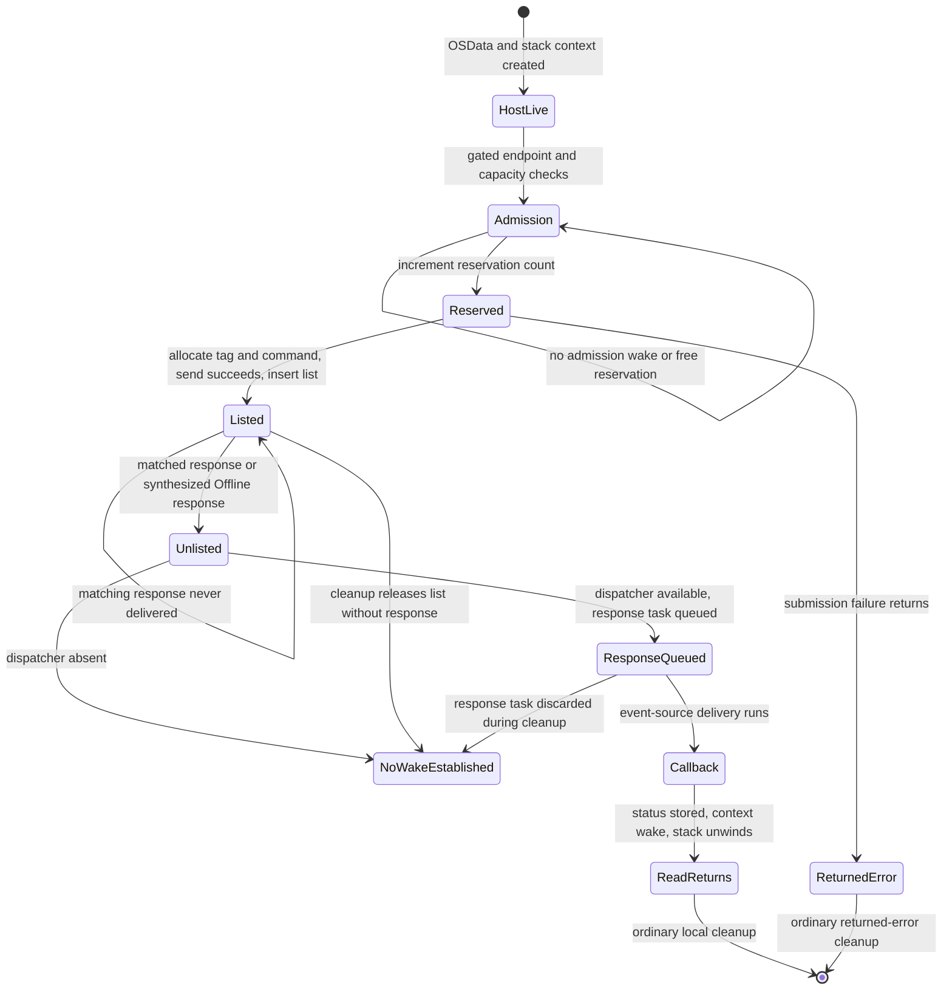

# M2H: In-Flight Selector-0 Read Termination

## Scope And Acceptance

This milestone is static, mock and public-read-only investigation of one future
in-flight selector-0 read. No DPDV open/close, private constructor, selector,
DPCD/AUX/I2C transaction, abort, concurrent close, physical disconnect or security
change is performed. No selector transport or read executable is added.
The consumed M2F-ATTEMPTED marker is preserved. M2G-DPCD-READ-ATTEMPTED remains
absent. The historical M2F open/close remains exactly one, with zero selectors.

The question is whether a read waiting for a missing DCP/firmware response can
necessarily reach a bounded terminal state without reboot or weakened security.
A terminal state requires consistent command/tag/list ownership, no remaining
unsafe callback access, and completion of or proven safe detachment from the
waiter. A returned parent timeout or disappearance of a userspace process does
not meet that criterion. Normal reply, explicit error, helper death, client close
and endpoint disconnect must each have an established finite completion bound or
a proven safe teardown path before termination can be classified as proven.

M2G's open ABI, selector contract, revision semantics/classifier, public framebuffer
result, provider ownership and userServer discriminator are retained evidence,
not reopened topics. Reply completeness remains a separate gate. Transport stays
NO_TRANSPORT_READY; one-byte readiness stays NOT_READY_FOR_ONE_BYTE_DPCD_READ;
the global gate stays NOT_READY_FOR_DPCD_TEST.

Evidence labels in this report:

- VERIFIED_ON_CURRENT_KERNEL: bytes in a retained image whose UUID matches the
  running kernel, not execution of the private method or a live-state observation.
- PRIMARY_SOURCE: pinned source behavior with its version scope; it does not
  override a different current driver implementation.
- INFERRED: a stated consequence or possible interleaving of those observations.
- UNKNOWN: a required condition or behavior not established by retained evidence.

## Integration, Tag And Branch

The starting M2G branch and upstream were exactly
`88474f9cb4bf2f0d2c3c84ee2dfe96e10121b30f`, clean and synchronized. All three
linear commits and nine changed UTF-8 blobs across eight scoped paths were
audited. Main was `3f5f0cd887ed2ef5c8dbadc9abb278792c3150be`; the historical
branches and all tag objects/peeled identities matched locally and remotely.

The --no-ff merge is `2b1565ee61337a368d75980af281621a5959000e`, message
`merge: record selector-0 one-byte readiness investigation`, with parents
`3f5f0cd887ed2ef5c8dbadc9abb278792c3150be` and
`88474f9cb4bf2f0d2c3c84ee2dfe96e10121b30f`. Its tree equals the audited M2G tree.
Main was pushed, followed by annotated tag `selector0-safety-v0.4`, object
`ed6e79f5a73b25a5ed6adbc991718747fbddacd9`, peeling to the merge. The tag message is
`Verified MacMST selector-0 safety assessment before any DPCD transaction.`
Both remote identities were read back before creating
`research/inflight-read-termination` from the tagged merge. No historical branch
or tag was deleted or moved.

At 2026-09-13T04:57:43Z the host still reported macOS 26.6.2 (25G83), kernel UUID
`447D769E-1CB7-3086-A0B4-32226837B587`. Retained current-image evidence therefore
remains applicable to the build, without attesting the live native/delegated route.
The successful M2F receipt hash remains
`86ee9fdd87eb631e7552b0087471a149c183667c2162e838866ce993e1dd3d04` and consumed
marker hash remains `2f3da1f224c0602dc46f812d3f6eb2c1560fe7a82c1a89f93eedb725b2726efc`.

## Exact Post-Submission Anchor

VERIFIED_ON_CURRENT_KERNEL: retained R3 at
artifacts/probes/iodp-static-20260912T045748Z/iodp-static.json, SHA-256
`b80b5f6b1d9553ce1ee1b292f68102369d0c7e3d29cfdd6ab80ff3c9c199b263`, contains
DCPAVProxy::performCommandGated at `0xfffffe000a018f40`, 332 bytes, body SHA-256
`98bf09b907fc17558a5f487ba143182ab3e613585f21ae6f8e30c63c153efee3`.

After the enqueue call at `0xfffffe000a018fb8` returns zero, the routine loads the
proxy's command gate at +192, selects vtable slot +512 at `0xfffffe000a018fd0`,
passes the stack context at sp+8 as the event, and loads w2=0 at
`0xfffffe000a018fe0` (raw bytes `02008052`). The authenticated sleep call is at
`0xfffffe000a018fe8`. The selected method is
IOCommandGate::commandSleep(void*,uint32_t) at `0xfffffe000bfe79ac`, not the
deadline overload at +528. An abnormal sleep result selects abort slot +2192;
the normal result is read from the stack context.

The local hypothesis is that a lost matching reply can leave that context waiting
indefinitely: length one supplies neither a deadline nor a guaranteed independent
teardown wake. A cheap discriminating check is to verify the exact sleep flag and
primitive chain, then check retained reply/error/close/death paths for a mandatory
bounded wake plus callback quiescence. A proven non-response terminal transition
covering that same context would disprove or narrow the hypothesis. No hardware
fault injection or process-kill experiment on a private call is permitted.

## Sleep Primitive And Interruption

VERIFIED_ON_CURRENT_KERNEL: R3 retains the upper three functions; R9 retains the
immediate mutex-sleep implementation and its _assert_wait callee. This is a local
continuation of existing evidence, not a new kernel graph.

| Step | Current Instruction Evidence | Consequence |
| --- | --- | --- |
| DCP performCommandGated | At 0xfffffe000a018fdc event=sp+8; at 0xfffffe000a018fe0 w2=0; call 0xfffffe000a018fe8 selects gate+512 | Wait event is the live stack CommandContext; no deadline argument |
| IOCommandGate::commandSleep, 0xfffffe000bfe79ac | Forwards event and flags to IOEventSource::sleepGate, 0xfffffe000bfe60d0 | The selected overload is not +528/deadline |
| IOEventSource::sleepGate | Loads workloop at +48 and calls its +432 slot at 0xfffffe000bfe6158 | Forwards the same event/flags to IOWorkLoop::sleepGate, 0xfffffe000bfe31d4 |
| IOWorkLoop::sleepGate | Saves recursive depth at lock+32 and clears owner at +24; at 0xfffffe000bfe3270 w1=16, x2=event, x3=flags; BL at 0xfffffe000bfe327c targets 0xfffffe000b809300 | Action 16 is lock priority bookkeeping, not interruptibility or a timeout; recursive ownership is restored after return |
| Mutex-sleep leaf, 0xfffffe000b809300 | Moves x2 to x0 and x3 to x1 at 0xfffffe000b809344/348; BL 0xfffffe000b80934c targets exact _assert_wait at 0xfffffe000b8225f8 | Raw interruptibility zero reaches wait registration unchanged |
| Blocking and reacquisition | On wait-result -1, unlocks the mutex, passes zero continuation arguments and calls 0xfffffe000b8231d4 at 0xfffffe000b8093d0; reacquires before return | The reply wait releases the workloop mutex; later lock acquisition is a separate scheduling/locking dependency |

The mutex-sleep leaf is 496 bytes, SHA-256
`b6549076615a43781dfe90fd5546b6d63f1c25f07cc9f2554f7cf2afaffc6b1e`.
Its current direct _assert_wait target is 320 bytes, SHA-256
`29155139202e88a509584740cd406e5c8b5fdcbce835d46cb447bd0882b11030`.
R9 report SHA-256 is
`587ef7b55e8ed3a5fd0e88e69c0d160ac2973ddbcaa9a6ac86bf04a71dc1f966`.

PRIMARY_SOURCE: pinned XNU
`f6217f891ac0bb64f3d375211650a4c1ff8ca1ea`,
[locks.c](https://github.com/apple-oss-distributions/xnu/blob/f6217f891ac0bb64f3d375211650a4c1ff8ca1ea/osfmk/kern/locks.c)
lck_mtx_sleep uses assert_wait, unlike lck_mtx_sleep_deadline. Its priority-floor
option does not supply a deadline. In
[sched_prim.c](https://github.com/apple-oss-distributions/xnu/blob/f6217f891ac0bb64f3d375211650a4c1ff8ca1ea/osfmk/kern/sched_prim.c),
thread_mark_wait_locked masks the interruptibility argument, sets TH_WAIT and
TH_UNINT for zero, and does not mark THREAD_ABORTSAFE. clear_wait_internal returns
KERN_FAILURE for THREAD_INTERRUPTED when TH_UNINT is set. Its assert_wait source
uses TIMEOUT_WAIT_FOREVER. These source rules corroborate the current call/flag
trace; a source revision is not asserted to be the exact running XNU revision.

INFERRED: a pending signal or userspace SIGKILL is not a finite-deadline wake
contract for this wait. A normal kernel wake on the event can wake an
uninterruptible waiter; uninterruptible does not mean unwakeable. Equally, waking
it without completing or quiescing the callback is not proven safe cancellation.
The current nonzero-sleep-result branch calls a no-op abort hook, not a drain.
Do not induce such a wake or close race on hardware.

## Constant 500

Classification: **500_MEANING_UNRESOLVED**. Its host role is precise: a uint32
firmware service-request field, serialized little-endian at message+96. Its
firmware interpretation is not recovered. It is not used as the demonstrated
host wait's deadline, queue limit, command tag or gate event.

| Value Boundary | Established Flow | Timeout Relevance |
| --- | --- | --- |
| _readBytes / interface thunk | Raw instruction 843e8052 at 0xfffffe000a7ac694 sets w4=500; retained read thunk forwards it | No clock conversion or deadline calculation |
| DCPDPDeviceProxy::readDPCD, 0xfffffe000a020628 | Copies fourth uint32 argument into w22 and stores it at message+96 at 0xfffffe000a020740, raw 166000b9 | Bytes are f4 01 00 00; address +64 and length +80 are distinct fields |
| DCPAVProxy::__sendMessage, 0xfffffe000a008e20 | Uses header flags and message+8 length, passes the service message to its response-taking block | Power-option selection is independent of message+96 |
| Response-taking block, 0xfffffe000a0090a4 | Supplies outer command 0xc0, request pointer/size, same reply buffer and a stack-local reply-size pointer | No 500-to-time transformation; no timeout parameter added |
| performCommandGated, 0xfffffe000a018f40 | Passes pointer/size/options through enqueue and then calls gate+512 with flag 0 | The host reply wait has no deadline derived from 500 |
| AFK endpoint adapter / KextV2 / AFKEPInterfaceV2 | Carries the service bytes as AFKEPMessage spans, adds separate command headers/tag, serializes/sends and retains callback state | Admission limits and optional synchronous-mode flags are separate state/options; no DPCD-specific interpretation of +96 is evidenced |
| Firmware handler | Exact DP-device group 1/command 6 handler and its field semantics are not retained | Milliseconds, microseconds, retries and other firmware meanings cannot be chosen from host stores alone |

The service payload is unchanged at the examined host serialization boundary; no
firmware receive or physical AUX transaction was observed. This is not a claim
that every transport callback or firmware instruction is decoded. There is no
evidence for an absolute/relative host deadline, a hard host timeout, or a proven
lower-layer timeout. Consequently there is no evidenced expiry/cancel transition
to assign to 500. A source-backed firmware interpretation would be required to
choose any of the other three classifications.

Its irrelevance to proving a hard overall bound is nevertheless established:
admission can block before the message reaches firmware, and the outer reply wait
uses the no-deadline primitive independently of this field. Even if firmware
internally times out at 500 units, loss of its response leaves that outer wait
without a demonstrated expiry wake. No further generic search for unrelated
constants is needed; Linux's 500-microsecond retry interval is not this field.

## One-Command Lifetime

The names below are analysis labels for actual fields and transitions, not an
invented firmware enum. VERIFIED_ON_CURRENT_KERNEL applies to the cited native
host bodies; firmware execution and any unobserved teardown ordering are UNKNOWN.



No timeout or cancel-requested state is evidenced for this command. No arrow out
of NoWakeEstablished is asserted: it represents missing terminal-state evidence,
not a measured permanently leaked object. In particular, that label does not
claim the runtime always reaches the cleanup path before an error callback.

| Transition | Owner / Trigger | Lifetime / Callback Effect | List, Tag And Waiter |
| --- | --- | --- | --- |
| HostLive | readDPCD holds OSData; performCommandGated increments proxy+200 and creates stack CommandContext | Context+8 points at OSData reply storage; context+16 points at the response-taking block's stack size variable | No local AFK command yet; neither stack object is heap-owned by retaining a callback |
| Admission | KextV2 callback 0xfffffe0009276e1c performs state snapshot and reservation acquisition | At 0xfffffe0009276f10 it may sleep on the endpoint with deadline 0 before acquireCommand | The pending selector can block before its own firmware command or tag exists |
| Reserved | acquireCommand block 0xfffffe000928549c sees count+145 below limit+144 and increments count | Consumes one shared reservation; callback construction/copy has separate lifetime | Release wakes interface+144, not the DCP context |
| Command creation and send | AFKEPInterfaceV2::enqueueCommand, 0xfffffe00092855b4, consumes next tag byte+146, creates local command and serializes/sends | Failure releases the created command and propagates submission error; the callback's submission-failure flag is distinct from a delivered response | Successful send increments uint16+76 and inserts the node in local list+40/tail+48 at 0xfffffe00092856d0-6dc; node stores the tag at +41 |
| Listed / waiting | Default asynchronous response options return to the outer DCP commandSleep | OSData, active call stacks and queued callback remain needed; no local timer is armed by this path | Command stays listed until matching response or cleanup; DCP event is its stack context |
| Tagged response | handleClientResponse, 0xfffffe000928384c, requires an eight-byte header and extracts its tag | removeCommand at 0xfffffe0009283af4 finds matching node+41 and unlinks it, updating tail before any later release | Missing tag logs/drops the response and increments interface+90; this does not wake the missing read |
| Response task queued | With dispatcher at interface+120 present, parse/copy and dispatchResponse at 0xfffffe000925e46c store context, allocation, options and status in a new task | Normal async response data/context outlive release of the AFKEPCommandLocal node at 0xfffffe0009283a38; delivery is a separate event-source action | Tag no longer in local list; queued response is not yet a DCP waiter wake |
| Callback delivered | KextV2::deliverResponse, 0xfffffe0009278414 | Calls releaseCommand first at 0xfffffe0009278450, invokes retained callback at 0xfffffe0009278474 with submission-failure flag 0, then releases that block at 0xfffffe000927847c; power deassertion is conditional | Reservation count decrements and interface+144 wakes before the DCP response callback completes |
| DCP context completed | Adapter callback 0xfffffe000926e0a8 forwards the saved context through AFKEndpointInterfaceClient::handleResponse to DCPAVProxy::handleResponse, 0xfffffe000a01908c | Writes reply prefix/size when pointers exist, then status at context+0; tail-wakes the context through gate+520 after its last context access | On normal wake, performCommandGated decrements proxy+200, wakes proxy+200, and returns; the DP frame then releases OSData |
| Local list cleanup | cleanupRemoteContext, 0xfffffe0009283a70, on its required AFK gate | Removes/releases remote list+56 and local list+40; resets tails and reservation count+145 | No response callback or commandSleep wake in this 132-byte body; freeing the node is not a completed read |

The KextV2 block at 0xfffffe0009277060 is the submission block, not the completion
callback. The actual completion entry is deliverResponse at 0xfffffe0009278414.
Likewise, the optional AFKEPInterfaceV2 synchronous branch sleeps on its local
command node; the retained default options do not select it. It is not an extra
firmware wait to count on top of the selected asynchronous path's DCP wait.

Current handleClientResponse has another explicit limit: if interface+120 is null
at 0xfffffe0009283958/395c, the asynchronous branch skips dispatch and proceeds
to command release. There is no DCP wake in that branch. This is a conditional
code path, not proof the field becomes null on every client death. The report
does not assume that a user-client state flag is checked at tag lookup: the
visible lookup uses the AFK interface and command tag, not a fresh IOUserClient
liveness query.

### Wake Events Are Not Interchangeable

| Event | Producer | What It Establishes |
| --- | --- | --- |
| AFK interface+144 | releaseCommand block at 0xfffffe0009285590 | A reservation may now be available; an admission loop rechecks capacity |
| Endpoint object | Conditional state-transition / close callbacks | State-admission sleep may progress; no DCP read-context completion follows merely from this wake |
| DCP stack CommandContext | handleResponse, status store at 0xfffffe000a0190e8 and gate+520 tail call | The corresponding read can resume after normal response processing |
| DCP proxy+200 | performCommandGated after its wait returns and outstanding count decrements | A drain observer can recheck outstanding work; it is not an independent producer that releases the blocked read |
| Command gate enabled field | enable or removal of a disabled gate | Releases callers waiting to enter an action, not a read already sleeping on its distinct CommandContext |

A raw command-gate wake would require a valid event, status, buffer and callback
lifetime contract. No caller-authorized primitive providing those guarantees was
found in the entries examined here. Dropping a tag, releasing a reservation or
destroying a Mach right cannot be substituted for that contract.

## Blocking Sites

This inventory covers the explicit waits and deferred-completion dependencies
identified on the retained native read, reply and teardown paths. It includes
pre-wire admission because a submitted selector can block there before firmware
receives its command. It does not claim whole-kernel closure: unresolved indirect
transport/lifecycle contracts remain W16. The synchronous userspace RPC reflects
these server waits; it is not an additional independently timed DCP operation.

UNBOUNDED_LOCAL means no local finite deadline for kernel scheduling/locking or
an enable handshake. It does not by itself mean firmware is awaited or that a
deadlock exists. UNBOUNDED_EXTERNAL means the condition can depend on an absent
response or progress of a command awaiting one. UNKNOWN means that boundary's
blocking/teardown contract is not established. None is a hard wall-clock bound.

| ID / Function | Condition / Phase | Primitive / Interruptibility | Deadline | Wake / Progress Source | Owner / State Field | Cleanup Consequence | Classification |
| --- | --- | --- | --- | --- | --- | --- | --- |
| W01: IOUserClient::callExternalMethod / ipcEnter | Entry or competing call with default locking enabled; PRIMARY_SOURCE lock span, current live flags unobserved | IORWLockRead or IORWLockWrite; ordinary kernel lock, not the DCP event wait | None in wrapper | Prior reader/writer unlock | User client, current lock+176; defaultLocking / defaultLockingSingleThreadExternalMethod | Matching ipcExit unlock only after externalMethod returns | UNBOUNDED_LOCAL |
| W02: IOCommandGate::runAction, 0xfffffe000bfe7be0; AFKWorkloop::runAction; IOWorkLoop::sleepGate return | Synchronous gate entry, nested gated callback, or mutex reacquisition after a wake | Recursive workloop mutex; action executes under the gate rather than inherently moving to another worker | No local time bound | Current lock owner unlocks; normal scheduler progress | Gate workloop+48 / workloop gate lock+16 | Sleep releases recursive ownership; action return restores normal gate bookkeeping | UNBOUNDED_LOCAL |
| W03: IOCommandGate::runAction disabled-entry loop | Not on workloop thread, enabled byte false, workLoop still present; before action entry | Workloop+432 sleep; raw w2=1 at 0xfffffe000bfe7d80, THREAD_INTERRUPTIBLE | No deadline | enable, interruption, or removal's interrupted wake | Gate enabled+40; gate+72 bit 1 tracks enable waiters | Returns aborted on interruption/removal; this event is not a running read's context | UNBOUNDED_LOCAL |
| W04: KextV2 enqueue admission block, 0xfffffe0009276e1c | Endpoint not inactive and sampled state bytes equal raw 3 and 1 | AFKWorkloop::sleep at call 0xfffffe0009276f10; eventual gate+512, flag 0 | Raw x2=0 at 0xfffffe0009276f0c | Endpoint state/close notification wake | KextV2 endpoint event; loop object at endpoint+168; snapshots obtained via callback 0xfffffe0009276f50, including endpoint+186 | No submitted command to abort yet; proceeds to acquireCommand only after this sleep returns | UNBOUNDED_EXTERNAL |
| W05: acquireCommand block, 0xfffffe000928549c | Reservation count >= limit | AFKWorkloop::sleep; gate+512 / flag 0 | 0 | releaseCommand decrements count and wakes interface+144 | AFKEPInterfaceV2 count+145, limit/event+144 | Rechecks until capacity exists; clear count alone is not a wake in cleanupRemoteContext | UNBOUNDED_EXTERNAL |
| W06: performCommandGated, 0xfffffe000a018f40 | Enqueue returned success, matching reply/error not yet delivered | commandSleep+512 -> sleepGate -> mutex-sleep -> _assert_wait; flag 0 / THREAD_UNINT | None; current _assert_wait sets x3=0 at 0xfffffe000b82269c before waitq tail call | DCP handleResponse writes status then wakes the same context | DCP gate+192; event=stack CommandContext at sp+8; outstanding counter proxy+200 | Abnormal return invokes no-op abort; normal return decrements count and releases the DP frame's storage | UNBOUNDED_EXTERNAL |
| W07: AFKEPInterfaceEventSourceV2 response dispatch, 0xfffffe000925e46c | Reply unlisted and response task queued but delivery not run | Asynchronous task queue plus workloop gating, not a second synchronous DCP sleep | No delivery bound recovered | Event-source scheduling/checkForWork and KextV2 deliverResponse | Dispatcher interface+120; task stores allocation+24, context+32, options+40, status+48 | clearAll can discard a response task without a DCP callback | UNBOUNDED_LOCAL |
| W08: IOServiceClose, 0xfffffe000c038688; connection no-senders | Close/death notification tries exclusive client lock while an external method holds read/write mode | Exclusive lock call at 0xfffffe000c038764; interruption policy not established as caller cancellation | No deadline in close body | External method's IPC unlock; ordinary unlock is downstream of W06 when held by the read | User client lock+176, closed+153, IPC count+156 | clientClose cannot be reached through this locked path until acquisition succeeds | UNBOUNDED_EXTERNAL |
| W09: finalizeUserReferences / ipcExit | Finalization requested while active IPC remains; PRIMARY_SOURCE deferral, current ipcExit at 0xfffffe000c0303f4 | No sleep in the deferral predicate; finalization is postponed | No completion deadline | Final IPC decrement with inactive client schedules finalization | User client IPC+156 and deferred-finalization byte+154 | Returning false/defer does not finish the pending operation or free its stack | UNBOUNDED_EXTERNAL |
| W10: IOCommandGate::setWorkLoop(NULL), 0xfffffe000bfe801c | Removal sees enable-waiter bit 1 at gate+72 | Wakes enabled+40 with interrupted result, then sleepGate on gate+72 at 0xfffffe000bfe8138; raw flag 0 | None | Disabled-entry waiter exits, clears bit 1 and wakes gate+72 | Removing gate; gate+72 bit 0=removed, bit 1=enable waiters | Drains entry waiters only, not a submitted DCP read | UNBOUNDED_LOCAL |
| W11: active-action detach deferral | Removal sees nonzero action count mask 0xffffff00 at gate+72 | No sleep for action count in setWorkLoop; detach is deferred until runAction unwinds | None | Active action returns and decrements by 0x100 | IOAV/DCP gate's own action count; never-used-gate proof is inapplicable | Can remain attached while W06 remains pending; no synthesized response | UNBOUNDED_EXTERNAL |
| W12: IOService::terminatePhase1 / terminateWorker / scheduleTerminatePhase2 | Native clientClose requests terminate(0); ordinary arbitration and asynchronous phase scheduling | Arbitration/job locks; worker scheduling and lifecycle callbacks; callback-specific waits not all resolved | No returned-close terminal-state deadline | Unlock, termination worker progress and outstanding-reference/IPC transitions | IOService inactive/phase/busy state and job lists; source names retained, no invented field offsets | Native close requests termination, not synchronous read cancellation or guaranteed free | UNKNOWN |
| W13: DCPAVProxy::stop, 0xfffffe000a0095d8 | Provider actually stops and separate thread-call pointer+248 is nonnull | thread_call_cancel_wait at 0xfffffe000a0096b4, then free; lower callback wait not attributed as this read's cancel | No deadline argument at this call | That separate thread-call callback finishes | DCP provider thread-call+248, endpoint+184, gate+192 | Does not identify or cancel the AFK command by the read's context/tag; endpoint close and gate removal have separate conditions | UNKNOWN |
| W14: KextV2::closeHelper, 0xfffffe000927553c | Endpoint close helper reached; uint32 endpoint+344 nonzero | Repeats the property-operation call at 0xfffffe0009275588; lower blocking behavior not fully attributed | No finite loop bound shown | Field change / callee result; writer progress not proved for missing reply | KextV2 endpoint+344 | handleClose/list cleanup precedes later scheduled event-source cleanup; not a complete read terminal contract | UNKNOWN |
| W15: task termination / final task deallocation | thread_terminate_internal waits for another thread to leave CPU; final owner cleanup waits for references/threads to disappear | PRIMARY_SOURCE thread_wait(FALSE) uses assert_wait on wake_active with THREAD_UNINT; final refs are a precondition, not another direct sleep | No thread_wait deadline; no finite final-reference bound | Scheduler removes thread from CPU; final deallocation separately needs all references/threads gone | Thread on-CPU state/wake_active; task thread list and refcount | Off-CPU can be satisfied while DCP stack remains asleep; phase-2 owner cleanup is not an early cancellation wake | UNBOUNDED_LOCAL |
| W16: remaining transport and lifecycle boundaries | Serialized send/response transport callbacks, or conditional lifecycle callback outside decoded local closure | UNKNOWN; no synthetic primitive or deadline assigned | UNKNOWN | UNKNOWN | AFK transport/session and callback-owned state not fully attributed | Cannot promote missing contracts to bounded or safe teardown; no general graph expansion performed | UNKNOWN |

Two tempting timeout substitutions are excluded from the selected read path:

- AFKEPInterfaceV2's optional synchronous branch at 0xfffffe00092856ec sleeps
  on the local command with deadline 0: UNBOUNDED_EXTERNAL if selected, but the
  retained default response options leave it unselected. The selected response
  wait is W06, not two independent firmware waits.
- Pinned IOService::scheduleTerminatePhase2 has a 15-second busy-condition sleep
  only for kIOServiceSynchronous. That individual sleep is CONDITIONALLY_BOUNDED,
  but surrounding terminate-thread acquisition has no deadline. Native
  IOAVUserClient::clientClose calls terminate(0); current terminate adds raw 4,
  not synchronous bit 2. Neither that source-only timeout branch nor the global
  idle termination-worker sleep is a timeout for W06.

There is no BOUNDED firmware-dependent wait in this inventory. W15's local
off-CPU wait can finish while final task cleanup is still externally dependent on
W06. W02 releasing its recursive gate permits possible other work; W08 concerns
a different client IPC lock that a commandSleep does not explicitly release.

The gate-removal distinction is verified in current bytes: setWorkLoop tests
bit 1 at 0xfffffe000bfe80a0 and waits at 0xfffffe000bfe8138 only for that entry
handshake; at 0xfffffe000bfe8150 it tests the separate action mask and defers
detachment. runAction increments at 0xfffffe000bfe7cac and decrements at
0xfffffe000bfe7cdc. These lifetime protections are not a wake of the DCP context.

## Concurrent Close

Result: **CONCURRENT_CLOSE_UNRESOLVED**. This is not a proposal to add a close
thread. Thread A is already inside the read; Thread B uses the same connection.

VERIFIED_ON_CURRENT_KERNEL: IOServiceClose's kernel routine at
0xfffffe000c038688 checks the client and closed/shared state, conditionally changes
closed byte+153 before acquiring the exclusive lock+176 at 0xfffffe000c038764,
increments IPC count+156 and invokes clientClose slot 2336 at
0xfffffe000c038790. The concrete IOAVUserClient::clientClose at
0xfffffe000a5a3694 calls terminate(0). Current IOService::terminate at
0xfffffe000bfa0f64 adds raw option 4, not synchronous bit 2. The close routine
exits through current ipcExit at 0xfffffe000c0303f4 in lock mode 2 and returns
zero on its valid close path, without treating the virtual close result as a
completed-read receipt. Userspace deallocates its connection right only after
the close RPC returns.

PRIMARY_SOURCE: pinned
[IOUserClient.cpp](https://github.com/apple-oss-distributions/xnu/blob/f6217f891ac0bb64f3d375211650a4c1ff8ca1ea/iokit/Kernel/IOUserClient.cpp)
callExternalMethod encloses the virtual external method in ipcEnter/ipcExit. With
defaultLocking enabled it holds a read lock, or a write lock when the separate
single-thread flag is enabled. With defaultLocking disabled it still counts IPC
but does not take that lock. The exact current callExternalMethod wrapper and
the future live client's locking flags are not independently attested here.
This source-conditioned branch must not become an unconditional current-runtime
claim; the frozen native/delegated routing uncertainty also remains.

| Question | Established Answer / Limit |
| --- | --- |
| Does B call clientClose immediately? | No universal immediate call: exclusive-lock acquisition precedes it. Closed=true can precede the call and is not the same as service inactive |
| Does B wait for A? | Under the pinned default-locking contract, yes: A holds a conflicting IPC lock until externalMethod returns; sleeping the DCP workloop gate does not release that distinct lock |
| Can B run termination concurrently? | The source's no-default-locking branch permits reaching clientClose with another counted IPC active; actual live mode and all resulting lifecycle interleavings remain unknown |
| Does it remove/free the client? | terminate(0) requests inactive/termination processing; active IPC, action counts and other references can defer finalization or detachment. Close return is not proof of removal/free |
| Does it abort or wake the read? | No read-context abort, AFK tag cancellation or CommandContext wake appears in these concrete close/clientClose bodies. Conditional lifecycle/error delivery is a different path |
| Can close hang behind the read? | Yes as a source-backed possibility in W08; no local close deadline resolves that dependency |
| Is there a proven A/B deadlock? | No two-lock cycle is established. Waiting behind A while A waits for an absent response is already enough to defeat a close-based bound; it must not be mislabeled a demonstrated deadlock |
| Can close return with AFK work outstanding? | Not excluded by the no-locking/asynchronous-termination branch. No end-to-end invariant proves return implies callback/firmware quiescence |

The source finalizeUserReferences predicate defers while IPC is nonzero. Current
ipcExit similarly tests last IPC/inactive/deferred state before scheduling
finalization. These are protective lifetime dependencies, not cancellation.
IOAV client stop removes its own gate and releases provider references; it is not
identical to stopping the pre-existing DCP provider or disconnecting its endpoint.
The already-recorded provider-close guard is retained without reopening ownership
analysis. M2F's zero-selector close cannot resolve any of these pending-read cases.

## Task Death And SIGKILL

Result: **TASK_DEATH_READ_STATE_UNRESOLVED**. Signal delivery, rights destruction,
client finalization, AFK command completion and firmware quiescence are separate.

PRIMARY_SOURCE, pinned
[task.c](https://github.com/apple-oss-distributions/xnu/blob/f6217f891ac0bb64f3d375211650a4c1ff8ca1ea/osfmk/kern/task.c)
and [thread_act.c](https://github.com/apple-oss-distributions/xnu/blob/f6217f891ac0bb64f3d375211650a4c1ff8ca1ea/osfmk/kern/thread_act.c):

1. Normal task_terminate_internal marks the task inactive, disables task IPC
  operations and calls thread_terminate_internal for each thread. That routine
  marks a started thread inactive, requests abort and calls clear_wait with
  THREAD_INTERRUPTED. The TH_UNINT rule described above can refuse that wake.
2. thread_wait(FALSE) can wait for a different thread to leave a CPU, but not
  for its full kernel call to return. A thread sleeping in W06 is already off
  CPU. This wait is not an AFK completion/cancellation barrier.
3. Normal task termination then calls IOKit phase 1 and tears down the task's
  IPC space. Pinned IOKit phase 1 returns immediately for an ordinary non-driver
  task; its driver-task behavior must not be assigned to a MacMST CLI helper.
4. Connection no-senders is conditional on Mach-port/owner state and valid
  notification generation. Its retained current path at 0xfffffe000c0308c8
  takes the exclusive client lock before clientDied, so W08 can matter there too.
5. Pinned normal task_deallocate_internal calls IOKit phase 2 only at final
  reference deallocation, with threads gone. The current phase routine at
  0xfffffe000c031e4c retains the matching phase/owner cleanup shape. It removes
  owners, temporarily retains newly ownerless clients and conditionally calls
  clientDied, then releases those references. Exec/reset call sites are not
  substituted for normal process death.
6. Current IOUserClient::clientDied at 0xfffffe000c02c0c8 calls clientClose only
  for a shared instance or a successful closed-byte transition. That guarded
  termination and subsequent client cleanup still do not identify the AFK
  read context/tag or prove a wake of it.

| Component | Exact Conclusion |
| --- | --- |
| A: Userspace/kernel thread | Userspace termination is requested; completion of a started thread's TH_UNINT kernel wait is not bounded by that request. The kernel stack may remain live until its event is awakened and the thread reaches termination processing |
| B: IOUserClient | Rights/owners can begin teardown, but exclusive-lock acquisition, active IPC, action counts and remaining references can retain/defer it. Immediate free or a finite destruction time is not proved |
| C: AFK/DCP host command | No direct task-death cancellation of the listed tag/callback is evidenced. It can remain pending until reply, a conditional error path or separate endpoint cleanup; those outcomes are not universally bounded |
| D: Firmware transaction | UNKNOWN: it may still run, have finished with a lost reply, or have failed before execution. No task-death-to-firmware cancel/ack contract is established |
| E: Late response | Goes through endpoint/tag/delivery state if that infrastructure remains; it is not automatically a message to the dead process. Safe handling for every teardown interleaving remains unresolved below |

The current wait/close/clientDied bytes and source phase ordering support these
limits; no SIGKILL was sent to a helper inside a private call. The source does not
prove that the current kernel must promptly reap such a process, nor that a reaped
PID would establish firmware quiescence. Choosing either automatic cancellation
or guaranteed client release from those observations would overstate the evidence.

## Late Reply After Client Death

Result: **LATE_REPLY_UNRESOLVED**, a critical gate. The proposed worst sequence
must not silently equate "parent sent SIGKILL" with "kernel stack and client are
already freed." Both may remain retained/deferred while the read is outstanding.

The receiver is the AFK endpoint response machinery, not a userspace pipe or the
helper's Mach receive loop. handleClientResponse extracts the eight-bit tag,
removeCommand searches interface local list+40 by node tag+41 and unlinks it
before release. The asynchronous path may then place the separately retained
callback/context and copied response allocation in an event-source task. The
event-source delivers to KextV2::deliverResponse, then the retained adapter/client
callback reaches DCPAVProxy::handleResponse with the original raw context pointer.

| State At Late Arrival / Delivery | Consequence And Limit |
| --- | --- |
| Same command listed; dispatcher, callback, DCP context and storage all live | Normal retained-command response processing can complete it. No helper userspace continuation is required to store status and wake the kernel context |
| Node already unlisted but response task queued | Callback/context and copied response allocation are held by the delivery path, not the freed command node. Event-source progress or clearAll determines delivery; task queue presence alone is not completion |
| Node removed by cleanup and no matching tag now present | Current removeCommand returns null and handleClientResponse logs/drops without dereferencing that removed node. This local drop does not wake the original DCP waiter |
| Dispatcher interface+120 absent | Current asynchronous response path skips callback dispatch and releases command storage. No DCP wake is visible there |
| Tag reused by other endpoint traffic | No death-specific generation check is recovered at this local eight-bit lookup. Outer transport/session protections are not fully attributed; neither safe rejection nor misdelivery is proved. MacMST's no-retry rule does not stop unrelated endpoint clients |
| Callback delivered after its context actually expired | The callback uses a raw pointer, not a fresh IOUserClient lookup. This would require a quiescence/lifetime proof; a concrete reachable expired-context interleaving is not established by the retained close/death paths |

For the selected synchronous read, context+8 points to kernel OSData message
storage and context+16 to a kernel stack size variable. The response callback
does not directly write the helper's one-byte userspace buffer. Only subsequent
readDPCD return handling copies to the method's output buffer; the one-byte
userspace request is in-band. That separation reduces one mistaken lifetime
inference, but does not prove every kernel allocation/context remains valid after
arbitrary teardown. Block retention alone does not own the raw DCP stack context.

Normal delivery has an evidenced last-context-access-before-wake ordering. No
universal callback drain, late-reply generation barrier or safe-drop-plus-waiter
completion contract is established for client/endpoint death. Conversely, this
analysis does not demonstrate a use-after-free from SIGKILL or concurrent close;
it does not promote a conditional raw-pointer risk into an observed vulnerability.

## Endpoint Disconnect

Result: **DISCONNECT_BEHAVIOR_UNRESOLVED**. Physical HPD drop, endpoint offline,
user-client termination and DCP-provider stop are different triggers. No physical
disconnect, HPD change or simulated driver notification was performed.

VERIFIED_ON_CURRENT_KERNEL, retained R3/R4:

| Trigger / Body | Actual Command Effect | Missing Guarantee |
| --- | --- | --- |
| handleNotification, 0xfffffe000928362c, raw notification 4 | Calls createErrorResponses at 0xfffffe0009283664 before notification dispatch | No proof every physical detach or lost firmware reply produces this notification within a bound |
| handleClientReport, 0xfffffe0009283ffc | Report 19 with the final boolean set calls createErrorResponses; report 20 sets bit 7 at interface+24 and invokes notification 4 | These exact predicates are not a universal HPD-to-error mapping |
| createErrorResponses, 0xfffffe0009283734 | Iterates local list+40, builds a matching-tag eight-byte response with raw Offline status 0xe00002d7, and calls normal handleClientResponse | Conditional host error synthesis, not a firmware cancellation acknowledgement; dispatch and event-source delivery must still succeed |
| KextV2::close, 0xfffffe0009275984 | Runs closeHelper only for the retained null-EPIC / client-count<=1 condition, then wakes the endpoint event and delegates to base close | One MacMST read does not imply one endpoint client; endpoint wake is not the DCP context wake |
| handleClose, 0xfffffe0009285040 | Runs cleanupRemoteContext and reaches tryClose | Cleanup is not an implicit call to createErrorResponses |
| cleanupRemoteContext, 0xfffffe0009283a70 | Unlinks/releases both local and remote lists, resets tails, zeros reservation count+145 | No normal response callback, context wake or reservation-event wake in the body |
| closeHelper cleanup callback, 0xfffffe0009275ad4; clearAll, 0xfffffe000925e660 | Removes event source, drains queued task allocations and releases it; notification/data tasks have different cleanup | Discarded data-response task is not automatically delivered to the DCP waiter |
| Disconnect-transition block, 0xfffffe0009285128 | If phase byte+26 is 2, calls completion only when uint16 counters+74 and +76 match | A state/counter predicate, not a deadline. The enclosing result is not a receipt that all DPCD waiters completed |
| Concrete tryClose callback, 0xfffffe0009275858 | Conditional power assertion/deassertion and an asynchronous close request | Neither enqueue success nor power bookkeeping proves cancellation or late-reply quiescence |

Thus a delivered synthesized error can complete the host read through the normal
callback path. A separate cleanup path can remove command state without that
wake, and an already queued response can be discarded before delivery. The
required ordering that would make all relevant disconnects safe and bounded is
not established. This does not prove the no-wake branch is the outcome of every
disconnect, so a universal clears-without-wake classification is not justified.

## Abort Primitive Inventory

Result: **READ_ABORT_SET_INCOMPLETE**. No complete read-specific cancel primitive
was found in the selected decoded host entries. The lower transport/session and
firmware cancel/quiescence contracts remain unestablished at W16; this is not a
claim that every possible cancellation facility in the system was enumerated.

| Candidate | Changes This Read's State? | Scope / Limit |
| --- | --- | --- |
| User-client close/clientDied | Marks/request client lifecycle changes after guards and locks; no direct read-context/tag cancel in the concrete entries | Not an exposed per-read abort contract; unknown lifecycle callbacks are not silently treated as no-ops |
| Selected AFK abortCommand, vtable+2192 -> 0xfffffe0009279284 | No; complete body is hint/ret, raw 5f2403d5c0035fd6 | Does not remove tag, release reservation, synthesize status, wake context or drain callback |
| Other retained same-named abort at 0xfffffe000926e520 | Also hint/ret | Not an alternate working cancel path; the selected vtable remains authoritative |
| commandWakeup / wakeupGate | Can wake a matching event, not cancel the command by itself | No caller-safe request token/status/quiescence protocol is established; arbitrary wake could violate lifetime assumptions and is not proposed |
| AFK releaseCommand | Decrements capacity and wakes admission event+144 | Not cancellation of a listed command or completion of its DCP context |
| createErrorResponses | Real conditional host error-completion path through existing tags/callbacks | Does not itself prove firmware quiescence, universal dispatch or bounded trigger; not a supported MacMST cancellation API |
| Endpoint handleClose / cleanupRemoteContext / clearAll | Removes/releases command or task state | Storage disposal without guaranteed response/wake is not safe terminal-state proof |
| DCP provider stop / thread_call_cancel_wait | Cancels/waits for a separate thread-call at provider+248 and conditionally closes endpoint | No evidence that this thread-call is the pending AFK request or that cancelling it cancels that request |
| IOCommandGate removal | Interrupts disabled-entry waiters and defers detach for active actions | Does not wake the distinct in-action DCP CommandContext |
| RTBuddy / DCP transport cancellation | No verified read-context-to-transport cancel/ack/generation contract in the retained boundary evidence | UNKNOWN, not proof of absence and not permission for broad privileged investigation or a cancellation call |
| SIGKILL / port destruction | Requests task/rights teardown | No guaranteed interrupt of W06 or firmware abort acknowledgement |

The only additional positive host completion mechanism established here is
conditional synthesized Offline delivery. It is not enough to classify a real,
bounded read-abort primitive as available to MacMST. No abort, notification,
forced wake, endpoint close or provider-stop API was invoked.

## Failure Containment

Scope classification: **UNKNOWN**. A helper process boundary is not an upper bound
on the effects of a stranded kernel request. The following distinctions are
supported; none is a measured hardware failure in M2H.

| Possible Condition | Evidence-Supported Impact / Limit |
| --- | --- |
| Ordinary mock child hangs | Parent can observe a deadline and kill/reap tested userspace children; USERSPACE_CONTAINMENT_ONLY |
| Read thread remains in W06 | A kernel execution context and its stack can remain blocked; prompt process completion/reaping is not guaranteed |
| Command remains outstanding | OSData, callback/reference state, active IPC/action counts and one AFK reservation can remain needed. A permanent leak is not demonstrated |
| Endpoint resources are shared | Reservation count+145, limit+144 and tag/list state belong to an AFK interface shared by endpoint traffic, not just the helper |
| Endpoint becomes unusable | Possible resource/progress impact cannot be excluded, but one stranded read is not proof that the whole endpoint wedges |
| Display stack disruption | No bounded isolation or no-impact guarantee is established; neither an actual disruption nor an inevitable display-stack hang is claimed |

Another process is not necessarily blocked by the same IPC lock if it obtains a
distinct client. W06 releases recursive workloop ownership, allowing other work
in principle. If endpoint state and reservation capacity permit, another request
could therefore progress while the first waits. Conversely, shared clients,
reservation exhaustion, endpoint state, power bookkeeping or unresolved callback
ordering can prevent progress. Neither continued usability nor total provider
failure is proved. The strongest defensible statement is shared-endpoint resource
exposure with an unproved upper containment boundary, hence UNKNOWN rather than
HELPER_ONLY or an asserted whole-display failure.

## Termination Criterion And Result

Termination: **INFLIGHT_READ_TERMINATION_NOT_PROVEN**.

| Required Trigger | Established Path | Acceptance Result |
| --- | --- | --- |
| Normal reply | Valid matching response, retained delivery/context, status-before-wake, normal unwind | Conditional normal completion; no bound on arrival or every teardown interleaving |
| Explicit error | Returned submission failure or successfully delivered synthesized/transport error | Conditional returned-error completion; a lost error response has the same waiter problem |
| Helper death | Abort request, rights/owner lifecycle, possible deferred client/task teardown | No mandatory bounded wake or proven safe detached completion of W06 |
| Concurrent close | Lock-mode-dependent serialization or asynchronous client termination | No universal abort/drain guarantee for the pending read |
| Endpoint disconnect | Conditional synthesized errors, separate list/task cleanup and async close | Ordering and bounded completion not established for all pending commands |

A minimal countermodel consistent with the traced host code is: one command is
successfully submitted/listed, the helper's kernel thread enters W06, and neither
a matching response nor a qualifying delivered error arrives. There is no local
deadline at W06. A signal's interrupted wake may be rejected, an exclusive close
can wait behind the active IPC, and later cleanup is not proven to complete the
context. This is a static possibility, not a claim that it occurred on M5.

No recovered path makes the final terminal-state criterion universal. Conversely,
no fully established reachable premature-context-destruction interleaving was
recovered, so this result is not upgraded to a demonstrated unsafe lifetime claim.
The raw-pointer and dropped-callback concerns remain critical unresolved risks,
not permission to test them by killing or closing around a private operation.

## One-Byte Readiness And Next Step

- Transport: **NO_TRANSPORT_READY**.
- One-byte readiness: **NOT_READY_FOR_ONE_BYTE_DPCD_READ**.
- Wait: **UNBOUNDED_KERNEL_WAIT_POSSIBLE**.
- Global gate: **NOT_READY_FOR_DPCD_TEST**.

The single lowest-level blocking object is **the event wait registered for
DCPAVProxy::performCommandGated's stack CommandContext**, W06. Current raw flag
0 reaches _assert_wait at 0xfffffe000b8225f8, which supplies deadline 0 to the
waitq path. There is no demonstrated response-independent terminal transition
that both wakes that context and guarantees its callback can no longer access
expired storage. A documented target-specific completion/cancel-and-drain contract
for that exact wait is the missing fact; another DPDV open or a userspace watchdog
cannot supply it.

Termination findings do not alter M2G reply completeness: manageable one-byte
copy bounds are not proof of a complete firmware reply. That remains a separate
future gate, not an additional read or broad reply-semantics investigation here.
No selector transport, read CLI, arbitrary selector support or attempt marker is
added. No selector execution is proposed, and no new private-operation approval
is requested by this report.

## Userspace Containment Mocks

**USERSPACE_CONTAINMENT_ONLY**. The existing orchestration and mock suite are
unchanged; no new child mode or selector transport is useful for proving the
missing kernel contract. Reuse
[../../tests/isolation_tests.cpp](../../tests/isolation_tests.cpp) and
[../../tests/mock_helper.cpp](../../tests/mock_helper.cpp), not the private
open helper as a stand-in for an in-flight read.

| Existing Coverage | What It Does / Does Not Establish |
| --- | --- |
| Blocking child / timeout / SIGKILL | Parent deadline/failure recording and termination/reaping of tested ordinary userspace children; not interruption of W06 |
| Valid frame followed by cleanup-hang | A valid result frame is insufficient without normal completion/reaping; not a model of a firmware callback into a dead kernel context |
| Closed pipes / malformed or oversized output / early exit | IPC loss and framing/failure behavior, not destruction of IOConnect rights or firmware work |
| Fresh children, descriptor/signal/environment checks | Userspace isolation and ownership bookkeeping, not isolation of the shared DCP endpoint |
| Deliberate ECHILD ownership-loss case | Correct handling when SIGCHLD auto-reaping removes parent wait ownership; not an actually unreaped kernel-blocked child |
| Existing M2F-framed mocks | Framing and terminal/open-only coordinator guards without an actual DPDV operation; mock names do not make them hardware tests |

No new delayed-firmware-reply, post-kill callback or uninterruptible-child test is
claimed. An ordinary mock cannot reproduce those kernel guarantees by delaying
a pipe write. The existing parent watchdog remains an observation/termination
attempt policy, not a cancellation proof. Its outcome cannot promote any M2H gate.

## Provenance And Reproduction

No new kernel extraction, call graph, firmware search, source download, private
object acquisition or public display-topology capture was needed. The matched
kernel UUID is 447D769E-1CB7-3086-A0B4-32226837B587, and the retained kernel
container SHA-256 is
`b20d50fc8f445a5c578ac63bd974efeb6ae48a97116800301071891795fb26d9`.
Addresses are preferred image addresses, not executable live call targets.

| Retained Report Under artifacts/probes | SHA-256 |
| --- | --- |
| R3: iodp-static-20260912T045748Z/iodp-static.json | `b80b5f6b1d9553ce1ee1b292f68102369d0c7e3d29cfdd6ab80ff3c9c199b263` |
| R4: iodp-static-20260912T095457Z/iodp-static.json | `1262f818b09a562b22c4649c97d94e77a5c865148268793cd2a9dc8d5c72ab1f` |
| R6: iodp-static-20260912T115506Z/iodp-static.json | `8e235935b12579787150b991c1c90db2f618312deab0e58594eb52b1d14843dd` |
| R9: iodp-static-20260912T141129Z/iodp-static.json | `587ef7b55e8ed3a5fd0e88e69c0d160ac2973ddbcaa9a6ac86bf04a71dc1f966` |

All 80 concrete instruction addresses cited by the analysis resolve inside 46
retained full bodies. Concatenating instructions[].bytes_hex reproduces each
body's declared size/SHA-256; duplicate bodies agree across reports. The sleep
leaf resides in R9's retained graph bodies even though it is absent from R3's
named-function inventory. R4, not R3, supplies cleanupRemoteContext. Nothing was
silently treated as absent merely because one report's selected map lacked it.

In addition to the sleep-body hashes above, these exact bodies bind the newly
distinguished lifetime transitions:

| Body / Preferred Address | Bytes | SHA-256 |
| --- | --- | --- |
| removeCommand, 0xfffffe0009283af4 | 120 | `d629540dd1561a5f16edbc31f358fcaf75d18e7c08306dd922b923ed23a3d241` |
| dispatchResponse, 0xfffffe000925e46c | 136 | `64949f8ff6bb4bda736e056c82169ed3a51738168be0f3c8ccb70ad53dadd015` |
| deliverResponse, 0xfffffe0009278414 | 188 | `4ae2fe7259a157fdab79708569f8a4cf7d1c2319a36c9da4e68c30aa3eb15016` |
| cleanupRemoteContext, 0xfffffe0009283a70 | 132 | `675a703d3a3b46a28368bdcca8da7d41086dc8fd5d0e74b6e9d5b16ddb08d5d0` |
| setWorkLoop, 0xfffffe000bfe801c | 492 | `8f2aa1680215cde76c1fd14c79ea122e674df7b30416107cde6212089ae32ace` |
| Kernel close routine, 0xfffffe000c038688 | 384 | `17d5ebe7aae9d51873f11e8f78429e0f0321aa0b37f2828b7880bc52b453e4df` |
| clientDied, 0xfffffe000c02c0c8 | 88 | `5cc7802cf1e2c576d00b45e7a6eab5a90ea6a593ec87d81cabc9aaec6e85c572` |

Pinned XNU files were compared byte-for-byte with their entries in the retained
f6217f891ac0bb64f3d375211650a4c1ff8ca1ea archive, SHA-256
`0763146d2b5459b070d802aaba9526cead7fb0d55d0d51ba0069818030150b15`. Previously
used RPC-03/M2C source copies match those entries too. No extraction was performed
in M2H; the archive and its files remain ignored local evidence.

| Path Within Pinned XNU | SHA-256 |
| --- | --- |
| iokit/Kernel/IOUserClient.cpp | `a09c525b144ecbf834bb2b69f0c78b93358601ee22045340609b30acc8e0a6e7` |
| iokit/Kernel/IOCommandGate.cpp | `99e2ac31e11e1df5bc7d67ed847d6e395b89a103714adae85b8d1aed13faeba6` |
| iokit/Kernel/IOWorkLoop.cpp | `10f6d04e18a5fb60fda7782b13c5b551d7e27bb191e798ad1011429c0ef66bc3` |
| iokit/Kernel/IOService.cpp | `8791d87936ced84d6529a2becf6b78db31c0db7acd0aa6da4708a73b8cb50176` |
| osfmk/kern/locks.c | `55a475755bedb293861eda1c4773c46ed32423cbc094ba3b68067a697e17a68a` |
| osfmk/kern/sched_prim.c | `b2a2654b21d7731fce2f51f839c378a85e901d58f0c4a8d7d9effd5d39f83dbf` |
| osfmk/kern/thread_act.c | `cf143f5501df10798f81bba25263c756b02a749c9ecb85aaa2e46c3d6de9765c` |
| osfmk/kern/task.c | `f5ea4822b15aca636c4d940679e878904729b88acf312821d2ebacbf69312f71` |

Safe identity and evidence checks, when these existing local artifacts are present:

```sh
sysctl -n kern.uuid
git rev-parse selector0-safety-v0.4
git rev-parse 'selector0-safety-v0.4^{}'
shasum -a 256 artifacts/probes/iodp-static-20260912T141129Z/iodp-static.json
shasum -a 256 artifacts/sources/m2e1/xnu-f6217f8.tar.gz
shasum -a 256 artifacts/probes/M2F-ATTEMPTED
```

A missing ignored artifact is unavailable evidence, not permission to substitute
another kernel build or run a private operation. The final code/source state is
independent of the old executed M2F binary identities. No runtime read, close-race
or firmware-cancellation observation is inferred from compilation or hashes.

## Validation

M2H validation ran on the existing macOS/M5 toolchain on 2026-09-13 UTC. Only
five documentation paths change from the safety tag; source, tests, CMake,
inspection tools and configuration are unchanged. No private helper mode,
including no-open selection, was executed. The existing dpdv_contract marker
refusal test uses a temporary pre-existing marker and nonexistent helper, not a
real DPDV call.

| Command / Check | Result | Scope |
| --- | --- | --- |
| cmake --build build | PASS | Full strict warnings-as-errors build |
| ctest --test-dir build -L unit --output-on-failure | 9/9 PASS | Existing deterministic unit suite, including the unchanged 324 synthetic DPCD checks |
| cmake --build build-sanitized | PASS | AddressSanitizer / UndefinedBehaviorSanitizer build |
| ctest --test-dir build-sanitized -L unit --output-on-failure | 9/9 PASS | Same deterministic software gates under sanitizers |
| python3 -m unittest discover -s tests -p 'test_iodp_static.py' | 60/60 PASS | Synthetic static-parser/inspection regressions; no kernel or private method execution |
| Existing mock_helper_isolation in both unit suites | PASS | Original 13 plus eight framed mock cases and fresh-child/FD/signal/reap ownership checks; USERSPACE_CONTAINMENT_ONLY |
| Fresh public-only hardware probe | Not run; not needed | No production code or topology question changed. Public sysctl/sw_vers build identity checks were sufficient for evidence applicability |
| Retained provenance | PASS | Four report hashes, current UUID/container, 80 addresses in 46 consistent full bodies, eight source files matched to pinned archive |
| Source / binary / marker guards | PASS | All code/tests/config unchanged; production and parent imports remain non-transport; open-only helper has one open/close callsite and no selector imports; both M2F receipts and consumed marker unchanged; read marker absent |
| Documentation | PASS | Sixteen wait rows, seven required result classifications, source labels, links/fences, append-only ledger, whitespace and editor diagnostics |

Current binary hashes remain those of the unexecuted M2G rebuilds, not the older
historical runtime helper/parent binaries:

| Binary | Current SHA-256 |
| --- | --- |
| Public macmst | `450832c50446d3a430cbed2bcab7c285cddf5f6b370b2339df2cd0a33aefd89a` |
| Open-only helper, not executed | `d94b0a450e89daa697675d816e231994e37456ec61928fc72261ec500f153830` |
| Open-check parent, no private helper spawned | `f94db7e91ef670ce6c59ce73929016d2d36a5adb44fb9714f188932771b55e8b` |

One local validation harness initially compared LLVM's hexadecimal immediate
text to a decimal spelling. Interpreting the value numerically verified the same
raw terminate option 4; no report conclusion or production code needed changing.
No failed hardware check or new runtime result is hidden by that harness repair.

These checks establish documentation provenance and existing software behavior,
not a bounded private read, cancellation, late-reply safety, firmware quiescence
or M5 MST support. All execution gates remain unchanged.

## Git

The branch is `research/inflight-read-termination`, based on tagged merge
`2b1565ee61337a368d75980af281621a5959000e`. Its evidence commits are:

- `e36a8cf2adb90c3e42ee1567bc77eee5213abc66`: research: trace selector-0 blocking lifetime.
- `a1afb2da148203681c0664817031da402d307d0a`: research: analyze DPDV read cancellation and task death.
- The final report/index commit: research: finalize in-flight read termination gate.

After the explicitly completed M2G main/tag integration, publication is restricted
to this M2H branch with an explicit non-force refspec and push.followTags=false.
Main remains the M2G merge; selector0-safety-v0.4, the runtime/pre-open/baseline
tags and all historical research/experiment branches are retained. M2H is not
merged and no PR is opened. Only sanitized documentation is published; ignored
raw reports, source archives, binaries and both marker states are not rewritten.

```sh
git log --oneline selector0-safety-v0.4..HEAD
git rev-parse HEAD
git status --short --branch
git rev-list --left-right --count 'HEAD...@{upstream}'
```

Those commands identify the final HEAD and verify a clean synchronized branch
without embedding a self-referential commit hash in this document.