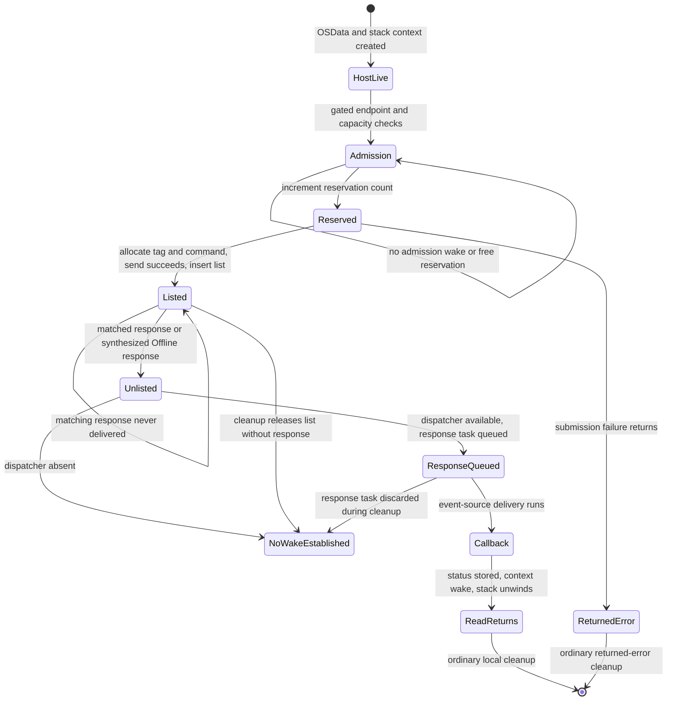

# M2H: In-Flight Selector-0 Read Termination

## Scope And Acceptance

This milestone is static, mock and public-read-only investigation of one future
in-flight selector-0 read. No DPDV open/close, private constructor, selector,
DPCD/AUX/I2C transaction, abort, concurrent close, physical disconnect or security
change is performed. No selector transport or read executable is added.
The consumed M2F-ATTEMPTED marker is preserved. M2G-DPCD-READ-ATTEMPTED remains
absent. The historical M2F open/close remains exactly one, with zero selectors.

The question is whether a read waiting for a missing DCP/firmware response can
necessarily reach a bounded terminal state without reboot or weakened security.
A terminal state requires consistent command/tag/list ownership, no remaining
unsafe callback access, and completion of or proven safe detachment from the
waiter. A returned parent timeout or disappearance of a userspace process does
not meet that criterion. Normal reply, explicit error, helper death, client close
and endpoint disconnect must each have an established finite completion bound or
a proven safe teardown path before termination can be classified as proven.

M2G's open ABI, selector contract, revision semantics/classifier, public framebuffer
result, provider ownership and userServer discriminator are retained evidence,
not reopened topics. Reply completeness remains a separate gate. Transport stays
NO_TRANSPORT_READY; one-byte readiness stays NOT_READY_FOR_ONE_BYTE_DPCD_READ;
the global gate stays NOT_READY_FOR_DPCD_TEST.

Evidence labels in this report:

- VERIFIED_ON_CURRENT_KERNEL: bytes in a retained image whose UUID matches the
  running kernel, not execution of the private method or a live-state observation.
- PRIMARY_SOURCE: pinned source behavior with its version scope; it does not
  override a different current driver implementation.
- INFERRED: a stated consequence or possible interleaving of those observations.
- UNKNOWN: a required condition or behavior not established by retained evidence.

## Integration, Tag And Branch

The starting M2G branch and upstream were exactly
`88474f9cb4bf2f0d2c3c84ee2dfe96e10121b30f`, clean and synchronized. All three
linear commits and nine changed UTF-8 blobs across eight scoped paths were
audited. Main was `3f5f0cd887ed2ef5c8dbadc9abb278792c3150be`; the historical
branches and all tag objects/peeled identities matched locally and remotely.

The --no-ff merge is `2b1565ee61337a368d75980af281621a5959000e`, message
`merge: record selector-0 one-byte readiness investigation`, with parents
`3f5f0cd887ed2ef5c8dbadc9abb278792c3150be` and
`88474f9cb4bf2f0d2c3c84ee2dfe96e10121b30f`. Its tree equals the audited M2G tree.
Main was pushed, followed by annotated tag `selector0-safety-v0.4`, object
`ed6e79f5a73b25a5ed6adbc991718747fbddacd9`, peeling to the merge. The tag message is
`Verified MacMST selector-0 safety assessment before any DPCD transaction.`
Both remote identities were read back before creating
`research/inflight-read-termination` from the tagged merge. No historical branch
or tag was deleted or moved.

At 2026-09-13T04:57:43Z the host still reported macOS 26.6.2 (25G83), kernel UUID
`447D769E-1CB7-3086-A0B4-32226837B587`. Retained current-image evidence therefore
remains applicable to the build, without attesting the live native/delegated route.
The successful M2F receipt hash remains
`86ee9fdd87eb631e7552b0087471a149c183667c2162e838866ce993e1dd3d04` and consumed
marker hash remains `2f3da1f224c0602dc46f812d3f6eb2c1560fe7a82c1a89f93eedb725b2726efc`.

## Exact Post-Submission Anchor

VERIFIED_ON_CURRENT_KERNEL: retained R3 at
artifacts/probes/iodp-static-20260912T045748Z/iodp-static.json, SHA-256
`b80b5f6b1d9553ce1ee1b292f68102369d0c7e3d29cfdd6ab80ff3c9c199b263`, contains
DCPAVProxy::performCommandGated at `0xfffffe000a018f40`, 332 bytes, body SHA-256
`98bf09b907fc17558a5f487ba143182ab3e613585f21ae6f8e30c63c153efee3`.

After the enqueue call at `0xfffffe000a018fb8` returns zero, the routine loads the
proxy's command gate at +192, selects vtable slot +512 at `0xfffffe000a018fd0`,
passes the stack context at sp+8 as the event, and loads w2=0 at
`0xfffffe000a018fe0` (raw bytes `02008052`). The authenticated sleep call is at
`0xfffffe000a018fe8`. The selected method is
IOCommandGate::commandSleep(void*,uint32_t) at `0xfffffe000bfe79ac`, not the
deadline overload at +528. An abnormal sleep result selects abort slot +2192;
the normal result is read from the stack context.

The local hypothesis is that a lost matching reply can leave that context waiting
indefinitely: length one supplies neither a deadline nor a guaranteed independent
teardown wake. A cheap discriminating check is to verify the exact sleep flag and
primitive chain, then check retained reply/error/close/death paths for a mandatory
bounded wake plus callback quiescence. A proven non-response terminal transition
covering that same context would disprove or narrow the hypothesis. No hardware
fault injection or process-kill experiment on a private call is permitted.

## Sleep Primitive And Interruption

VERIFIED_ON_CURRENT_KERNEL: R3 retains the upper three functions; R9 retains the
immediate mutex-sleep implementation and its _assert_wait callee. This is a local
continuation of existing evidence, not a new kernel graph.

| Step | Current Instruction Evidence | Consequence |
| --- | --- | --- |
| DCP performCommandGated | At 0xfffffe000a018fdc event=sp+8; at 0xfffffe000a018fe0 w2=0; call 0xfffffe000a018fe8 selects gate+512 | Wait event is the live stack CommandContext; no deadline argument |
| IOCommandGate::commandSleep, 0xfffffe000bfe79ac | Forwards event and flags to IOEventSource::sleepGate, 0xfffffe000bfe60d0 | The selected overload is not +528/deadline |
| IOEventSource::sleepGate | Loads workloop at +48 and calls its +432 slot at 0xfffffe000bfe6158 | Forwards the same event/flags to IOWorkLoop::sleepGate, 0xfffffe000bfe31d4 |
| IOWorkLoop::sleepGate | Saves recursive depth at lock+32 and clears owner at +24; at 0xfffffe000bfe3270 w1=16, x2=event, x3=flags; BL at 0xfffffe000bfe327c targets 0xfffffe000b809300 | Action 16 is lock priority bookkeeping, not interruptibility or a timeout; recursive ownership is restored after return |
| Mutex-sleep leaf, 0xfffffe000b809300 | Moves x2 to x0 and x3 to x1 at 0xfffffe000b809344/348; BL 0xfffffe000b80934c targets exact _assert_wait at 0xfffffe000b8225f8 | Raw interruptibility zero reaches wait registration unchanged |
| Blocking and reacquisition | On wait-result -1, unlocks the mutex, passes zero continuation arguments and calls 0xfffffe000b8231d4 at 0xfffffe000b8093d0; reacquires before return | The reply wait releases the workloop mutex; later lock acquisition is a separate scheduling/locking dependency |

The mutex-sleep leaf is 496 bytes, SHA-256
`b6549076615a43781dfe90fd5546b6d63f1c25f07cc9f2554f7cf2afaffc6b1e`.
Its current direct _assert_wait target is 320 bytes, SHA-256
`29155139202e88a509584740cd406e5c8b5fdcbce835d46cb447bd0882b11030`.
R9 report SHA-256 is
`587ef7b55e8ed3a5fd0e88e69c0d160ac2973ddbcaa9a6ac86bf04a71dc1f966`.

PRIMARY_SOURCE: pinned XNU
`f6217f891ac0bb64f3d375211650a4c1ff8ca1ea`,
[locks.c](https://github.com/apple-oss-distributions/xnu/blob/f6217f891ac0bb64f3d375211650a4c1ff8ca1ea/osfmk/kern/locks.c)
lck_mtx_sleep uses assert_wait, unlike lck_mtx_sleep_deadline. Its priority-floor
option does not supply a deadline. In
[sched_prim.c](https://github.com/apple-oss-distributions/xnu/blob/f6217f891ac0bb64f3d375211650a4c1ff8ca1ea/osfmk/kern/sched_prim.c),
thread_mark_wait_locked masks the interruptibility argument, sets TH_WAIT and
TH_UNINT for zero, and does not mark THREAD_ABORTSAFE. clear_wait_internal returns
KERN_FAILURE for THREAD_INTERRUPTED when TH_UNINT is set. Its assert_wait source
uses TIMEOUT_WAIT_FOREVER. These source rules corroborate the current call/flag
trace; a source revision is not asserted to be the exact running XNU revision.

INFERRED: a pending signal or userspace SIGKILL is not a finite-deadline wake
contract for this wait. A normal kernel wake on the event can wake an
uninterruptible waiter; uninterruptible does not mean unwakeable. Equally, waking
it without completing or quiescing the callback is not proven safe cancellation.
The current nonzero-sleep-result branch calls a no-op abort hook, not a drain.
Do not induce such a wake or close race on hardware.

## Constant 500

Classification: **500_MEANING_UNRESOLVED**. Its host role is precise: a uint32
firmware service-request field, serialized little-endian at message+96. Its
firmware interpretation is not recovered. It is not used as the demonstrated
host wait's deadline, queue limit, command tag or gate event.

| Value Boundary | Established Flow | Timeout Relevance |
| --- | --- | --- |
| _readBytes / interface thunk | Raw instruction 843e8052 at 0xfffffe000a7ac694 sets w4=500; retained read thunk forwards it | No clock conversion or deadline calculation |
| DCPDPDeviceProxy::readDPCD, 0xfffffe000a020628 | Copies fourth uint32 argument into w22 and stores it at message+96 at 0xfffffe000a020740, raw 166000b9 | Bytes are f4 01 00 00; address +64 and length +80 are distinct fields |
| DCPAVProxy::__sendMessage, 0xfffffe000a008e20 | Uses header flags and message+8 length, passes the service message to its response-taking block | Power-option selection is independent of message+96 |
| Response-taking block, 0xfffffe000a0090a4 | Supplies outer command 0xc0, request pointer/size, same reply buffer and a stack-local reply-size pointer | No 500-to-time transformation; no timeout parameter added |
| performCommandGated, 0xfffffe000a018f40 | Passes pointer/size/options through enqueue and then calls gate+512 with flag 0 | The host reply wait has no deadline derived from 500 |
| AFK endpoint adapter / KextV2 / AFKEPInterfaceV2 | Carries the service bytes as AFKEPMessage spans, adds separate command headers/tag, serializes/sends and retains callback state | Admission limits and optional synchronous-mode flags are separate state/options; no DPCD-specific interpretation of +96 is evidenced |
| Firmware handler | Exact DP-device group 1/command 6 handler and its field semantics are not retained | Milliseconds, microseconds, retries and other firmware meanings cannot be chosen from host stores alone |

The service payload is unchanged at the examined host serialization boundary; no
firmware receive or physical AUX transaction was observed. This is not a claim
that every transport callback or firmware instruction is decoded. There is no
evidence for an absolute/relative host deadline, a hard host timeout, or a proven
lower-layer timeout. Consequently there is no evidenced expiry/cancel transition
to assign to 500. A source-backed firmware interpretation would be required to
choose any of the other three classifications.

Its irrelevance to proving a hard overall bound is nevertheless established:
admission can block before the message reaches firmware, and the outer reply wait
uses the no-deadline primitive independently of this field. Even if firmware
internally times out at 500 units, loss of its response leaves that outer wait
without a demonstrated expiry wake. No further generic search for unrelated
constants is needed; Linux's 500-microsecond retry interval is not this field.

## One-Command Lifetime

The names below are analysis labels for actual fields and transitions, not an
invented firmware enum. VERIFIED_ON_CURRENT_KERNEL applies to the cited native
host bodies; firmware execution and any unobserved teardown ordering are UNKNOWN.

No timeout or cancel-requested state is evidenced for this command. No arrow out
of NoWakeEstablished is asserted: it represents missing terminal-state evidence,
not a measured permanently leaked object. In particular, that label does not
claim the runtime always reaches the cleanup path before an error callback.

| Transition | Owner / Trigger | Lifetime / Callback Effect | List, Tag And Waiter |
| --- | --- | --- | --- |
| HostLive | readDPCD holds OSData; performCommandGated increments proxy+200 and creates stack CommandContext | Context+8 points at OSData reply storage; context+16 points at the response-taking block's stack size variable | No local AFK command yet; neither stack object is heap-owned by retaining a callback |
| Admission | KextV2 callback 0xfffffe0009276e1c performs state snapshot and reservation acquisition | At 0xfffffe0009276f10 it may sleep on the endpoint with deadline 0 before acquireCommand | The pending selector can block before its own firmware command or tag exists |
| Reserved | acquireCommand block 0xfffffe000928549c sees count+145 below limit+144 and increments count | Consumes one shared reservation; callback construction/copy has separate lifetime | Release wakes interface+144, not the DCP context |
| Command creation and send | AFKEPInterfaceV2::enqueueCommand, 0xfffffe00092855b4, consumes next tag byte+146, creates local command and serializes/sends | Failure releases the created command and propagates submission error; the callback's submission-failure flag is distinct from a delivered response | Successful send increments uint16+76 and inserts the node in local list+40/tail+48 at 0xfffffe00092856d0-6dc; node stores the tag at +41 |
| Listed / waiting | Default asynchronous response options return to the outer DCP commandSleep | OSData, active call stacks and queued callback remain needed; no local timer is armed by this path | Command stays listed until matching response or cleanup; DCP event is its stack context |
| Tagged response | handleClientResponse, 0xfffffe000928384c, requires an eight-byte header and extracts its tag | removeCommand at 0xfffffe0009283af4 finds matching node+41 and unlinks it, updating tail before any later release | Missing tag logs/drops the response and increments interface+90; this does not wake the missing read |
| Response task queued | With dispatcher at interface+120 present, parse/copy and dispatchResponse at 0xfffffe000925e46c store context, allocation, options and status in a new task | Normal async response data/context outlive release of the AFKEPCommandLocal node at 0xfffffe0009283a38; delivery is a separate event-source action | Tag no longer in local list; queued response is not yet a DCP waiter wake |
| Callback delivered | KextV2::deliverResponse, 0xfffffe0009278414 | Calls releaseCommand first at 0xfffffe0009278450, invokes retained callback at 0xfffffe0009278474 with submission-failure flag 0, then releases that block at 0xfffffe000927847c; power deassertion is conditional | Reservation count decrements and interface+144 wakes before the DCP response callback completes |
| DCP context completed | Adapter callback 0xfffffe000926e0a8 forwards the saved context through AFKEndpointInterfaceClient::handleResponse to DCPAVProxy::handleResponse, 0xfffffe000a01908c | Writes reply prefix/size when pointers exist, then status at context+0; tail-wakes the context through gate+520 after its last context access | On normal wake, performCommandGated decrements proxy+200, wakes proxy+200, and returns; the DP frame then releases OSData |
| Local list cleanup | cleanupRemoteContext, 0xfffffe0009283a70, on its required AFK gate | Removes/releases remote list+56 and local list+40; resets tails and reservation count+145 | No response callback or commandSleep wake in this 132-byte body; freeing the node is not a completed read |

The KextV2 block at 0xfffffe0009277060 is the submission block, not the completion
callback. The actual completion entry is deliverResponse at 0xfffffe0009278414.
Likewise, the optional AFKEPInterfaceV2 synchronous branch sleeps on its local
command node; the retained default options do not select it. It is not an extra
firmware wait to count on top of the selected asynchronous path's DCP wait.

Current handleClientResponse has another explicit limit: if interface+120 is null
at 0xfffffe0009283958/395c, the asynchronous branch skips dispatch and proceeds
to command release. There is no DCP wake in that branch. This is a conditional
code path, not proof the field becomes null on every client death. The report
does not assume that a user-client state flag is checked at tag lookup: the
visible lookup uses the AFK interface and command tag, not a fresh IOUserClient
liveness query.

### Wake Events Are Not Interchangeable

| Event | Producer | What It Establishes |
| --- | --- | --- |
| AFK interface+144 | releaseCommand block at 0xfffffe0009285590 | A reservation may now be available; an admission loop rechecks capacity |
| Endpoint object | Conditional state-transition / close callbacks | State-admission sleep may progress; no DCP read-context completion follows merely from this wake |
| DCP stack CommandContext | handleResponse, status store at 0xfffffe000a0190e8 and gate+520 tail call | The corresponding read can resume after normal response processing |
| DCP proxy+200 | performCommandGated after its wait returns and outstanding count decrements | A drain observer can recheck outstanding work; it is not an independent producer that releases the blocked read |
| Command gate enabled field | enable or removal of a disabled gate | Releases callers waiting to enter an action, not a read already sleeping on its distinct CommandContext |

A raw command-gate wake would require a valid event, status, buffer and callback
lifetime contract. No caller-authorized primitive providing those guarantees was
found in the entries examined here. Dropping a tag, releasing a reservation or
destroying a Mach right cannot be substituted for that contract.

## Blocking Sites

This inventory covers the explicit waits and deferred-completion dependencies
identified on the retained native read, reply and teardown paths. It includes
pre-wire admission because a submitted selector can block there before firmware
receives its command. It does not claim whole-kernel closure: unresolved indirect
transport/lifecycle contracts remain W16. The synchronous userspace RPC reflects
these server waits; it is not an additional independently timed DCP operation.

UNBOUNDED_LOCAL means no local finite deadline for kernel scheduling/locking or
an enable handshake. It does not by itself mean firmware is awaited or that a
deadlock exists. UNBOUNDED_EXTERNAL means the condition can depend on an absent
response or progress of a command awaiting one. UNKNOWN means that boundary's
blocking/teardown contract is not established. None is a hard wall-clock bound.

| ID / Function | Condition / Phase | Primitive / Interruptibility | Deadline | Wake / Progress Source | Owner / State Field | Cleanup Consequence | Classification |
| --- | --- | --- | --- | --- | --- | --- | --- |
| W01: IOUserClient::callExternalMethod / ipcEnter | Entry or competing call with default locking enabled; PRIMARY_SOURCE lock span, current live flags unobserved | IORWLockRead or IORWLockWrite; ordinary kernel lock, not the DCP event wait | None in wrapper | Prior reader/writer unlock | User client, current lock+176; defaultLocking / defaultLockingSingleThreadExternalMethod | Matching ipcExit unlock only after externalMethod returns | UNBOUNDED_LOCAL |
| W02: IOCommandGate::runAction, 0xfffffe000bfe7be0; AFKWorkloop::runAction; IOWorkLoop::sleepGate return | Synchronous gate entry, nested gated callback, or mutex reacquisition after a wake | Recursive workloop mutex; action executes under the gate rather than inherently moving to another worker | No local time bound | Current lock owner unlocks; normal scheduler progress | Gate workloop+48 / workloop gate lock+16 | Sleep releases recursive ownership; action return restores normal gate bookkeeping | UNBOUNDED_LOCAL |
| W03: IOCommandGate::runAction disabled-entry loop | Not on workloop thread, enabled byte false, workLoop still present; before action entry | Workloop+432 sleep; raw w2=1 at 0xfffffe000bfe7d80, THREAD_INTERRUPTIBLE | No deadline | enable, interruption, or removal's interrupted wake | Gate enabled+40; gate+72 bit 1 tracks enable waiters | Returns aborted on interruption/removal; this event is not a running read's context | UNBOUNDED_LOCAL |
| W04: KextV2 enqueue admission block, 0xfffffe0009276e1c | Endpoint not inactive and sampled state bytes equal raw 3 and 1 | AFKWorkloop::sleep at call 0xfffffe0009276f10; eventual gate+512, flag 0 | Raw x2=0 at 0xfffffe0009276f0c | Endpoint state/close notification wake | KextV2 endpoint event; loop object at endpoint+168; snapshots obtained via callback 0xfffffe0009276f50, including endpoint+186 | No submitted command to abort yet; proceeds to acquireCommand only after this sleep returns | UNBOUNDED_EXTERNAL |
| W05: acquireCommand block, 0xfffffe000928549c | Reservation count >= limit | AFKWorkloop::sleep; gate+512 / flag 0 | 0 | releaseCommand decrements count and wakes interface+144 | AFKEPInterfaceV2 count+145, limit/event+144 | Rechecks until capacity exists; clear count alone is not a wake in cleanupRemoteContext | UNBOUNDED_EXTERNAL |
| W06: performCommandGated, 0xfffffe000a018f40 | Enqueue returned success, matching reply/error not yet delivered | commandSleep+512 -> sleepGate -> mutex-sleep -> _assert_wait; flag 0 / THREAD_UNINT | None; current _assert_wait sets x3=0 at 0xfffffe000b82269c before waitq tail call | DCP handleResponse writes status then wakes the same context | DCP gate+192; event=stack CommandContext at sp+8; outstanding counter proxy+200 | Abnormal return invokes no-op abort; normal return decrements count and releases the DP frame's storage | UNBOUNDED_EXTERNAL |
| W07: AFKEPInterfaceEventSourceV2 response dispatch, 0xfffffe000925e46c | Reply unlisted and response task queued but delivery not run | Asynchronous task queue plus workloop gating, not a second synchronous DCP sleep | No delivery bound recovered | Event-source scheduling/checkForWork and KextV2 deliverResponse | Dispatcher interface+120; task stores allocation+24, context+32, options+40, status+48 | clearAll can discard a response task without a DCP callback | UNBOUNDED_LOCAL |
| W08: IOServiceClose, 0xfffffe000c038688; connection no-senders | Close/death notification tries exclusive client lock while an external method holds read/write mode | Exclusive lock call at 0xfffffe000c038764; interruption policy not established as caller cancellation | No deadline in close body | External method's IPC unlock; ordinary unlock is downstream of W06 when held by the read | User client lock+176, closed+153, IPC count+156 | clientClose cannot be reached through this locked path until acquisition succeeds | UNBOUNDED_EXTERNAL |
| W09: finalizeUserReferences / ipcExit | Finalization requested while active IPC remains; PRIMARY_SOURCE deferral, current ipcExit at 0xfffffe000c0303f4 | No sleep in the deferral predicate; finalization is postponed | No completion deadline | Final IPC decrement with inactive client schedules finalization | User client IPC+156 and deferred-finalization byte+154 | Returning false/defer does not finish the pending operation or free its stack | UNBOUNDED_EXTERNAL |
| W10: IOCommandGate::setWorkLoop(NULL), 0xfffffe000bfe801c | Removal sees enable-waiter bit 1 at gate+72 | Wakes enabled+40 with interrupted result, then sleepGate on gate+72 at 0xfffffe000bfe8138; raw flag 0 | None | Disabled-entry waiter exits, clears bit 1 and wakes gate+72 | Removing gate; gate+72 bit 0=removed, bit 1=enable waiters | Drains entry waiters only, not a submitted DCP read | UNBOUNDED_LOCAL |
| W11: active-action detach deferral | Removal sees nonzero action count mask 0xffffff00 at gate+72 | No sleep for action count in setWorkLoop; detach is deferred until runAction unwinds | None | Active action returns and decrements by 0x100 | IOAV/DCP gate's own action count; never-used-gate proof is inapplicable | Can remain attached while W06 remains pending; no synthesized response | UNBOUNDED_EXTERNAL |
| W12: IOService::terminatePhase1 / terminateWorker / scheduleTerminatePhase2 | Native clientClose requests terminate(0); ordinary arbitration and asynchronous phase scheduling | Arbitration/job locks; worker scheduling and lifecycle callbacks; callback-specific waits not all resolved | No returned-close terminal-state deadline | Unlock, termination worker progress and outstanding-reference/IPC transitions | IOService inactive/phase/busy state and job lists; source names retained, no invented field offsets | Native close requests termination, not synchronous read cancellation or guaranteed free | UNKNOWN |
| W13: DCPAVProxy::stop, 0xfffffe000a0095d8 | Provider actually stops and separate thread-call pointer+248 is nonnull | thread_call_cancel_wait at 0xfffffe000a0096b4, then free; lower callback wait not attributed as this read's cancel | No deadline argument at this call | That separate thread-call callback finishes | DCP provider thread-call+248, endpoint+184, gate+192 | Does not identify or cancel the AFK command by the read's context/tag; endpoint close and gate removal have separate conditions | UNKNOWN |
| W14: KextV2::closeHelper, 0xfffffe000927553c | Endpoint close helper reached; uint32 endpoint+344 nonzero | Repeats the property-operation call at 0xfffffe0009275588; lower blocking behavior not fully attributed | No finite loop bound shown | Field change / callee result; writer progress not proved for missing reply | KextV2 endpoint+344 | handleClose/list cleanup precedes later scheduled event-source cleanup; not a complete read terminal contract | UNKNOWN |
| W15: task termination / final task deallocation | thread_terminate_internal waits for another thread to leave CPU; final owner cleanup waits for references/threads to disappear | PRIMARY_SOURCE thread_wait(FALSE) uses assert_wait on wake_active with THREAD_UNINT; final refs are a precondition, not another direct sleep | No thread_wait deadline; no finite final-reference bound | Scheduler removes thread from CPU; final deallocation separately needs all references/threads gone | Thread on-CPU state/wake_active; task thread list and refcount | Off-CPU can be satisfied while DCP stack remains asleep; phase-2 owner cleanup is not an early cancellation wake | UNBOUNDED_LOCAL |
| W16: remaining transport and lifecycle boundaries | Serialized send/response transport callbacks, or conditional lifecycle callback outside decoded local closure | UNKNOWN; no synthetic primitive or deadline assigned | UNKNOWN | UNKNOWN | AFK transport/session and callback-owned state not fully attributed | Cannot promote missing contracts to bounded or safe teardown; no general graph expansion performed | UNKNOWN |

Two tempting timeout substitutions are excluded from the selected read path:

- AFKEPInterfaceV2's optional synchronous branch at 0xfffffe00092856ec sleeps
  on the local command with deadline 0: UNBOUNDED_EXTERNAL if selected, but the
  retained default response options leave it unselected. The selected response
  wait is W06, not two independent firmware waits.
- Pinned IOService::scheduleTerminatePhase2 has a 15-second busy-condition sleep
  only for kIOServiceSynchronous. That individual sleep is CONDITIONALLY_BOUNDED,
  but surrounding terminate-thread acquisition has no deadline. Native
  IOAVUserClient::clientClose calls terminate(0); current terminate adds raw 4,
  not synchronous bit 2. Neither that source-only timeout branch nor the global
  idle termination-worker sleep is a timeout for W06.

There is no BOUNDED firmware-dependent wait in this inventory. W15's local
off-CPU wait can finish while final task cleanup is still externally dependent on
W06. W02 releasing its recursive gate permits possible other work; W08 concerns
a different client IPC lock that a commandSleep does not explicitly release.

The gate-removal distinction is verified in current bytes: setWorkLoop tests
bit 1 at 0xfffffe000bfe80a0 and waits at 0xfffffe000bfe8138 only for that entry
handshake; at 0xfffffe000bfe8150 it tests the separate action mask and defers
detachment. runAction increments at 0xfffffe000bfe7cac and decrements at
0xfffffe000bfe7cdc. These lifetime protections are not a wake of the DCP context.