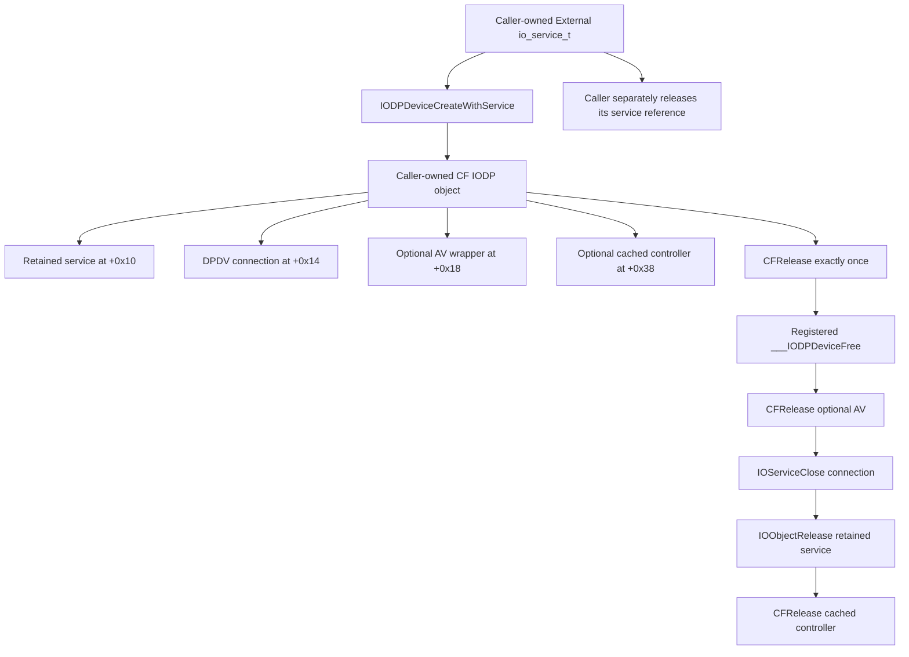

# M2A-ABI-02: IODPDevice / DPDV Read Contract

**Follow-up:** [dcp-dpcd-rpc-03.md](dcp-dpcd-rpc-03.md) adds AFK reply/zeroing,
no-deadline wait, no-op abort and authorization evidence. The host ABI below
remains established; RPC-03 narrows its remaining safety limits without invoking it.

## Verdict

**NOT_READY_FOR_DPCD_TEST**

The current-image construction, CF destruction, PS190 authenticated call
bindings, DPDV client routing, and selector-0 host implementation are resolved.
The remaining boundary is narrower than in Milestone 2A: the host sends a DCP
register RPC, but firmware-native AUX semantics, complete-reply assurance, and
a bounded/cancellable wait are not established. No private constructor, user
client, read, write, updater, or firmware routine was invoked.

This report supersedes the unresolved-lifecycle/binding/server statements in the
[historical A1 investigation](iodpdevice-api.md). It does not repeat or replace
the [C1/D1/C2 external-path experiment](external-dock-diff.md).

## Evidence And Reproduction

- **G3**: `artifacts/probes/20260912T021152Z/`, fresh public observation,
  33 commands, zero failures, unchanged probe binary and topology.
- **A2**: `artifacts/probes/iodp-static-20260912T022704Z/iodp-static.json`,
  complete ABI-02 static report and manifest. Retains selected raw instructions,
  image/section identities, authenticated-pointer words and chain evidence,
  virtual-method bindings, dispatch rows, and allowlisted client-class properties.
- Earlier static captures, including `iodp-static-20260912T021518Z`, are
  preserved as intermediate evidence. A1 and G2 remain historical baselines.
- Host: Apple M5 / Mac17,2 / arm64, macOS 26.6.2 (25G83), Xcode 26.6
  (17F113), SDK 26.5. Capture dates are UTC 2026-09-12, local 2026-09-11.

```sh
python3 tools/inspect_iodp.py --baseline artifacts/probes/20260912T021152Z --server
```

The command only reads files, resolves symbols, decodes instructions, and reads
public registry/kernel-identity properties. It never loads an inspected kernel
collection or updater. Installed public LLVM and libcompression APIs do the
disassembly and bounded in-memory decompression; no dependency was installed.
The IMG4 reader does not verify signatures, and reports that limitation.

| Image | UUID |
| --- | --- |
| IOKit arm64e | `12372585-DF92-33EF-B632-714FAA13260A` |
| libPS190Updater arm64e | `890D3A6A-FE7B-3D04-BA1F-B6EAE4D0071C` |
| libdpfu arm64e | `B9E57F34-C7CA-3BBD-806C-4A8D0C67CB21` |
| Kernel image, also returned by `sysctl -n kern.uuid` | `447D769E-1CB7-3086-A0B4-32226837B587` |
| IODisplayPortFamily | `21AA8D3B-3EE1-3812-9D20-BB3B5A0B79DB` |
| IOAVFamily | `6E4B9D42-04A2-393A-B1F5-F121B8D00954` |
| DCPDPFamilyProxy | `7732A096-166C-312F-8AEB-BF0DED28C5C3` |
| DCPAVFamilyProxy | `9CA0BBA6-98A5-3CAB-8D7A-9EB2D79C9D08` |

`VERIFIED_ON_M5`: the uniquely selected readable Preboot kernelcache is an
IMG4/IM4P `krnl` payload, description `KernelManagement_host-487.100.11`.
It decompresses to a 121,012,224-byte arm64 Mach-O fileset. Its embedded kernel
UUID matches the running kernel. That match ties this installed image to the
running kernel build; it does not independently attest every live kext page.
Personal Preboot path identifiers are not persisted. Binary UUIDs are retained.

- Container SHA-256: `b20d50fc8f445a5c578ac63bd974efeb6ae48a97116800301071891795fb26d9`
- Decoded SHA-256: `f516560c295e10d62c3d219237d23c5900664107b2115dad590eaa259516d05f`

The Intel System/Boot KernelCollections are not M5 evidence. A dyld_info assertion
on one of them was a tool failure, not a security restriction. The relevant arm64
image was readable without privilege escalation or security changes.

## External Target

`VERIFIED_ON_M5`: G3 again enumerates one External DCPEXT0 / Unit 0 DP device
and service, one external 1920x1080@60 logical display, and active USB-C port 4:
HPD raw 2 / High, two lanes, LinkRate raw 4 with published HBR3 / 8.1 Gbps
description, SinkCount 1, Tunneled false. LinkRate 4 is not a DPCD rate byte.

`INFERRED`: the existing owner-controlled C1/D1/C2 cycle associates that context
with the ZMUIPNG 14-in-1 hub, ASIN B0FWJZCX5G, on the right-side socket. The
owner reports both VG248 panels show the same image. This is not the earlier HP
dock and does not identify an MST chip or an M5 source packetizer.

A2's fresh, public `ioreg -a -r -c DCPDPDeviceProxy -d 1` observation preserves:

| Property | Observed Value |
| --- | --- |
| IORegistryEntryID | `4296595301`, transient, not a future selector |
| Location / Unit | `External` / `0` |
| IODPDeviceUserInterfaceSupported | `true` |
| IOUserClientClass | `DCPDPDeviceProxyUserClient` |
| IOAVDeviceUserInterfaceSupported | Not published on this DP node |

The expected constructor input is a freshly acquired `io_service_t` for this
External **DP device**, not its DP service, AV sibling, controller, AFK parent,
or an integer registry ID. Device and service remain sibling EPIC endpoints.
Never use an unqualified/default constructor or an Embedded fallback.

## IODP Lifecycle

`PRIMARY_SOURCE`: `_IODPDeviceCreateWithService` at IOKit `0x1849047c4`
(export offset `0xa67c4`) rejects a null service and checks
`IODPDeviceUserInterfaceSupported == kCFBooleanTrue`. The key is composed by
`_IOAVObjectConformsTo` from the raw `IODPDevice` and `UserInterfaceSupported`
strings, not a C++ subclass test.

It registers a CF type and calls `_CFRuntimeCreateInstance` with 48 extra bytes,
zeroes the extra state, retains the service, stores it at object+`0x10`, and
opens DPDV into the 32-bit field at +`0x14`. On open failure it calls `CFRelease`
on the partially initialized object and returns null. It then attempts
`_IOAVDeviceCreateWithService` on the **same** service, storing a nullable result
at +`0x18`. That optional wrapper independently checks its AV support flag;
the observed DP node lacks it. Null AV does not invalidate the returned DP object
or affect ReadDPCD's connection-only access. No sibling substitution occurs.

The CF class record at `0x1ee973aa8` has version 0; its finalize field at +32
(`0x1ee973ac8`) contains raw word `0x809000000487f0fc`. Its declared slide-5
chain resolves exactly to `___IODPDeviceFree` at `0x18487f0fc`. The layout is
corroborated by pinned Apple CFRuntime sources, the class-name pointer, and the
actual local callback, not presumed from a Create naming convention alone.



All four fields are null-checked in the finalizer. `_IOServiceClose` at
`0x184864924` calls `_io_service_close`, then `_mach_port_deallocate` even when
the server-close result is an error, and returns the saved result. Do not close
object+`0x14` manually and then CFRelease the object: that would duplicate cleanup.

Also resolved in A2: `___IODPServiceFree` (`0x18487f314`),
`___IOAVDeviceFree` (`0x1848818d4`), and `___IODPControllerFree`
(`0x18487ec1c`). Service cleanup releases its cached DP device at +`0x20`.
`IODPServiceGetDevice` returns that borrowed cached object or looks up its
IOService parent before creating/caching it. The actual External service parent
is an AFK endpoint, not the DP sibling, so this helper is not the binding route.
`IODPDeviceGetAVDevice` returns a borrowed nullable field; lazy controller getters
can create/open additional objects and are unnecessary for the proposed read.

## DPDV User Client

`PRIMARY_SOURCE`: the constructor's call at `0x184904874` is:

```c
IOServiceOpen(service, mach_task_self(), 0x44504456, &object_connection);
```

`0x44504456` is the **third IOServiceOpen argument**, the user-client type
conventionally written `DPDV`. It is not selector 0, a function name, an AUX
opcode, or permission to read. The service-family constructor instead uses
`0x44505356` (`DPSV`); do not interchange them.

The DCPDPDeviceProxy primary vtable slot at `0xfffffe0008310da8` binds to
`IOService::newUserClient(task*,void*,unsigned,OSDictionary*,IOUserClient**)`
at `0xfffffe000bf964cc`. Its four-argument fallback is also inherited from
IOService. The generic path reads the user-client class property, allocates
that class, initializes it with the supplied type, attaches it to the provider,
and calls start, releasing/detaching on failure. The observed class property
and proxy vtable agree: **DCPDPDeviceProxyUserClient**.

Its vtable +2320/+2328 slots resolve to the two base `IOUserClient::initWithTask`
overloads (`0xfffffe000c02c224` / `0xfffffe000c02c130`). The examined inherited
path forwards, then does not discriminate on, the type value. There is no
proxy-specific `DPDV` switch in this path. Consequently even a future successful
open would not by itself validate a selector contract or the chosen class.
General Mach/IOKit authorization remains separate and untested here.

`DCPDPDeviceProxyUserClient::start` at `0xfffffe000a0214a4` checks the provider
with `safeMetaCast`, passes provider+1552 as `IODPDeviceUserInterface` and
provider+136 as logging interface, then tail-calls `IODPDeviceUserClient::start`
at `0xfffffe000a7ac62c`. The latter stores the interface at client+256 and
installs the six-row method table through `IOAVUserClient::start`.

The shared start allocates/adds a command gate and retains the provider. Its
stop removes the gate; free releases the gate/provider; clientClose at
`0xfffffe000a5a3694` calls the client's inherited `IOService::terminate(0)`.
These are real lifecycle/state effects. The examined client start/close code
does not directly issue DPCD writes or retraining, but that is not a guarantee
that general driver/power/termination machinery has no indirect effects.

## Read ABI

`INFERRED`, machine ABI recovered from local code and a bound independent caller;
this is documentation, not a new compiled private header:

```c
CFTypeRef IODPDeviceCreateWithService(CFAllocatorRef allocator, io_service_t service);
kern_return_t IODPDeviceReadDPCD(CFTypeRef device, uint32_t address,
                               void *output_buffer, uint32_t requested_length);
```

| Field | Confidence | Evidence / Limit |
| --- | --- | --- |
| Create argument 1: allocator pointer, x0 | HIGH | Forwarded to CFRuntimeCreateInstance; PS190 supplies the default allocator. |
| Create argument 2: io_service_t, w1 | HIGH | Conformance, IOObjectRetain and IOServiceOpen use this service. |
| Create return: nullable, caller-owned CF object, x0 | HIGH | Registered CF allocation, failure CFRelease, exact finalizer and PS190 dealloc. |
| Read argument 1: opaque CF object, x0 | HIGH | Dereferenced only for its 32-bit connection at +0x14 in this wrapper. |
| Read argument 2: address, w1 | HIGH | Low 32 bits zero-extended into one uint64 scalar; server consumes low 32 bits. No observed 20-bit masking. |
| Read argument 3: writable output-buffer pointer, x2 | HIGH | Ninth IOConnectCallMethod argument, then server structureOutput and memcpy destination. |
| Read argument 4: requested byte length, w3 | HIGH | Unsigned minimum with 4096, output-structure size, then proxy copy count. |
| Read return: 32-bit kern_return_t/IOReturn-compatible status, w0 | HIGH | Public IOConnectCallMethod return propagated; PS190 checks zero. No private error enum recovered. |
| Private opaque typedef/tag name | UNKNOWN | CFTypeRef describes representation/ownership, not a recovered Apple private declaration. |
| Native AUX address/transfer semantics behind RPC | UNKNOWN | Host marshalling is not firmware or wire evidence. |

The buffer must remain writable for the whole synchronous call; there is no
returned buffer ownership. Zero length, null buffer, arbitrary addresses, or a
length above the proposed single byte are not approved probes. The 4096-byte
wrapper cap is not an AUX wire-payload limit or proof of safe large reads.

## Exact Selector 0 Call

`PRIMARY_SOURCE`: `_IODPDeviceReadDPCD` starts at `0x18487eeb0` (export offset
`0x20eb0`); IOConnectCallMethod is called at `0x18487ef10`. Its 35 instructions
support this reconstruction, against the SDK's ten-argument declaration:

```c
uint64_t address_scalar = (uint32_t)address;
size_t output_size = requested_length < 4096u ? requested_length : 4096u;
return IOConnectCallMethod(device_connection, 0,
                           &address_scalar, 1,
                           NULL, 0,
                           NULL, NULL,
                           output_buffer, &output_size);
```

| Public Call Argument | Value At Call |
| --- | --- |
| 1 / w0 / connection | Loaded from object+0x14 |
| 2 / w1 / selector | 0 |
| 3 / x2 / scalarInput | Address of local uint64 address scalar |
| 4 / w3 / scalarInputCount | 1 |
| 5 / x4 / structureInput | NULL |
| 6 / x5 / structureInputSize | 0 |
| 7 / x6 / scalarOutput | NULL |
| 8 / x7 / scalarOutputCount | NULL, not a pointer to a zero count |
| 9 / stack / structureOutput | Original buffer pointer |
| 10 / stack / structureOutputSize | Address of local size_t, initially min(length,4096) |

The returned output size is discarded. The public status survives the normal
stack-canary check. There is no buffer validation, DPCD plausibility check,
short-read result, retry loop, or follow-up address read in this wrapper.

## Authenticated PS190 Caller Binding

`PRIMARY_SOURCE`: for the three calls below, A2 verifies the raw BL, 16-byte
authenticated stub, calculated slot address, declared slide-5 page-chain membership,
and unique current-image export target. Other calls retain unresolved/aliased
statuses where appropriate. No pointer authentication was bypassed or executed.

| PS190 Method | BL Address | Stub | Slot | Exact Target |
| --- | --- | --- | --- | --- |
| initWithService:rootPath: | `0x28607676c` | `0x286086058` | `0x29a532650` | `0x1849047c4`, IODPDeviceCreateWithService |
| readRegisterAddress:buffer:length: | `0x286076954` | `0x286086068` | `0x29a532658` | `0x18487eeb0`, IODPDeviceReadDPCD |
| dealloc | `0x2860767f4` | `0x286086038` | `0x29a523620` | `0x180549314`, CFRelease |

Reader stub bytes: `71250a9031621991300240f9110a1fd7`; slot bytes:
`b0ee870400001480`, word `0x801400000487eeb0`. The slot is in
`.06.dylddata`, UUID `5e40ebd3-9ac6-385d-96db-ca2b24d55627`, file offset
`0x8b3e658`; auth IA, diversity 0, address diversity true. A2 retains page,
chain-hop, mapping, raw-header and hash details. The callback slot uses the
same declared-format verification, not a heuristic low-bit address mask.

The constructor stores the created pointer at PS190 self+8. The reader moves
that pointer and its three Objective-C explicit arguments into x0/x1/x2/x3.
Dealloc conditionally CFReleases the same pointer. This resolves A1's ambiguous
pretty-disassembler labels; it does not demonstrate that this updater targets
the connected hub or authorize executing any updater method.

## Server Side

`PRIMARY_SOURCE`: the DP method table at `0xfffffe000845e058` has 24-byte rows.
The top-level kernel declares pointer format 8, `DYLD_CHAINED_PTR_64_KERNEL_CACHE`.
Selector 0's word `0x8030bcad037a865c` belongs to the declared chain and resolves
from collection base `0xfffffe0007004000` to `_readBytes` at
`0xfffffe000a7ac65c`, with auth IA and diversity `0xbcad`.

| Selector | Exact Action | Scalar In | Struct In | Scalar Out | Struct Out |
| --- | --- | --- | --- | --- | --- |
| 0 | IODPDeviceUserClient::_readBytes | 1 | 0 | 0 | variable (`0xffffffff`) |
| 1 | IODPDeviceUserClient::_writeBytes | 1 | variable | 0 | 0 |
| 2 | _getLinkTrainingData | 0 | 0 | 0 | 152 |
| 3 | _getSymbolErrorCount | 1 | 0 | 1 | 0 |
| 4 | _setUpdateMode | 1 | 0 | 0 | 0 |
| 5 | _setUpdated | 1 | 0 | 0 | 0 |

Other rows are static contrast only and are prohibited experiment targets.
`IOAVUserClient::externalMethod` (`0xfffffe000a5a36e0`) checks inactivity and
enters its gate. `externalMethodGated` (`0xfffffe000a5a3788`) selects the row
by selector*24 for selectors below six and delegates to IOUserClient. Its
checked-dispatch path (`0xfffffe000c02c30c` onward) validates the scalar and
structure counts against the table. Variable size is not a one-byte guarantee;
the future caller must enforce that boundary itself.

`_readBytes` loads client+256, scalarInput at args+32 (low uint32),
structureOutput at args+88, and structureOutputSize at args+96. It calls the
DP interface's vtable+16 slot with these values and an additional **raw 500**.
The unit/meaning of 500 is not recovered; do not label it a proven 500 ms timeout.

The DCPDPDeviceProxy constructor installs the secondary interface vtable at
provider+1552. Its +16 function slot (`0xfffffe0008310f70`) binds exactly to
the -1552 adjusting thunk at `0xfffffe000a0207b0`, which reaches
`DCPDPDeviceProxy::readDPCD(unsigned,unsigned char*,unsigned,unsigned)` at
`0xfffffe000a020628`. This is a complete static host dispatch chain, not a
coincidental method name match.

That implementation allocates an OSData request/reply buffer and constructs:

| Message Offset | Observed Raw Field |
| --- | --- |
| +0 / uint16 | 0 |
| +2 / uint16 | 1 when requested length is nonzero |
| +4 / uint32 | 6, distinct from user-client selector 0 |
| +8 / uint32 | length + 64 |
| +12 / uint32 | `0x69706378` |
| +64 / uint32 | DPCD-address argument |
| +80 / uint32 | requested length |
| +96 / uint32 | raw 500 forwarded by _readBytes |
| +112 / uint32 | result consumed from reply |
| +128 | returned bytes copied to caller buffer |

It calls `DCPAVProxy::__sendMessage` at `0xfffffe000a008e20`. The synchronous
block at `0xfffffe000a0090a4` uses outer command `0xc0` and
`performCommandGated` (`0xfffffe000a018f40`). That routine submits through an
AFK endpoint interface and waits on a command gate. The endpoint's lower-level
implementation, DCP firmware receiver, and wire opcode are not established here.

On a nonzero RPC result the read returns that status without copying output.
Otherwise it copies **requested_length** bytes from reply+128, then returns
the uint32 at reply+112, even if that result is nonzero. Therefore discard output
on every error; an altered buffer does not imply success.

### Reply Length And Semantic Limits

`DCPAVProxy::handleResponse` (`0xfffffe000a01908c`) copies the minimum of supplied
and received lengths and updates a response-size variable. The synchronous
send block's response-size variable is local and not checked after the call.
The DP read then copies the original requested count, and `_readBytes` does not
update structureOutputSize. Finally the userspace wrapper discards its own size.

`PRIMARY_SOURCE`: those examined layers expose **no end-to-end actual DPCD byte
count**. `UNKNOWN`: whether a lower AFK/DCP layer independently rejects every
short, malformed, or header-only success reply. Do not manufacture such replies
or fuzz the live interface to investigate this. A zero return, requested size,
changed sentinel, or plausible-looking byte is not independently proof of a
complete, live native-AUX response. An unchanged sentinel could also equal a
legitimate byte; it is an observation, not a conclusive failure test.

The gate-wait path does not demonstrate a bounded wall-clock deadline or safe
cancellation. The raw 500 inside the message cannot establish those properties.

| Interpretation | Assessment |
| --- | --- |
| A: direct host-native AUX transaction | Not this observed host path: it forwards an RPC, not an identified host AUX opcode. |
| B: DCP-mediated native AUX read | HYPOTHESIS; compatible with the host code, but needs firmware/lower-transport evidence. |
| C: higher-level DCP register RPC | PRIMARY_SOURCE for the exposed host contract. C does not exclude a native AUX implementation inside DCP. |
| D: selector 0 actually maps to a different method | Disfavored for these images: exact table, interface and caller bindings resolve to the read path. |
| E: wholly unresolved interface | No longer describes the host ABI; remains UNKNOWN below the identified RPC boundary. |

## Safety Analysis And First-Read Preflight

Read-only **file analysis** is not equivalent to a side-effect-free future
hardware read. Opening the CF object opens a kernel client; start/close allocate,
attach, retain, gate and terminate objects. The read sends a firmware request and
can wait. Possible wake/power/locking, hidden initialization, cache behavior,
firmware retry/write behavior, and timeout/cancellation need explicit treatment.
No inspected host selector-0 branch calls the sibling write/update methods, but
that does not establish the entire firmware operation is read-only.

| Critical Gate | Current Evidence | Result |
| --- | --- | --- |
| 1. Current correlated External target | G3 plus preserved C1/D1/C2, Unit/context and active port | Strong; re-enumerate again immediately before any later experiment |
| 2. Correct service and support/class checks | DP flag, direct DP service handle, published client class | Strong |
| 3. Constructor and DPDV mechanism | Exact local wrapper, inherited factory and client start | Strong static evidence; actual authorization untested |
| 4. CF ownership, failure and teardown | Registered finalizer, all null checks, CFRelease caller, IOServiceClose | Strong static evidence |
| 5. Each read argument and return ABI | Wrapper plus exactly bound PS190 reader | HIGH for machine representation |
| 6. Selector-0 server/read mapping | Declared table fixups, count checks, secondary vtable and thunk | Strong static evidence |
| 7. Complete reply and bounded wait | Actual count discarded; lower validation and cancellation unproven | Blocking UNKNOWN |
| 8. Native read-only firmware semantics | DCP register RPC, no identified native AUX opcode/handler | Blocking UNKNOWN |
| 9. Explicitly approved, fail-closed one-byte experiment | Proposed below only; no private transport implemented | Not authorized/executed in this task |

Required preflight for a later proposal, in addition to closing blocking gates:

1. Record exact hardware/OS/image UUIDs and a fresh successful public snapshot.
   Require the same external display, External Location, Unit 0, unique matching
   DCPEXT0 RTBuddy context, supported DP interface and expected client class.
2. Require the correlated port 4 active with HPD High, with the existing topology
   still applicable. Multiple candidates, missing flags, changed images or topology,
   stale IDs, or disconnect invalidate the selection. Never choose Embedded.
3. Acquire a fresh explicit service reference; do not reopen a recorded numeric
   ID or use IODPDeviceCreate, IODPServiceGetDevice, an AV sibling, or lazy getters.
   Require no unexpected AV support flag if relying on the nullable-AV path.
4. Permit only verified CreateWithService, one ReadDPCD, and exact CF/IOObject
   cleanup. Do not manually close the private object's connection. Own each
   reference once; clean up on every success/failure path and before returning.
5. Enforce address **0x000**, requested size **1**, one call, a valid initialized
   output byte and guard storage. No automatic retries, extra reads, scan, MST_CAP,
   write, sideband, retraining, or fallback. Do not bypass the wrapper to recover
   an output count; that is a different experiment and still lacks RPC assurance.
6. Obtain explicit later approval that acknowledges kernel-client setup/teardown
   and the remaining bounded-risk analysis. A process deadline alone does not
   guarantee that killing a blocked client cancels kernel/DCP work.

No firmware, NVRAM, security settings, link parameters, HPD state, kernel code,
or display configuration was modified. A disabled transport scaffold was not
added: the existing CLI remains a public probe, with read capability UNVERIFIED.

## Proposed M2-02

**Withheld until the blocking gates are resolved and separately approved.**

Exactly one requested byte at DPCD **0x000**, through the verified direct
External DP-device route, then cleanup and stop. No read at 0x021 and no
16-byte capability block. No runnable `macmst dpcd read` command exists yet.

Expected observation: one successful, contractually complete response with a
raw revision byte attributable to the selected receiver. Record the initialized
and final byte, guards, requested count 1, raw status in hex/signed form,
elapsed monotonic time, fresh path/Unit/context, image identities and topology.
Explicitly record actual DPCD count as **unavailable through this wrapper**,
unless a stronger completion guarantee has first been established.

Disconfirming/stop observations: null construction, authorization/unsupported/
transport error, changed target, guard damage, incomplete/ambiguous reply,
unbounded wait, or any unexpected display/link change. Do not retry or escalate
privileges. A plausible revision is not proof of a physical AUX transaction if
caching remains possible. A failed read is not proof that M5 lacks MST hardware;
even a verified native read would not establish a source MST packetizer.

## Tooling And Verification

[inspect_iodp.py](../../tools/inspect_iodp.py) now uses the bounded
[dyld cache reader](../../tools/dyld_cache.py) for slide-5 authenticated bindings
and CF callback resolution. Optional `--server` uses the
[kernel image reader](../../tools/kernel_image.py) for IMG4/IM4P, public LZFSE
decompression, arm64 Mach-O filesets, symbols and declared format-8 fixups.
Unsupported formats, ambiguous identities/mappings, out-of-range data, unmatched
kernel UUIDs and nonmember chain slots fail closed. Whole decoded collections
are not persisted; relevant bytes and hashes are.

The existing [static test suite](../../tests/test_iodp_static.py) has 24 focused
tests, including malformed/truncated structures, architecture/UUID ambiguity,
chain membership, authenticated fields, and External client-routing privacy.
The focused suite and real A2 capture passed. Both builds, all seven unit entries,
the single public-hardware entry and all seven sanitizer-configuration entries
passed; see [the final verification record](README.md#m2a-abi-02-verification).
All 118 selected historical/current artifact hashes and the three A2 tool-source
digests verified. No hardware transport functionality was tested.

Source formats are pinned in [ledger S14-S17](evidence-ledger.md#primary-and-reproducible-source-catalog).
Apple CF source is historical and used with local binary corroboration; dyld
format definitions are not treated as a private IODP API declaration.